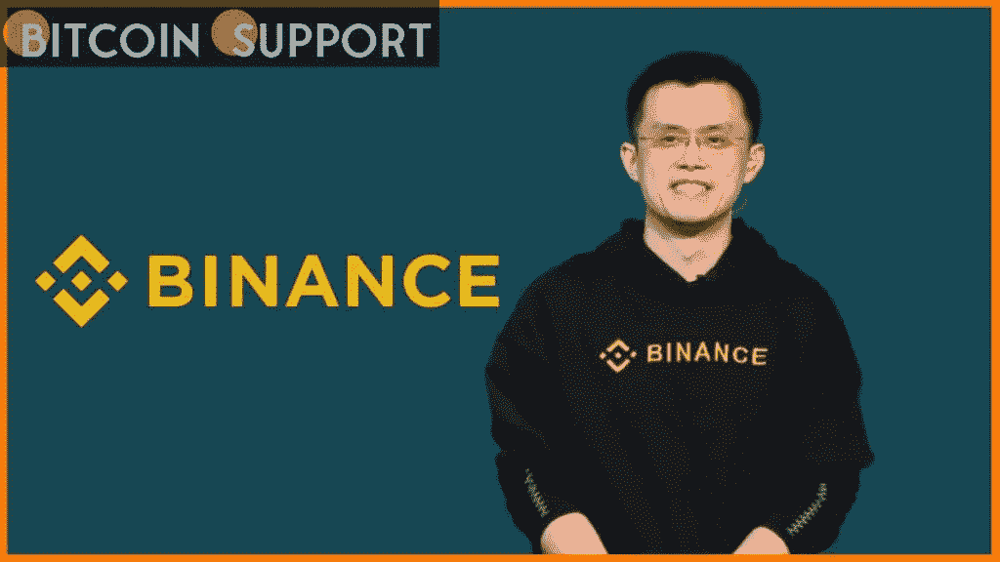

# 币安首席执行官计划在未来博物馆举办首次“未来对话”活动

> 原文：<https://medium.com/coinmonks/binance-ceo-schedules-first-future-talks-event-at-the-museum-of-the-future-3d3bb6bd13b0?source=collection_archive---------49----------------------->

**Visit our website:-** [**https://bitcoinsupports.com/**](https://bitcoinsupports.com/)

CZ 无疑是世界顶级的加密声音，通过各种活动为加密事业贡献资源。

**展望未来**

【币安 CEO 赵昌鹏将发表首届未来对话系列活动。该系列由迪拜未来博物馆制作，将涉及对发展区块链现象的未来的讨论，如增强现实、元宇宙、加密货币和不可替代令牌(NFT)。

赵昌鹏定于世界协调时 2 月 24 日 15:00 讲话。他的讲话将致力于 NFT 的潜力和加密货币的未来。该活动的组织者于 2 月 23 日在 Twitter 上宣布:

***【未来博物馆在其推文中写道:“全球最大的比特币和比特币加密交易所的创始人兼首席执行官赵昌鹏将于 2 月 24 日来到#MuseumOfTheFuture，参加一系列讲座的第一场。”***

[https://thumbs . gfy cat . com/parchedinfatuatedrmine-mobile . MP4](https://thumbs.gfycat.com/ParchedInfatuatedErmine-mobile.mp4)

**正合适**

据其网站介绍，未来博物馆汇集了能够影响未来的各大实业家。在加密货币方面，中车币安站在了行业领先的位置。币安首席执行官一直致力于通过各种举措提高区块链的认知度和加密采用率。‍

CZ 币安公司在推进加密货币事业中发挥了重要作用。他承受了监管审查的压力，并通过帮助加密业务在监管水域中航行，为监管合规性设定了标准。此外，CZ 正在通过区块链教育、最有价值的建设者项目和其他计划完成令人难以置信的事情。他应该有机会谈论加密货币和 NFTs 的未来。bsc 新闻将密切关注未来的会谈，并为您带来 CZ 会谈的亮点。

**访问我们的网站:-**[**https://bitcoinsupports.com/**](https://bitcoinsupports.com/)

**免责声明:以上为作者观点，不应视为投资建议。读者应该自己做研究。**

> 加入 Coinmonks [电报频道](https://t.me/coincodecap)和 [Youtube 频道](https://www.youtube.com/c/coinmonks/videos)了解加密交易和投资

# 另外，阅读

*   [去中心化交易所](https://coincodecap.com/what-are-decentralized-exchanges) | [比特恩斯 FIP](https://coincodecap.com/bitbns-fip) | [Pionex 评论](https://coincodecap.com/pionex-review-exchange-with-crypto-trading-bot)
*   [用信用卡购买密码的 10 个最佳地点](https://coincodecap.com/buy-crypto-with-credit-card)
*   [最好的卡达诺钱包](https://coincodecap.com/best-cardano-wallets) | [Bingbon 副本交易](https://coincodecap.com/bingbon-copy-trading)
*   [印度最佳 P2P 加密交易所](https://coincodecap.com/p2p-crypto-exchanges-in-india) | [柴犬钱包](https://coincodecap.com/baby-shiba-inu-wallets)
*   [8 大加密附属计划](https://coincodecap.com/crypto-affiliate-programs) | [eToro vs 比特币基地](https://coincodecap.com/etoro-vs-coinbase)
*   [最佳以太坊钱包](https://coincodecap.com/best-ethereum-wallets) | [电报上的加密货币机器人](https://coincodecap.com/telegram-crypto-bots)
*   [交易杠杆代币的最佳交易所](https://coincodecap.com/leveraged-token-exchanges) | [购买 Floki](https://coincodecap.com/buy-floki-inu-token)
*   [3Commas 对 Pionex 对 Cryptohopper](https://coincodecap.com/3commas-vs-pionex-vs-cryptohopper) | [Bingbon 评论](https://coincodecap.com/bingbon-review)