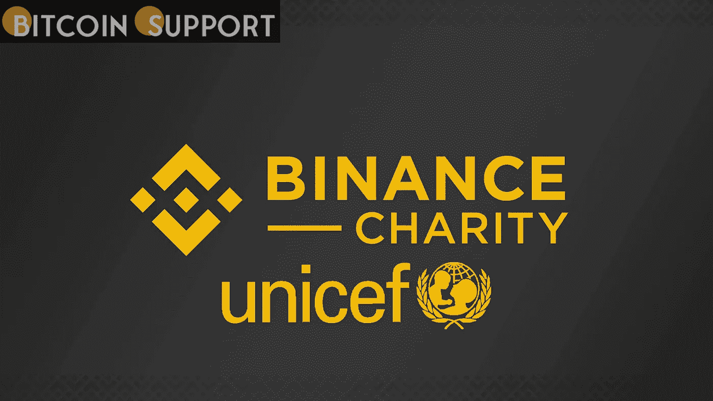

# 币安慈善基金会向联合国儿童基金会捐赠 250 万美元帮助乌克兰

> 原文：<https://medium.com/coinmonks/binance-charity-foundation-donates-2-5-million-in-crypto-to-unicef-to-help-ukraine-da3559465344?source=collection_archive---------59----------------------->

**Visit our website:-** [**https://bitcoinsupports.com/**](https://bitcoinsupports.com/)

币安慈善机构承诺捐赠 250 万美元的比特币，以支持联合国儿童基金会在乌克兰的人道主义工作。该声明是在与入侵的俄罗斯军队的持续军事冲突继续危及越来越多的儿童的情况下做出的。

**联合国儿童基金会将使用捐赠的加密货币资助在乌克兰的活动**

币安慈善基金会宣布向联合国儿童基金会捐赠 250 万美元的比特币。这些资金将用于支持该组织在乌克兰的行动，那里与俄罗斯的冲突正在上升，并危及越来越多的儿童及其父母。联合国儿童基金会在一份声明中表示:“人道主义需求正以极快的速度增长。”。“许多儿童因他们每天目睹的暴力而留下了严重的创伤。成千上万的人正在迁移，许多家庭已经被拆散，”该慈善机构补充道。联合国儿童基金会强调，此次加密货币捐赠正值该组织寻求扩大其在乌克兰和接受难民的邻国的业务之际。目标是帮助每一个需要保护的儿童，在乌克兰大约有 750 万。

该组织目前专注于确保获得安全饮用水和医疗保健，特别是在冲突地区附近的地区。儿童基金会与地方政府合作，向有需要的家庭提供紧急援助，以及儿童保护和心理社会支持。“我们依靠全球企业界的慷慨和支持来帮助联合国儿童基金会和我们的合作伙伴帮助那些生命和未来受到威胁的儿童及其家庭，”联合国儿童基金会日内瓦私人筹款和伙伴关系司司长卡拉·哈迪德·马尔蒂尼说。她对币安慈善机构的援助表示感谢。全球最大的加密货币交易所币安上周宣布了一系列人道主义举措，并承诺向乌克兰人民提供 1000 万美元。币安慈善机构通过其卢森堡委员会与儿童基金会合作。

币安创始人兼 CEO 赵昌鹏表示，乌克兰战争的发展速度令全球震惊。他还称赞了币安社区与联合国儿童基金会的合作。

联合国儿童基金会在 2019 年推出了一个加密基金，成为第一个接受和分发加密货币的联合国组织，以促进惠及全球儿童的项目。2020 年，它还将为企业家提供加密投资资本。自 2 月份俄罗斯发动军事进攻以来，乌克兰一直在筹集各种加密货币的现金。基辅当局和非政府组织已经使用加密货币捐款来资助防御活动和人道主义努力。

**访问我们的网站:-**[**https://bitcoinsupports.com/**](https://bitcoinsupports.com/)

**免责声明:以上为作者观点，不应视为投资建议。读者应该自己做研究。**