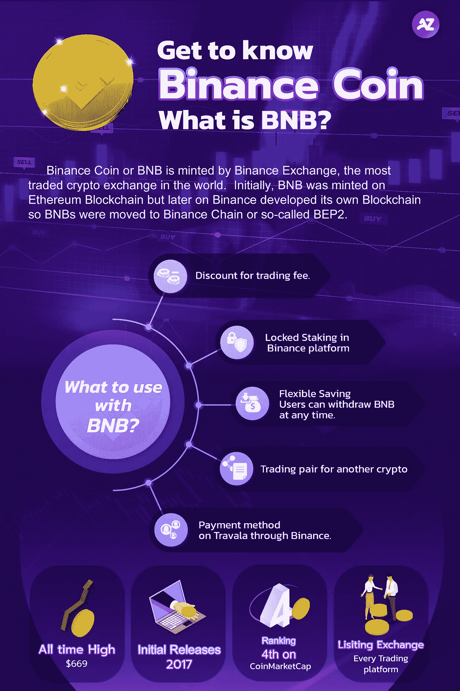

# 币安硬币(BNB) 101:什么是 BNB？

> 原文：<https://medium.com/coinmonks/binance-coin-bnb-101-what-is-bnb-585dd411fc83?source=collection_archive---------52----------------------->

## 更多地了解币安硬币或 BNB

What is BNB

在密码行业，你不可能不知道币安。币安是最常用的密码交易平台之一。Binace 是一家拥有最大用户群和最高交易量的加密交易所。今天我们将谈论二元硬币或“BNB ”,它实际上是币安硬币。

币安硬币或 BNB 由世界上交易量最大的密码交易所——币安交易所铸造。最初，BNB 是在以太坊区块链上创建的，但后来币安开发了自己的区块链，所以 bnb 被转移到币安链或所谓的 BEP2。在第一阶段，在币安交易所诞生之前，币安通过首次发行硬币或 ICO 提供 BNB。BNB 被创造出来是为了在币安的生态系统中使用。

用什么搭配 BNB？

*   交易费折扣。
*   在币安平台下注(用户可以下注 30 天、60 天或 90 天)。赌注的利润取决于你押了多少 BNB。在锁定期间，用户不能使用 BNB。
*   灵活储蓄。如果您存入 BNB 进行灵活储蓄，用户可以随时提取 BNB。
*   参与 Launchpool。当你和 BNB 一起参与一个新项目时，你可以从这个项目中获得密码。你将获得的利润取决于你拥有的 BNB 数量。
*   另一个可以在币安交易的密码的交易对。
*   酒店付款方式，机票在特拉瓦拉通过币安。

**BNB 的数量**

目前，有 2 亿 BNB。每个季度都有一个烧钱机制来维持通货膨胀率。刻录机制设置为自动刻录。这意味着每次交易发生时，BNB 将被自动烧录。燃烧过程结束后，币安将扣除 20%的利润回购 BNB。币安买回的 BNB 将被存放在钱包里，任何人都不能进入这个钱包。

**币安 NFT 市场**

由于 NFT 市场仍在蓬勃发展，加密服务提供商正在进入 NFT 市场，当然也包括币安。币安还提供了一个 NFT 市场，称为“币安 NFT 市场”。用户可以使用 BNB 在币安 NFT 市场上买卖 NFT。

BNB 可以有多种用法。创建 BNB 是为了促进币安的生态系统，而不仅仅是为了贸易。未来，币安可能会推广 BNB 的生态系统，使其可以用于各种平台或其他用例。我们可以说，BNB 是这一时期最有趣的密码之一。

*请注意，投资数字资产有风险，交易者应在投资前自我教育。

如果您对分散资产管理感兴趣，请随时联系我们。

请确保您不会错过任何更新的新闻，请关注我们的社交媒体如下:
推特:[https://twitter.com/azirafinance](https://twitter.com/azirafinance)
媒体:[https://medium.com/@azirafinance](/@azirafinance)
脸书:[https://www.facebook.com/azirafinance](https://www.facebook.com/azirafinance)
Reddit:[https://www.reddit.com/user/azirafinance](https://www.reddit.com/user/azirafinance)
白皮书:[https://azira-finance.gitbook.io/product-docs/](https://azira-finance.gitbook.io/product-docs/)

> 加入 Coinmonks [电报频道](https://t.me/coincodecap)和 [Youtube 频道](https://www.youtube.com/c/coinmonks/videos)了解加密交易和投资

# 另外，阅读

*   [加拿大最佳加密交易机器人](https://coincodecap.com/5-best-crypto-trading-bots-in-canada) | [Bybit vs 币安](https://coincodecap.com/bybit-binance-moonxbt)
*   [阿联酋 5 大最佳加密交易所](https://coincodecap.com/best-crypto-exchanges-in-uae) | [SimpleSwap 评论](https://coincodecap.com/simpleswap-review)
*   购买 Dogecoin 的 7 种最佳方式
*   [最佳期货交易信号](https://coincodecap.com/futures-trading-signals) | [流动性交易所评论](https://coincodecap.com/liquid-exchange-review)
*   [用于 Huobi 的加密交易信号](https://coincodecap.com/huobi-crypto-trading-signals) | [Swapzone 审查](/coinmonks/swapzone-review-crypto-exchange-data-aggregator-e0ad78e55ed7)
*   [最佳加密交易机器人](/coinmonks/crypto-trading-bot-c2ffce8acb2a) | [购买索拉纳](https://coincodecap.com/buy-solana) | [矩阵导出评论](https://coincodecap.com/matrixport-review)
*   [Coldcard 评论](https://coincodecap.com/coldcard-review) | [BOXtradEX 评论](https://coincodecap.com/boxtradex-review)|[uni swap 指南](https://coincodecap.com/uniswap)