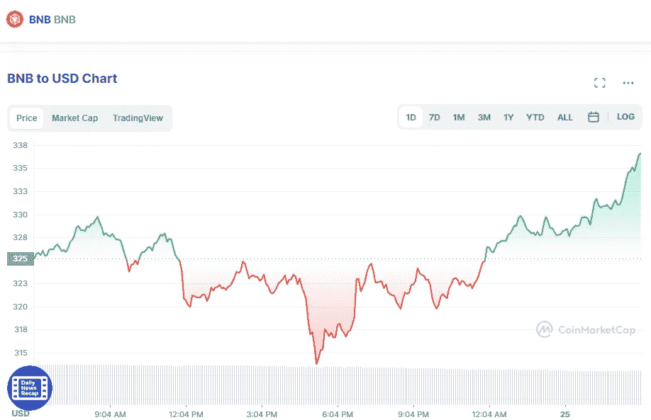

# 币安硬币(BNB)和卡尔达诺(ADA)价格分析 5 月 25 日

> 原文：<https://medium.com/coinmonks/binance-coin-bnb-and-cardano-ada-price-analyse-25th-of-may-3470316e4688?source=collection_archive---------34----------------------->

# 币安硬币(BNB)

Source photo [BNB price today, BNB to USD live, marketcap and chart | CoinMarketCap](https://coinmarketcap.com/currencies/bnb/)

自诞生以来，币安币一直是最有价值的五大加密货币之一。这种数字资产的代号为 BNB，在币安市场上被用作打折券。

对于庞大的币安创造的加密解决方案，BNB 扮演着更重要的角色。投资于…