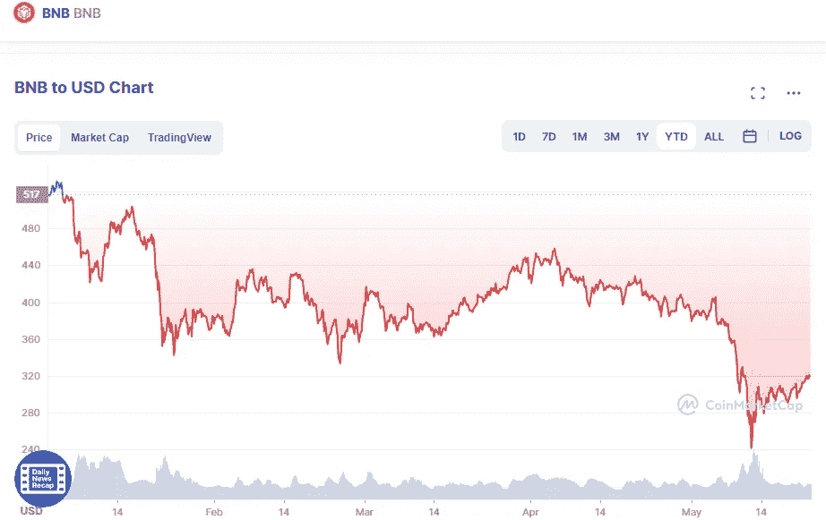

# 币安硬币(BNB)技术分析 5 月 23 日

> 原文：<https://medium.com/coinmonks/binance-coin-bnb-technical-analyse-23th-of-may-fb2ce5695f0a?source=collection_archive---------27----------------------->

币安硬币(BNB)已经从 211 美元的重要支撑位强劲反弹，现在已经越过了 20 天指数移动平均线(323 美元)的阻力位。因为跌破和收盘高于这个水平表明底部已经形成，空头必须积极捍卫它。

Source photo [BNB price today, BNB to USD live, marketcap and chart | CoinMarketCap](https://coinmarketcap.com/currencies/bnb/)