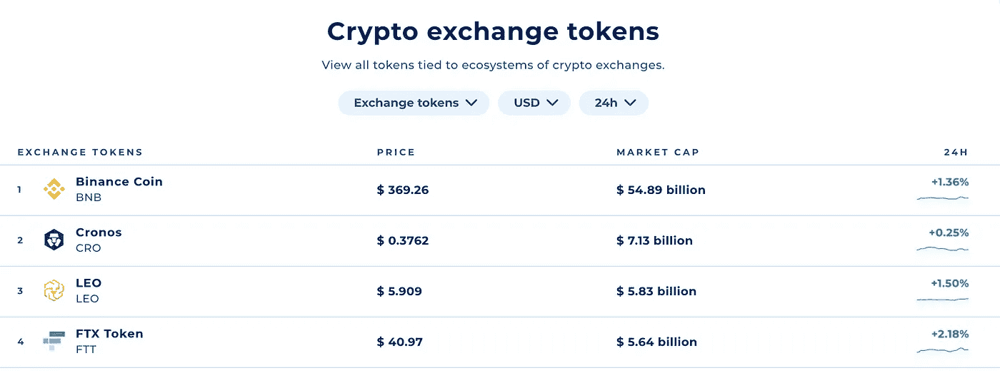

# Crypto.com 硬币对币安硬币

> 原文：<https://medium.com/coinmonks/binance-coin-vs-crypto-com-coin-22a13c76f87f?source=collection_archive---------5----------------------->

$BNB 和$CRO 的比较

# 介绍

币安是世界上交易量排名第一的加密交易所，它在 2017 年 7 月开发了自己的令牌——BNB。大约在同一时间，排名第十一的 Crypto.com 也开发了一种相对“成功”的硬币——经过多次重新定位和更名后的 CRO。

然而，尽管交易量看起来差距很大(币安的日交易量为 370 亿美元，而 crypto.com 的日交易量为 15 亿美元)，但在 2022 年初，在不同的交易代币中，$CRO 的市值仅落后于$BNB 一位。

Figure.1 Exchange Tokens Marketcap from Coinranking

本文旨在从以下几个方面比较和对比排名前两位的兑换硬币 BNB 和 CRO:

1.  **公用事业/需求**
2.  **ICO /供应**
3.  **战略与合作伙伴**
4.  **团队**
5.  **法规**

并在最后提供结论性的最终裁决。

# 效用/需求

$BNB 的效用主要有三个方面:

1.  用作币安智能链(BSC)上的交易费

BNB 用于支付 BSC 上的交易费用，BSC 是仅次于以太坊和 Terra 的第三大第一层，价值约 117 亿 TVL。多年来，BSC 凭借其低廉的费用结构和[以太坊虚拟机](https://cointelegraph.com/ethereum-for-beginners/architectural-components-of-the-ethereum-blockchain-what-are-they) (EVM) &智能合约兼容性吸引了大量开发者和用户。

BSC 链使用 PoS 机制，只有 **21 个社区验证者**，全部由币安任命。因此，它为了可伸缩性而牺牲了分散性—大约 3 秒的阻塞时间。

2.用于降低币安的交易费用(25%)

据币安称，仅在其交易平台上，就有大约 200 万用户使用 BNB 支付超过 1270 亿笔交易的交易费，总额超过 4000 万 BNB。当使用$BNB 时，交易现货、期货和保证金显著减少，特别是对机构交易者和鲸鱼。

3.用作合作项目/抵押品的货币

$BNB 还可以用于网上购物，如礼品卡、加密信用卡账单、娱乐、旅游等等。在过去的一年中，币安已经实现了多种方式来使用$BNB 通过不断增长的商家和机构网络购买商品和服务。此外，BNB 可以被用作币安的抵押品来获得加密贷款，或者被押在 BNB 的金库里以获得最低 0.35%的 APY 收益率。

另一方面，$CRO 的效用是非常不同的。

目前，$CRO 的大部分需求和效用来自“额外津贴”的形式。主要来自信用卡“额外津贴”(**返现**)和赌注“额外津贴”(**更高收益**)

Figure.2 Crypto.com Credit Card Perks

为了让 CRO 获得更高端的信用卡，提供更高的**返现**和更多的网飞/Spotify/亚马逊 Prime/等。好处，用户必须先购买$CRO。类似地，如下图所示，下注价值 4000 美元的$CRO 可以使 s **获得每年 2%的奖励。**

Figure.3 Crypto.com Staking Perks

除了这些额外津贴，CRO 还将用于支付克罗诺斯连锁店**的交易费，这是一家与 EVM 兼容的连锁店**，并计划于 2022 年在 Q2 推出其 Mainnet。

$BNB 的需求和效用就像以太坊里的以太。此外，它还为币安用户提供了许多交易优惠和额外津贴，同时通过合作伙伴关系不断扩大$BNB 的使用案例。

另一方面，忽略它在 Cronos 链上的使用，它还没有证明自己，它像一个“庞氏”骗局一样运作。具体来说，它提供了我认为不可持续的优惠，比如 12%的稳定硬币收益率，8%的信用卡返现，以吸引用户购买$CRO。在引擎盖下，我怀疑 Crypto.com 出售他们的美元 CRO，以补偿这些额外津贴，本质上是经营一个庞氏骗局。不可否认，我忽略了$CRO 在 Cronos 上的潜在用途，但我高度怀疑 Cronos 将赢得一个甚至接近 BSC 或以太坊的位置。

因此，根据需求/使用情况，获胜者将获得$BNB。

# ICO /电源

币安将其 10%的 BNB 代币分配给天使投资者，40%给团队，其余 50%给公众。

根据 CZ 最近的推文，它已经承诺按季度燃烧 100，000，000 BNB——或总供应量的 50%—预计需要 5-8 年，而不是 27 年。下一次 BNB 燃烧——第 19 次燃烧——将发生在 2022 年 4 月。

最初，1000 亿美元 CRO 中的 75%由 Crypto.com 团队用于发展项目和倡议。在烧掉 700 亿代币后，还有 300 亿代币在流通，现在只有大约 60 亿由 Crypto.com 团队持有。

与$BNB 清晰的 ICO 和燃烧结构相比，$CRO 似乎落后了，自发燃烧。此外，由于$CRO 的通货膨胀性质，10%的赌注 APY，我会说$BNB 在供应/发行方面也赢了。

# 战略和伙伴关系

币安的策略分为两部分:通过合作扩展$BNB 的用例，完善 BSC 以吸引更多的用户/开发者。

*   用于通过[zela acoun](https://thecoinshark.net/zelaacoin-launches-cryptocurrency-atms-with-binance/)在加密自动取款机上提取现金
*   在 [Pundi X](https://info.binance.com/en/currencies/pundi-x) 、【Crypto.com】T2、私人夜店 [MORE](https://twitter.com/getmorecoin/status/1045370081486635008) 等平台上的支付方式
*   通过 Coinbates 获得 BNB 形式的返点
*   在直播服务 [Uplive](https://www.businesswire.com/news/home/20171228005141/en/World%E2%80%99s-Leading-Crypto-Exchange-Binance-Partners-Uplive) 和聊天服务[armandy](/adamant-im/in-chat-transfers-for-binance-coin-is-now-supported-3b494b812e62)上用作礼物代币
*   …

Crypto.com 一直专注于利用名人/影响者营销，从迈克·达蒙到 F1、UFC、巴黎圣日耳曼和阿斯顿·马丁认知一级方程式车队。此外，在 Crypto.com 和 AEG 合作引领体育、音乐和娱乐世界创意之都的未来，将斯泰普中心更名为 Crypto.com 竞技场后，CRO 的美元飙升至新的历史新高。

最近，它与澳大利亚足球联盟(AFL)达成了另一项重大的体育主题合作。

Crypto.com 的营销策略类似于庞氏骗局，更侧重于短期营销而非长期基本面。关于战略和伙伴关系，我把获胜者交给$BNB。

# 组

币安由著名的首席执行官赵昌鹏领导。作为业界最受关注和最有影响力的成员之一，CZ 在 BSC 和$BNB 上有很大的愿景，以解决以太坊的可扩展性问题。他还分享说，他 90%的员工都是用 BNB 元领薪水的。

Crypto.com 于 2016 年由现任首席执行官 Kris Marszalek 以摩纳哥的名义在香港成立。它拥有庞大的顾问团队和高管团队，人才不断增多。然而，鉴于市场的相对规模，他们比币安更难获得顶尖人才。

在中车的带领下，市场领先者币安无疑拥有一支更有前途的团队。因此，我也要说，币安在领导类别中胜出。

# 规程

2021 年 6 月，英国金融监管机构金融行为监管局(FCA)对币安市场有限公司(BML)和币安集团发出警告，裁定 BML“不允许在英国从事任何受监管的活动”，因为它缺乏相关授权。此外，美国商品期货交易委员会(Commodity Futures Trading Commission)的监管机构正在调查币安是否参与了内幕交易或市场操纵，即“在执行客户指令之前根据客户指令进行交易”。

路透社的一项调查发现，尽管在公开场合，币安表示欢迎政府监督，但该公司实际上向监管机构隐瞒了信息，对客户的检查不力，并违反了自己合规部门的建议。

另一方面，Crypto.com 一直很好地处理与监管机构的关系。它重申了自己的战略，即通过遵守 MFSA 法规，并加入国际数字资产交易协会(IDAXA)和全球数字金融(GDF)，在其运营的所有市场实现完全合规。现在，Crypto.com 用户可以将他们的资产委托给欧盟许可的 3 级 VFA 服务提供商。

在监管方面，由于其在全球的主导地位，币安一直受到监管部门的大量关注。目前，它正处于美国和英国监管机构的严密监控之下。Crypto.come 做得非常好，成为第一个获得 Class 3 级 VFA 服务提供商许可证的全球加密货币平台。因此，赢家将是$CRO。

# 结论/最终裁决

除了监管以外，在所有其他方面，$ term 大概都处于一个更好的位置。具体来说，$BNB 的策略实际上是推广他们的 BSC 链，从而促进$BNB 的使用，而$CRO 则采取更短期的营销方法和庞氏骗局一样的津贴来吸引需求。然而，如果 Cronos 链能够吸引大量用户/开发者，我可以看到 CRO 在长期内获得一些牵引力。CZ 指出，在监管方面，$ term 正采取各种行动解决其创始人的合规问题。因此，我的最终裁决是 **$BNB。**让我知道你的想法和/或我错过的任何要点/观点。

> 加入 Coinmonks [电报频道](https://t.me/coincodecap)和 [Youtube 频道](https://www.youtube.com/c/coinmonks/videos)了解加密交易和投资

# 另外，阅读

*   [如何使用 Solidity 在以太坊上创建 DApp？](https://coincodecap.com/create-a-dapp-on-ethereum-using-solidity)
*   [币安 vs FTX](https://coincodecap.com/binance-vs-ftx) | [最佳(SOL)索拉纳钱包](https://coincodecap.com/solana-wallets)
*   [如何在 Uniswap 上交换加密？](https://coincodecap.com/swap-crypto-on-uniswap) | [A-Ads 审查](https://coincodecap.com/a-ads-review)
*   [加密货币储蓄账户](/coinmonks/cryptocurrency-savings-accounts-be3bc0feffbf) | [YoBit 审核](/coinmonks/yobit-review-175464162c62)
*   [Botsfolio vs nap bots vs Mudrex](/coinmonks/botsfolio-vs-napbots-vs-mudrex-c81344970c02)|[gate . io 交流回顾](/coinmonks/gate-io-exchange-review-61bf87b7078f)
*   [CoinFLEX 评论](https://coincodecap.com/coinflex-review) | [AEX 交易所评论](https://coincodecap.com/aex-exchange-review) | [UPbit 评论](https://coincodecap.com/upbit-review)