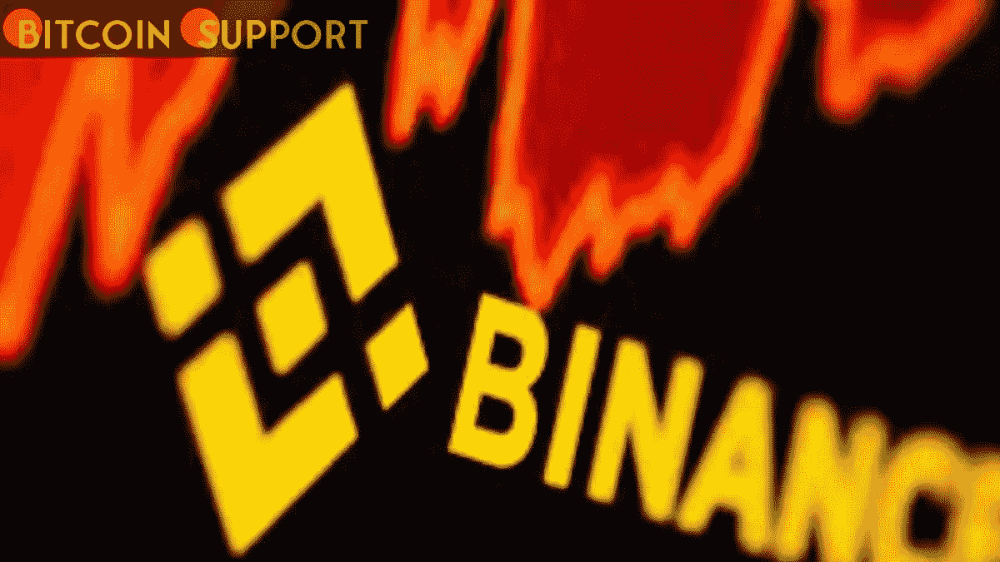

# 应监管机构的要求，币安暂停了西班牙的加密货币衍生品交易

> 原文：<https://medium.com/coinmonks/binance-has-halted-cryptocurrency-derivatives-trading-in-spain-in-response-to-a-regulators-request-46aa7346283d?source=collection_archive---------3----------------------->

**For full blog visit:-**[**https://bitcoinsupports.com/binance-has-halted-cryptocurrency-derivatives-trading-in-spain-in-response-to-a-regulators-request/**](https://bitcoinsupports.com/binance-has-halted-cryptocurrency-derivatives-trading-in-spain-in-response-to-a-regulators-request/)

据报道，在西班牙市场监管机构的要求下，币安加密交易所被迫停止了西班牙的所有加密期货交易。据《西班牙信息报》报道，币安最近被国家证券市场委员会(CNMV)强制“完全停止在西班牙销售加密资产衍生品”，该委员会对加密领域拥有一定的管辖权，并负责监管股票市场。根据该报告，币安的西班牙“经理”已经“自今年年初以来与他们进行了多次会谈”，据未透露姓名的“商业部门消息人士”称

在币安的西班牙语网站上，衍生品菜单已经从相关选择中删除。在英文版中,“衍生产品”菜单位于“交易”和“收入”菜单之间。币安在今年三月初与监管机构进行了谈话，币安已经向监管机构递交了“国书”，据同一家媒体援引接近此案的“消息人士”称。该公司于 1 月份申请在西班牙央行(BdE)的官方记录中上市。文章称，这家“加密货币巨头”对其在西班牙的扩张战略“很确定”，但在扩大其在该国的活动之前，它“正在等待 BdE 的授权”。这不是 CNMV 和币安第一次发生冲突。在币安和西班牙足球偶像安德烈斯·伊涅斯塔签订所谓的推广合同后，后者在去年 11 月使用加密交易平台向推特上传了自己的照片。不满的 CNMV 在社交媒体上公开指责他，指出加密资产构成“风险”，因为它们是“不受监管的物品”这位世界杯冠军被当局告知“在投资”加密货币或向他人推荐加密货币之前，要彻底教育自己”。

[https://twitter.com/CNMV_MEDIOS/status/1463573103943077889](https://twitter.com/CNMV_MEDIOS/status/1463573103943077889)

去年，该机构将币安列入一份实体“灰名单”，其中大部分是与密码相关的公司，该机构认为这些公司从事“不受监管”和“不受监督”的业务。币安和其他几家知名的加密货币交易所被允许“离开”名单。然而，它在西班牙争取正式认可的斗争似乎仍在进行中。

**完整博客访问:-**[**https://bitcoinsupports . com/币安-has-halted-crypto currency-derives-trading-in-Spain-response-to-a-regulators-request/**](https://bitcoinsupports.com/binance-has-halted-cryptocurrency-derivatives-trading-in-spain-in-response-to-a-regulators-request/)

**免责声明:以上为作者观点，不应视为投资建议。读者应该自己做研究。**

> 加入 Coinmonks [电报频道](https://t.me/coincodecap)和 [Youtube 频道](https://www.youtube.com/c/coinmonks/videos)了解加密交易和投资

# 另外，阅读

*   [最佳比特币保证金交易](/coinmonks/bitcoin-margin-trading-exchange-bcbfcbf7b8e3) | [萝莉点评](/coinmonks/lolli-review-e6ddc7895ad8) | [比特币保证金交易](https://coincodecap.com/bityard-margin-trading)
*   [创造并出售你的第一个 NFT](https://coincodecap.com/create-nft) | [密码交易机器人](https://coincodecap.com/best-crypto-trading-bots)
*   [如何在 CoinDCX 上购买柴犬(SHIB)币？](https://coincodecap.com/buy-shiba-coindcx)
*   [CBET 评论](https://coincodecap.com/cbet-casino-review) | [库科恩 vs 比特币基地](https://coincodecap.com/kucoin-vs-coinbase) | [拜比特 vs 比特币基地](https://coincodecap.com/bybit-vs-coinbase)
*   [折叠 App 回顾](https://coincodecap.com/fold-app-review) | [LocalBitcoins 回顾](/coinmonks/localbitcoins-review-6cc001c6ed56) | [Bybit vs 币安](https://coincodecap.com/bybit-binance-moonxbt)