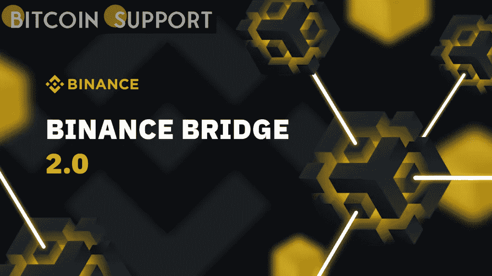

# 币安推出了整合 CeFi 和 DeFi 的币安桥 2.0

> 原文：<https://medium.com/coinmonks/binance-has-launched-binance-bridge-2-0-which-integrates-cefi-and-defi-cc2c427437dc?source=collection_archive---------21----------------------->

**Visit our website:-** [**https://bitcoinsupports.com/**](https://bitcoinsupports.com/)

该桥将允许用户连接和利用来自 BNB 链上的任何区块链的资产。

**币安大桥现已投入运营**

币安，全球最大的加密生态系统，发布了币安大桥 2.0 版本。新版本通过支持更多令牌、降低维护费用和提供更完美的用户体验，改进了原来的币安桥。根据 BNB 链团队 3 月 29 日与 BSC News 一起发布的独家新闻稿，币安桥 2.0 将允许用户无缝连接任何区块链到 BNB 链的加密资产。用户将能够直接从币安应用程序进行操作，使该桥成为币安用户集中金融(CeFi)和分散金融(DeFi)需求的一站式商店。

***“借助币安桥 2.0，我们可以让 DeFi 在全球范围内为更多用户所用，同时还能提供 CeFi 所提供的无缝用户体验。币安桥 2.0 是一个变革性的一步，我非常兴奋地看到它如何让十亿多用户访问 Web3，”币安产品负责人 Mayur Kamat 断言。***

币安桥 1 版只支持在币安交易所上市的资产，2 版不支持。第二版用户将能够把未在币安市场上市的其它资产作为打包股票连接到 BNB 连锁店。然后，用户可以部署 BTokens，并在 BNB 链环境中探索 DeFi 元宇宙、区块链游戏等，消除了交换需求和其他困扰区块链互操作性的瓶颈。

通过引入新的桥梁，币安成为第一家为用户提供 CeFi 和 DeFi 资产无缝集成的加密货币交易所。币安桥 2.0 是币安努力提高全球对分散金融和加密货币接受度的又一创新。

**访问我们的网站:-**[**https://bitcoinsupports.com/**](https://bitcoinsupports.com/)

**免责声明:以上为作者观点，不应视为投资建议。读者应该自己做研究。**

> 加入 Coinmonks [电报频道](https://t.me/coincodecap)和 [Youtube 频道](https://www.youtube.com/c/coinmonks/videos)了解加密交易和投资

# 另外，阅读

*   [Bookmap 点评](https://coincodecap.com/bookmap-review-2021-best-trading-software) | [美国 5 大最佳加密交易所](https://coincodecap.com/crypto-exchange-usa)
*   最佳加密[硬件钱包](/coinmonks/hardware-wallets-dfa1211730c6) | [Bitbns 评论](/coinmonks/bitbns-review-38256a07e161)
*   [新加坡十大最佳加密交易所](https://coincodecap.com/crypto-exchange-in-singapore) | [购买 AXS](https://coincodecap.com/buy-axs-token)
*   [红狗赌场评论](https://coincodecap.com/red-dog-casino-review) | [Swyftx 评论](https://coincodecap.com/swyftx-review) | [CoinGate 评论](https://coincodecap.com/coingate-review)
*   [投资印度的最佳密码](https://coincodecap.com/best-crypto-to-invest-in-india-in-2021)|[WazirX P2P](https://coincodecap.com/wazirx-p2p)|[Hi Dollar Review](https://coincodecap.com/hi-dollar-review)