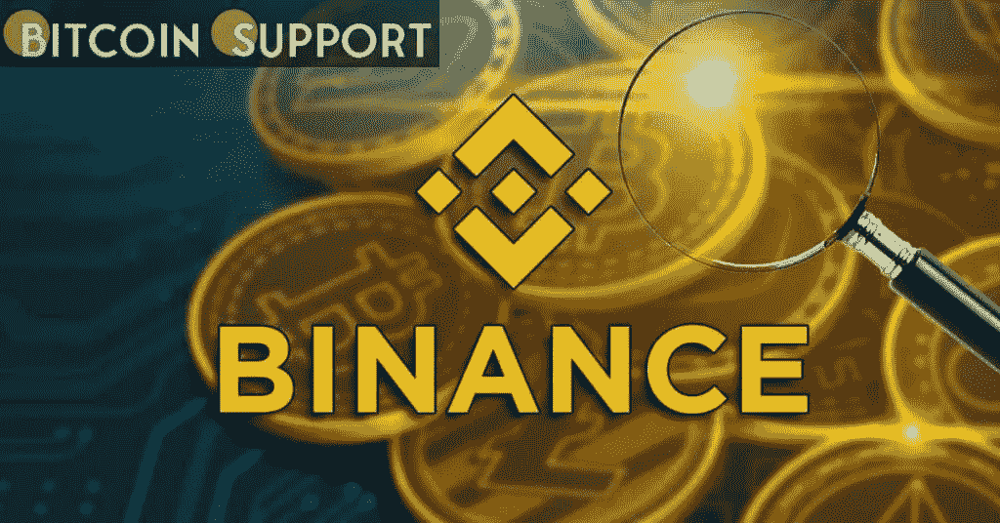

# 币安提供 10 万美元的柴犬代币赠品

> 原文：<https://medium.com/coinmonks/binance-is-offering-a-100-000-shiba-inu-token-giveaway-12bf5ecbe3e7?source=collection_archive---------30----------------------->

**Visit our website:-** [**https://bitcoinsupports.com/**](https://bitcoinsupports.com/)

毫无疑问，柴犬非常受欢迎。毫无疑问，SHIB 是社交媒体和其他平台上讨论最多的加密货币之一。它在 2021 年取得了惊人的成绩，而 token 以一系列合作和上市拉开了 2022 年的序幕。著名的加密货币交易所币安现在已经借助柴犬来推广其钱包。

交易所公布了两个涉及 SHIB 的广告方案。https://twitter.com/binance/status/1501109208116527104

[第一个优惠，在币安的网站上被称为“促销 A”，规定在 3 月 8 日上午 08:00 到 3 月 21 日晚上 11:59(UTC)之间，所有通过他们的推荐链接在币安注册的新客户都将获得一部分 8 万美元的柴犬代币！

第二个推广活动称为“推广 B”，要求参与者完成任务以赢得 SHIB 代金券。用户只要点击活动页面上的按钮，并在符合条件的 SHIB 现货交易对之间交易至少 1，000 USDT 等值货币，就有资格分享 20，000 美元的 SHIB 代币代金券奖金池。

**网站注明推广 B 的奖品计算如下:**

每个合格用户的奖品计算如下:(每个用户的总有效交易量/所有合格用户的总有效交易量)* 20000 美元 SHIB 代币代金券。

**条件**

只有在活动期结束前成功完成 KYC 并点击此页面按钮的用户才有资格获得奖品。柴犬(SHIB)现货交易对包括 ShibaUSDT、SHIB/BUSD 和 SHIB/道格。币安的奖励分配基于 0.00002591050344 的 SHIB/美元汇率。

促销 A 项下的欢迎红利将在有效注册时即时发放。

只有通过促销 A 获得的代币才可以交易。收到欢迎红利后，在所有现货、保证金和 BLVT 交易对的总交易量达到 50 USDT 等值之前，不能从账户中提取代币。

促销 B 奖励将在促销活动结束后两周内发放。

**访问我们的网站:-**](https://twitter.com/binance/status/1501109208116527104)[**https://bitcoinsupports.com/**](https://bitcoinsupports.com/)

**免责声明:以上为作者观点，不应视为投资建议。读者应该自己做研究。**