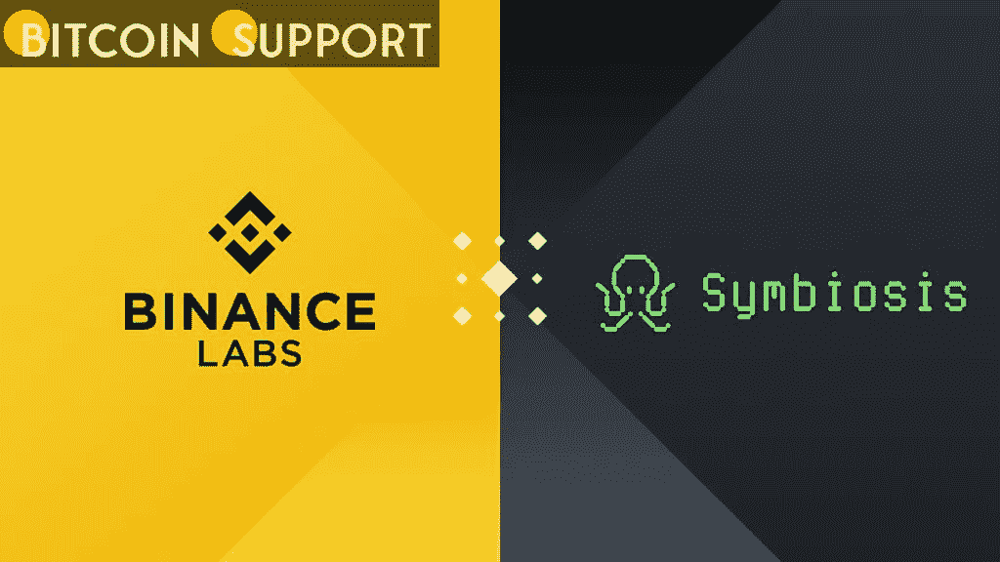

# 币安实验室在战略层面投资共生金融

> 原文：<https://medium.com/coinmonks/binance-labs-invests-in-symbiosis-finance-on-a-strategic-level-355a58884d2a?source=collection_archive---------52----------------------->

[**https://bitcoinsupports.com/**](https://bitcoinsupports.com/)

这笔投资将用于帮助共生金融在 Mainnet 启动前扩大和加强其团队，以确保获得众多区块链的支持。

**共生获得力量**
币安实验室，加密货币交易所的风险投资部门和创新孵化器，宣布了对多链流动性机制共生金融的最新战略投资。根据该团队的说法，币安实验室战略投资了共生金融，以实现多链流动性的未来。

***“共生金融是 crypto 多链未来的重要贡献者，我们很高兴能够支持共生金融，并与团队密切合作，构建我们的共同愿景，”币安实验室基金负责人 Bill Chin 指出。***

[**https://bitcoinsupports.com/**](https://bitcoinsupports.com/)

币安实验室今天宣布的新资金将用于帮助共生金融在 Mainnet 启动前发展和加强团队，使团队能够扩展和整合更多的 EVM 和非 EVM 网络，以及扩展和整合更多的钱包、服务和 dApps。币安实验室的 Jasmine Kong 在一份声明中说:“我们投资于有潜力提供更好的用户体验和塑造加密世界的创新，这就是我们决定支持共生的原因。”。

**什么是共生金融？**

共生金融是一种去中心化的多链流动性协议，用户只需点击一下，就可以进行跨链加密令牌交换。该协议现在支持四种网络:BNB 链(以前的 BSC)、以太坊、多边形和雪崩，在不久的将来还会增加更多的网络。共生金融打算引入共生 v.2 协议，该协议将包含侧链、跨链养殖、智能订单路由和统一 AMM 池。

***“想法很简单；我们努力向市场领导者学习，采纳他们的最佳实践，这是我们创造需求的方式。但更重要的是，我们不仅需要考虑短期需求，还需要制定长期战略并相应地制定解决方案。“我们很高兴与币安实验室建立战略合作伙伴关系，并成为其生态系统的一部分，”共生金融的联合创始人兼首席营销官尼克·阿夫拉莫夫说。***

共生金融在 10 月份筹集了种子资金，由 Blockchain.com 风险投资公司牵头。共生公司已经在连续几轮私人和公共融资中筹集了 1000 万美元。Amber Group、Algorand、Avalanche Asia Star Fund、蜻蜓、Wave Financial、BTC 公司、Injective Labs 和 Primitive Ventures 都是目前的支持者。

**访问我们的网站:-**[**https://bitcoinsupports.com/**](https://bitcoinsupports.com/)

**免责声明:这些都是作者的观点，不应被视为投资建议。读者应该做自己的研究。**

> 加入 Coinmonks [电报频道](https://t.me/coincodecap)和 [Youtube 频道](https://www.youtube.com/c/coinmonks/videos)了解密码交易和投资

# 此外，请阅读

*   [隐漏斗替代品](/coinmonks/cryptohopper-alternatives-d67287b16d27) | [HitBTC 审查](/coinmonks/hitbtc-review-c5143c5d53c2)
*   [CBET 评论](https://coincodecap.com/cbet-casino-review) | [库科宁 vs 比特币基地](https://coincodecap.com/kucoin-vs-coinbase)
*   [Fold App Review](https://coincodecap.com/fold-app-review)|[ku coin Trading Bot](/coinmonks/kucoin-trading-bot-automate-your-trades-8cf0ca2138e0)|[Probit Review](https://coincodecap.com/probit-review)
*   [如何匿名购买比特币](https://coincodecap.com/buy-bitcoin-anonymously) | [比特币现金钱包](https://coincodecap.com/bitcoin-cash-wallets)
*   [币安 vs FTX](https://coincodecap.com/binance-vs-ftx)|[Best(SOL)Solana 钱包](https://coincodecap.com/solana-wallets)
*   [Binomo Review](https://coincodecap.com/binomo-review)|[Stoic vs 3 commas vs trade Anta](https://coincodecap.com/stoic-vs-3commas-vs-tradesanta)
*   [Capital.com 评论](https://coincodecap.com/capital-com-review) | [香港密码借贷平台](https://coincodecap.com/crypto-lending-hong-kong)
*   [如何在 Uniswap 上交换密码？](https://coincodecap.com/swap-crypto-on-uniswap) | [A-Ads 审核](https://coincodecap.com/a-ads-review)