# 币安 NFT 刚刚提升了其 NFT 交易体验

> 原文：<https://medium.com/coinmonks/binance-nft-just-leveled-up-its-nft-trading-experience-bb84364d4f5?source=collection_archive---------28----------------------->

*币安 NFT:轻松交易&获得独家优惠*

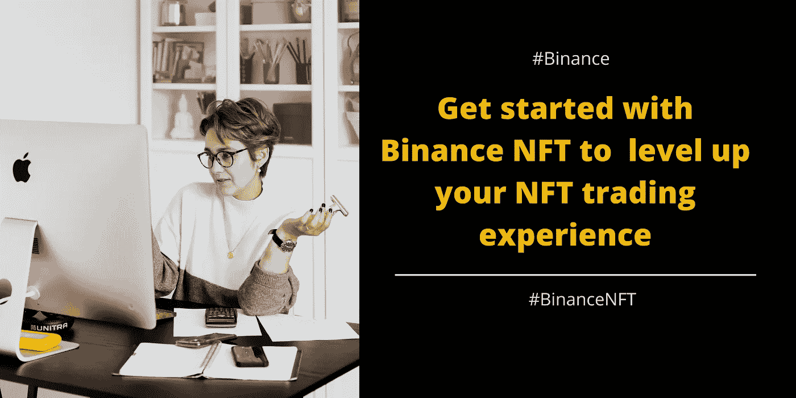

*[***轻松交易新增“报价”功能***](#f906) ***∘***[***增强过滤&搜索功能提升您的币安 NFT 用户体验***](#ab08) ***【∘***[***设置提醒不要错过神秘盒子推出 *∘****](#4dea) [***币安现在正式上币安 NFT*** ***∘***](#0a98)[***结论***](#023e)*

*不管你喜不喜欢，非功能性测试会一直存在。在你看来仅仅是无聊的猿猴和有趣的角色的图片就是网络 3 的定义。币安已经完全接受了非正规金融服务。除了成为世界上最大的加密货币交易所，其 NFT 空间也在快速增长。*

*我是说… *你刚刚看到币安·NFT 和 CR7 的新合作了吗？说到币安，绝对是“不成功便成仁”。**

*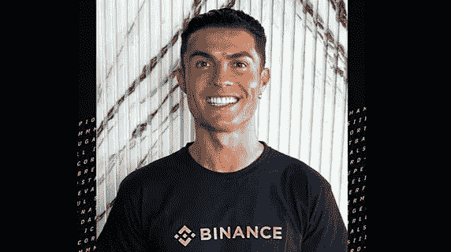*

*币安 NFT 总是热衷于改善其用户体验。事实上，他们已经开发了一些新的功能和改进，以改善用户的 NFT 交易体验。*

*让我们探索一下…*

## ***利用新的*出价*功能轻松交易***

*币安 NFT 的用户现在可以在 NFT 的列表上以一个固定的价格出价。该功能允许用户协商价格，卖家可以选择接受或拒绝报价。*

****作为买方报价:****

*I)转到您想要购买的特定 NFT，点击“*报价*”，如下所示。*

*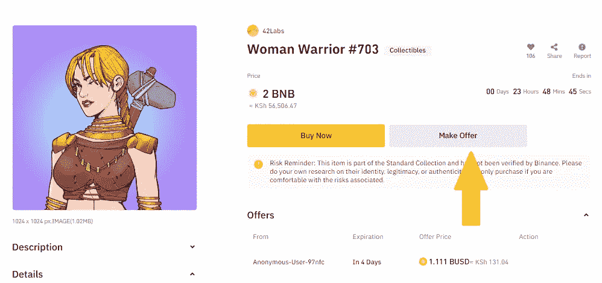*

*ii)若要继续，请设定您想要的价格，以及优惠预期到期的日期。然后点击“确认”下单。*

*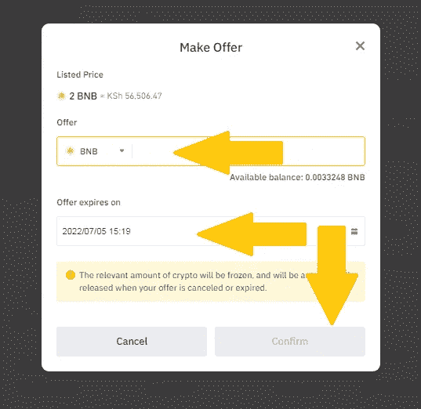*

****卖家可以接受/拒绝报价:****

*I)当任何买家对您的 NFT/神秘盒子出价时，您会在您的用户中心仪表板上收到通知。要查看收到的报价，请导航至“*个人资料*，然后导航至“*用户中心*”。点击“*优惠*，然后选择“*收到的优惠*”。*

*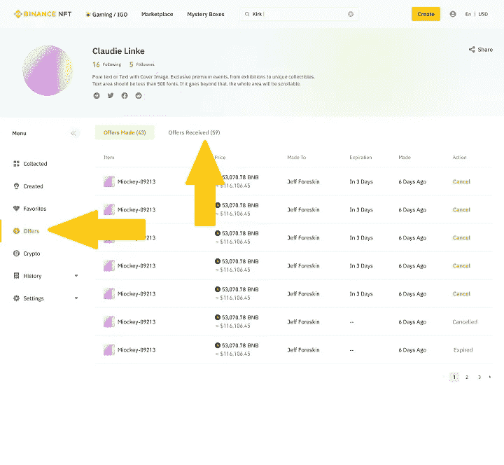*

***注意:**当你收到不同用户对同一件 NFT 物品的报价时，它们将按降序排列，从最高报价到最低报价。*

*ii)要接受报价，只需点击*“接受”*。你也可以拒绝一个提议。*

*iii)接受报价后，您会看到一个“*确认*的选项。*

*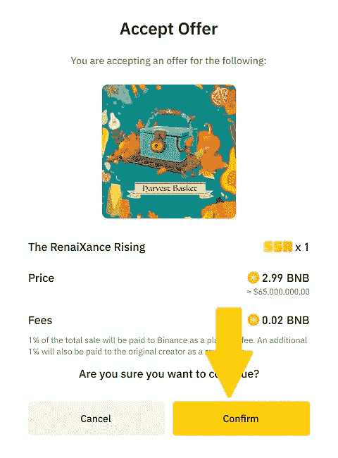*

**作为卖家，要跟踪您的订单，只需导航至用户中心，在“历史记录”下，点击“订单”,然后点击“购买历史记录”。**

## ***增强过滤&搜索功能，改善您的币安 NFT 用户体验***

*币安 NFT 市场现在有先进的过滤和搜索选项，使用户能够轻松地浏览各种 NFT 项目。通过“*稀有度狙击*”这样的选项，币安 NFT 的用户可以根据“*稀有度*”来识别 NFT 的项目。现在，通过搜索&过滤选项，你可以轻松登陆你想要的 NFT 项目登陆页面。*

*你可以在币安 NFT 市场的左侧找到最常用的过滤器选项。根据收藏、状态、货币、销售类型、文件类型和类别进行高级搜索。*

*例如，如果我要查找货币为“ *PixelSweeper* ”且价格至少为“ *Eth* ”的集合，我只需在左侧的导航选项卡中输入所有这些信息，如下所示。*

*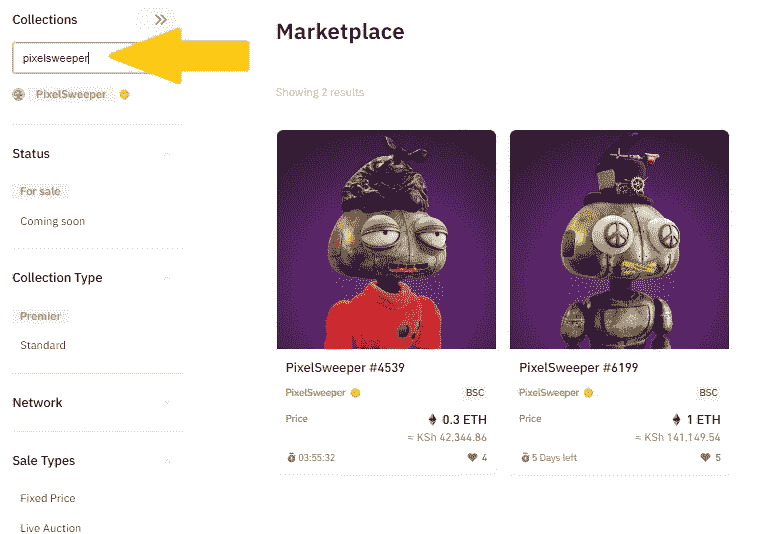**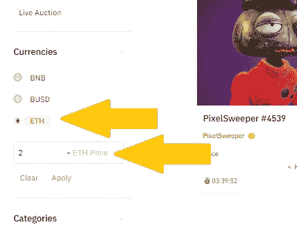*

*在左上角，您可以使用各种因素进行搜索，例如最近上市、即将结束、价格-价格-价格-价格-价格-价格-价格-价格和最喜爱的。*

*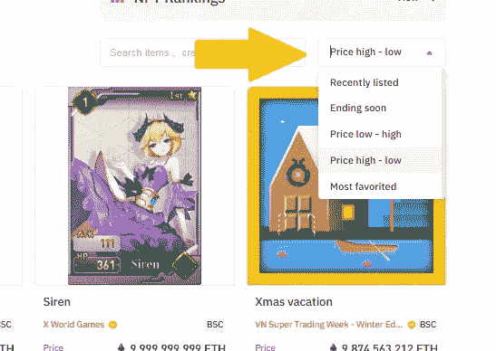*

*因此，所有这些搜索选项和过滤器节省您的时间和精力，以确定您想要的项目。*

## ***设置提醒，不要错过神秘盒子发布***

*说到神秘盒子的发布，准时就是一切。设置提醒将确保你不会错过最新的销售，也可以跟踪币安 NFT 即将推出的产品。*

*你可以订阅你想要的神秘盒子，在销售前 20 分钟你会收到通知。*

*要设置提醒，请导航到神秘盒子页面，并选择“*购买*”按钮旁边的时钟图标。*

*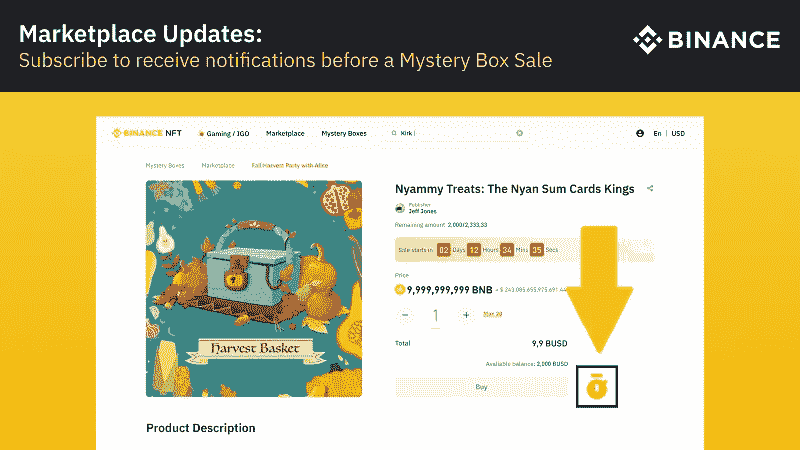*

## ***无密码购买体验***

*为了更好的用户体验，推出了无密码购买限额*(每笔)*以取代每日剩余购买限额。默认情况下，无密码购买限额为 500 BUSD，最高限额为 100，000 BUSD。*

*为了调整您的账户限额，请导航至*用户中心*，点击*设置*，然后点击*账户限额*。*

*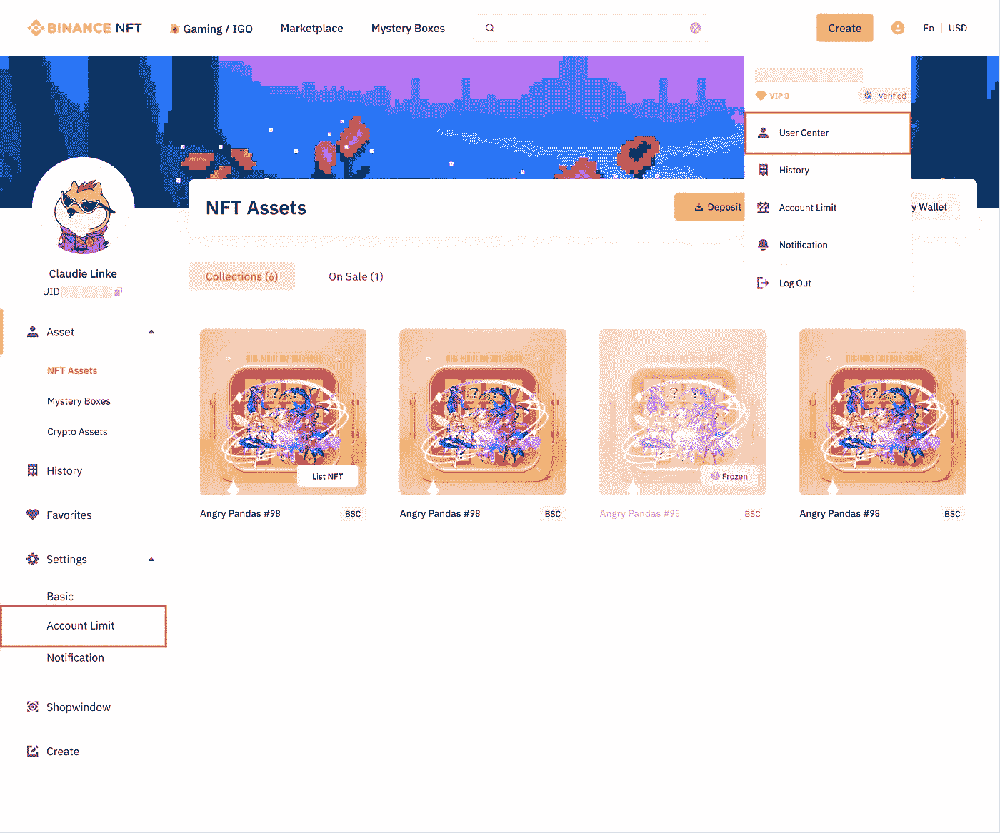*

****付销****

*有了新的“ *pay pin* ”功能，当购买价格超过无密码购买限额*(每笔交易)*时，用户可以最安全地完成交易。*

*因此，当用户购买的 NFT/神秘盒子的具体价格超过无密码购买限额时；用户需要输入他们的支付密码。*

*然而，已经注册的币安支付用户已经设置了他们的支付密码，不需要重复这个过程。*

*I)为了设置您的支付密码，请导航至*用户中心>设置>账户限额。*继续，然后点击“*设置支付密码*”。*

*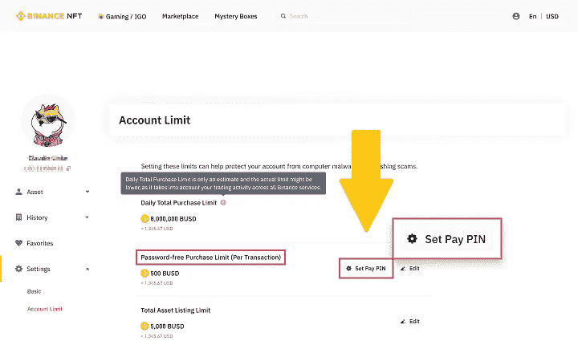*

*ii)您需要输入一个 6 位数的号码作为您的支付密码，然后单击确认。使用一组很难猜到的独特数字。*

*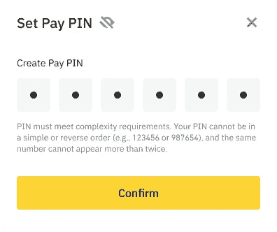*

*iii)完成您的双因素身份验证，然后单击继续以成功设置您的 pin。*

## ***币安现在正式在币安 NFT 支付***

*当用户用币安支付购买固定价格的 NFTs 和神秘盒子时，他们可以选择在支付时将他们的密码转换为购买 NFTs 所需的其他密码&免费。*

*然而，此功能仅适用于市场上有固定价格的 NFT &神秘盒子。*

****对固定价格进行支付***NFT 利用币安支付*

*I)确定您打算在币安市场上购买的 NFT，然后点击“*立即购买*”按钮。*

*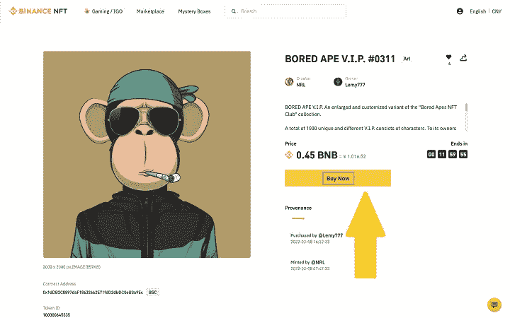*

*ii)您可以选择即期钱包或融资钱包来完成支付。然后你需要确认你的付款。*

*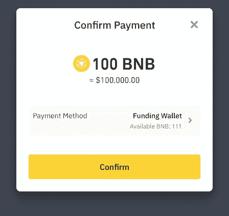*

*iii)以防您没有购买产品所需的密码，您可以选择转换您的现货或资金钱包中的密码来完成支付。为此，您只需勾选“*使用不同货币支付*”选项。*

*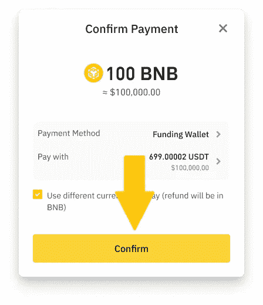*

*iv)如果您的钱包余额不足，您可以通过“*购买/存款*选项自由充值。*

*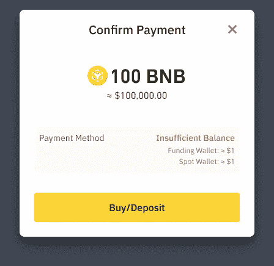*

## *结论*

*NFT 每天都在变大，如果你想开始你的 NFT 之旅，币安 NFT 可能是你最终的市场。除了拥有出色的用户体验，您还可以获得在其他市场无法获得的 NFT 独家交易。*

*币安是世界上最大的密码交易平台，没有比这更好的了。今天就开始吧。*

*[***在这里注册一个币安账户> >***](https://accounts.binance.com/en/register?ref=431277160)*

*[***访问币安 NFT 主页***](https://www.binance.com/en/nft/home?ref=431277160)*

*[***逛币安 NFT 市场***](https://www.binance.com/en/nft/marketplace?statusList=1&collection=1&order=list_time%40-1?ref=431277160)*

*[***NFT 币安神秘盒子入门***](https://www.binance.com/fr/nft/mystery-box?ref=431277160)*

*[***【币安入门】NFT 初始游戏娱乐城***](https://www.binance.com/en/nft/game-offering?ref=431277160)*

****关联披露:*** *本帖包含关联链接。如果您使用这些链接购买一些东西，我们可能会赚取佣金，对您没有额外的费用。感谢*。*

> *加入 Coinmonks [电报频道](https://t.me/coincodecap)和 [Youtube 频道](https://www.youtube.com/c/coinmonks/videos)了解加密交易和投资*

# *另外，阅读*

*   *[OKEx vs KuCoin](https://coincodecap.com/okex-kucoin) | [摄氏替代品](https://coincodecap.com/celsius-alternatives) | [如何购买 VeChain](https://coincodecap.com/buy-vechain)*
*   *[ProfitFarmers 点评](https://coincodecap.com/profitfarmers-review) | [如何使用 Cornix 交易机器人](https://coincodecap.com/cornix-trading-bot)*
*   *[如何匿名购买比特币](https://coincodecap.com/buy-bitcoin-anonymously) | [比特币现金钱包](https://coincodecap.com/bitcoin-cash-wallets)*
*   *[瓦济里克斯 NFT 评论](https://coincodecap.com/wazirx-nft-review)|[Bitsgap vs Pionex](https://coincodecap.com/bitsgap-vs-pionex)|[坦吉姆评论](https://coincodecap.com/tangem-wallet-review)*
*   *[如何使用 Solidity 在以太坊上创建 DApp？](https://coincodecap.com/create-a-dapp-on-ethereum-using-solidity)*