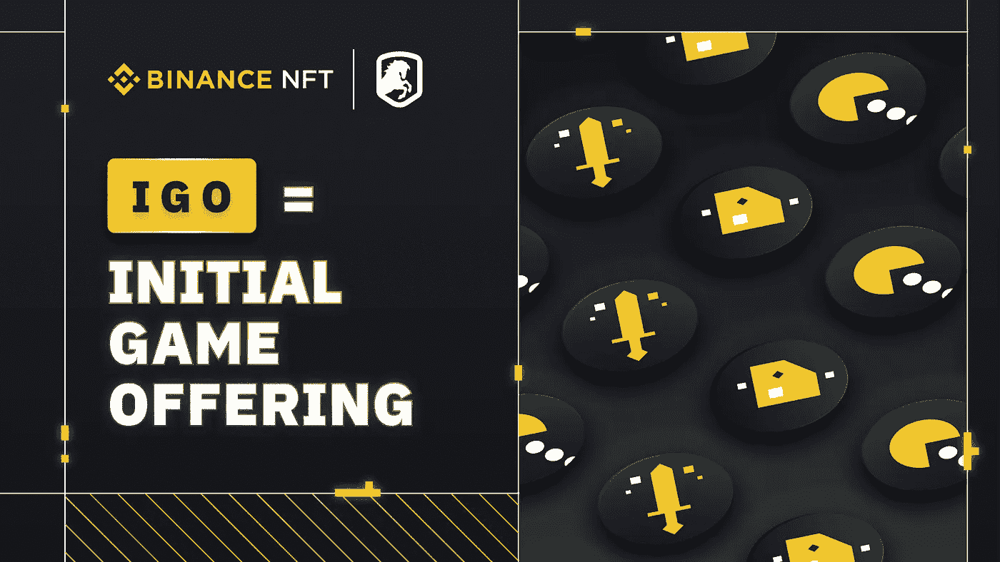
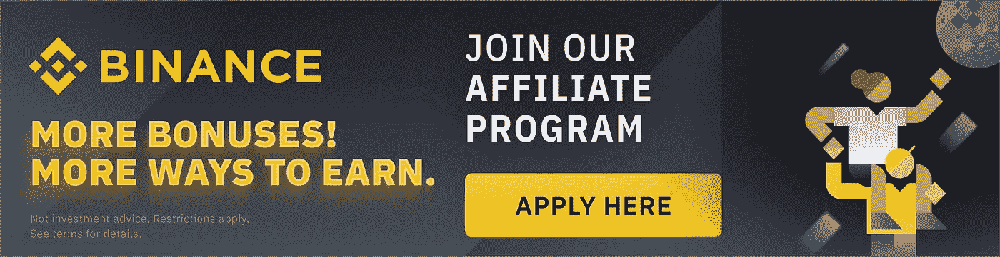

# 币安·NFT 发布 IGO:迎接下一代游戏

> 原文：<https://medium.com/coinmonks/binance-nft-launches-igo-welcoming-the-next-generation-of-gaming-bb161f70ea6e?source=collection_archive---------28----------------------->

币安·NFT 将于 10 月 26 日正式发布有史以来第一款 IGO 游戏。了解我们为 NFT 游戏和游戏玩家打造终极启动平台的最新计划。

# 主要要点

*   我们很高兴推出 IGO，即初始游戏产品的缩写，这是我们支持 NFT 游戏未来的全新计划。
*   IGO，或初始游戏产品，是 NFT 顶级游戏项目的核心游戏资产，仅在币安 NFT 提供。
*   IGO drops 将为游戏元宇宙提供基础，将高质量的区块链游戏和 NFT 资产连接到世界上最大和最有激情的加密社区。

游戏 NFT 已经迅速成为[币安 NFT](https://www.binance.com/en/nft) 的核心焦点。自 6 月份首次亮相以来，我们已经推出了 10 多个游戏 NFT 系列，广受欢迎和欢迎。这些藏品中的大多数在几秒钟内售罄，有些在二级市场上的价格高达最初价格的 23 倍。然而，新兴行业仍然年轻且不发达，游戏项目需要时间、资源和充满激情的社区来实现其全部潜力。

带着我们对不断发展的元宇宙游戏的热情，我们很高兴地宣布有史以来第一个 IGO 初始游戏产品-我们支持 NFT 游戏未来的全新计划。顶级游戏项目将被选中在 Binace NFT 上推出独家 NFT 系列，从早期准入证到游戏内资产。IGO 只是为 NFT 游戏和玩家打造终极发射台的第一步。

# 什么是 IGO？

IGOs，或初始游戏产品，是 NFT 收集的顶级游戏项目，仅在币安 NFT 提供。该系列可以通过拍卖、固定价格或神秘盒子推出。IGO 可以分几轮进行，每轮提供不同数量的资产，并采用分级价格结构。

IGO 纯粹是为了游戏，所有投放内容将由游戏中的资产组成，如早期访问通行证，武器和物品，独家币安化妆品和皮肤，等等！

# IGO 是如何工作的？

类似于我们的高级收藏，所有 IGO 都将有一个专门的登陆页面，这样用户可以彻底研究每一个掉落和游戏。事实上，你可以访问这些页面，就像访问币安·NFT 的每一次一样。在这些页面上，您可以找到游戏简介、开发路线图、游戏预览、待售 NFT 等信息。把这个项目的登陆页面想象成他们在币安的迷你游戏元宇宙。

# NFT 博彩的新家

尽管 NFT 游戏公司越来越受欢迎，占据了 NFT 超过 50%的交易量，但是这些项目中的许多都很难找到一个专门的中心来开发他们的游戏和社区。随着 Steam 最近禁止所有区块链、NFT 和加密游戏在他们的店面销售，区块链游戏领域缺乏一个成熟的游戏分发平台来建立一个蓬勃发展的粉丝群和社区。

币安 IGO drops 将为游戏元宇宙提供基础，将高质量的区块链游戏和 NFT 资产连接到世界上最大和最有激情的加密社区。此外，我们还希望增加币安智能链之外的游戏项目的曝光率和宣传力度。

# 以下是你对币安·NFT·伊苟斯的期待:

*   在游戏发布或正式公开发行之前，VIP 先睹为快加上独家提前访问 NFTs。
*   以较低的成本访问高级别 NFTs。我们的一些 IGO 产品也会以更低的价格卖给币安 NFT 的用户。

# 我如何参与？

*   如果你是币安用户，你可以在币安 NFT 上使用你钱包里的钱。如果你想了解如何充值在币安购买 NFT，请阅读我们的[分步指南。](https://accounts.binance.com/en/register?ref=-&utm_campaign=web_share_copy)

# 游戏项目如何向 IGO 申请？

*   如果您有兴趣在币安 NFT 推出 IGO 收藏，请 [**填写申请表**](https://accounts.binance.com/en/register?ref=-&utm_campaign=web_share_copy) 。如果您的提交成功并获得批准，币安 NFT 团队将审查并联系您。
*   币安 NFT IGO 是多链的；我们对所有区块链网络的任何高质量游戏项目都持开放态度。然而，与币安智能链的$1B 增长基金合作，最有价值的建设者(MVB)获奖者将有更高的机会被选中。

[JOIN NOW](https://accounts.binance.com/en/register?ref=-&utm_campaign=web_share_copy)

## [现在联合币安](https://accounts.binance.com/en/register?ref=-&utm_campaign=web_share_copy)

> *加入 Coinmonks* [*电报频道*](https://t.me/coincodecap) *和* [*Youtube 频道*](https://www.youtube.com/c/coinmonks/videos) *了解加密交易和投资*

# 另外，阅读

*   [Bookmap 点评](https://coincodecap.com/bookmap-review-2021-best-trading-software) | [美国 5 大最佳加密交易所](https://coincodecap.com/crypto-exchange-usa)
*   最佳加密[硬件钱包](/coinmonks/hardware-wallets-dfa1211730c6) | [Bitbns 评论](/coinmonks/bitbns-review-38256a07e161)
*   [新加坡十大最佳加密交易所](https://coincodecap.com/crypto-exchange-in-singapore) | [购买 AXS](https://coincodecap.com/buy-axs-token)
*   [红狗赌场评论](https://coincodecap.com/red-dog-casino-review) | [Swyftx 评论](https://coincodecap.com/swyftx-review) | [CoinGate 评论](https://coincodecap.com/coingate-review)
*   [投资印度的最佳密码](https://coincodecap.com/best-crypto-to-invest-in-india-in-2021)|[WazirX P2P](https://coincodecap.com/wazirx-p2p)|[Hi Dollar Review](https://coincodecap.com/hi-dollar-review)
*   [加拿大最佳加密交易机器人](https://coincodecap.com/5-best-crypto-trading-bots-in-canada) | [库币评论](https://coincodecap.com/kucoin-review)