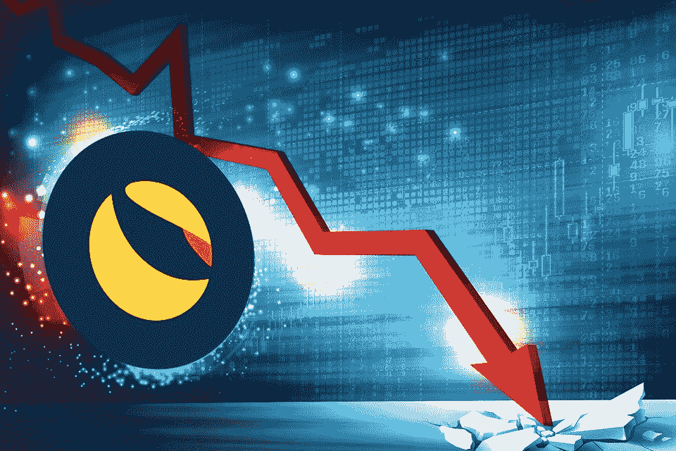

# 币安拥有价值 16 亿美元的 LUNA，现在只值 3000 美元

> 原文：<https://medium.com/coinmonks/binance-owned-1-6-billion-worth-of-luna-which-is-now-worth-only-3-000-8de20ac4df88?source=collection_archive---------15----------------------->

赵昌鹏介绍了币安在 Terra 投资的最新情况。在达到 16 亿美元后，他们现在只值 3000 美元。但他宣布，平台在跑马圈地中获得的利润将重新分配给受案件伤害的人。

# 币安在 LUNA 上损失 16 亿美元