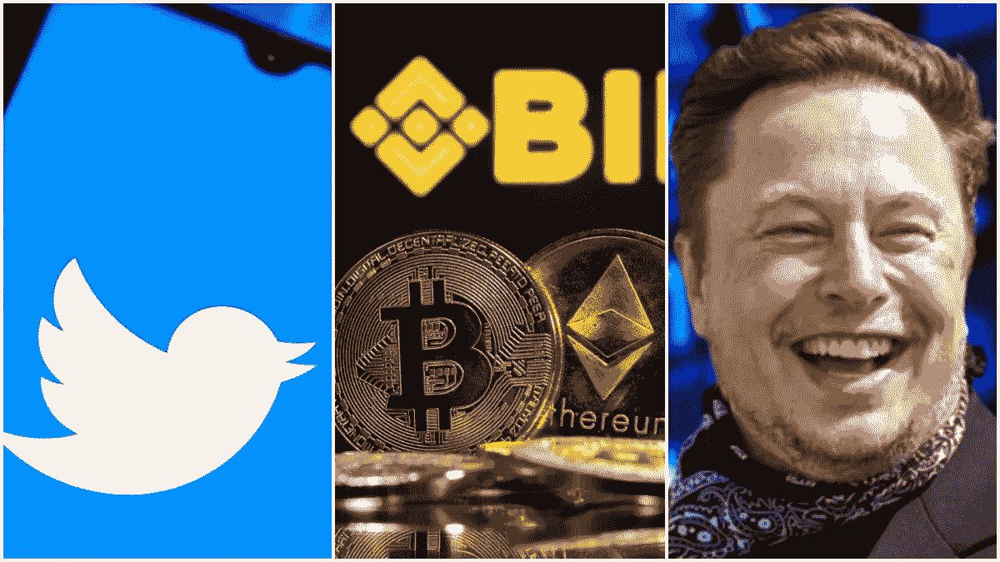

# 币安承诺支持埃隆·马斯克收购 Twitter

> 原文：<https://medium.com/coinmonks/binance-pledges-support-for-elon-musks-twitter-acquisition-30acae279d9a?source=collection_archive---------64----------------------->

“他在领导，我们在跟随，”全球最大的加密货币交易所的首席执行官在最近的彭博采访中表示。这将是世界上最大的采购之一。

主持人问为什么 CZ 仍然如此致力于 Twitter 的交易，而马斯克本人却没有表现出任何兴趣以商定的价格购买该平台，因为在日常用户群中，机器人和假冒用户的比例可能很高。

CZ 表示，埃隆马斯克的出价支持者只是跟随他的领导，并准备继续进行所需的资金，或者如果马斯克取消交易，就撤回他们。

埃隆马斯克收购 Twitter 并不是与这位币安首席执行官讨论的唯一话题。CZ 还被问及最近的市场行为，其中大多数数字资产平均损失了 15%至 30%的价值。

赵告诉主持人，他并不感到惊讶，加密货币市场表现“正常”，因为波动性一直是市场上平均数字资产的一部分。回到 2018 年，加密货币市场损失了近 90%的资本，大部分资产从市场上蒸发，再也没有出现过。

2022 年，在借贷市场流动性暴跌后，DeFi 行业面临价值数十亿美元的清算，是最大的输家之一。

今年的加密市场抛售是由连续两个极端负面事件引起的:Terra 的 UST 和卢纳灾难以及意外高通胀数据，这些事件导致资金从加密货币和股票等风险资产中大量流出。

关注我们了解更多故事[点击这里](http://t.me/etellworld)

> 加入 Coinmonks [电报频道](https://t.me/coincodecap)和 [Youtube 频道](https://www.youtube.com/c/coinmonks/videos)了解加密交易和投资

# 另外，阅读

*   [如何匿名购买比特币](https://coincodecap.com/buy-bitcoin-anonymously) | [比特币现金钱包](https://coincodecap.com/bitcoin-cash-wallets)
*   [币安 vs FTX](https://coincodecap.com/binance-vs-ftx) | [最佳(SOL)索拉纳钱包](https://coincodecap.com/solana-wallets)
*   [比诺莫评论](https://coincodecap.com/binomo-review) | [斯多葛派 vs 3Commas vs TradeSanta](https://coincodecap.com/stoic-vs-3commas-vs-tradesanta)
*   [Capital.com 审查](https://coincodecap.com/capital-com-review) | [港加密借贷平台](https://coincodecap.com/crypto-lending-hong-kong)
*   [如何在 Uniswap 上交换加密？](https://coincodecap.com/swap-crypto-on-uniswap) | [A-Ads 审核](https://coincodecap.com/a-ads-review)