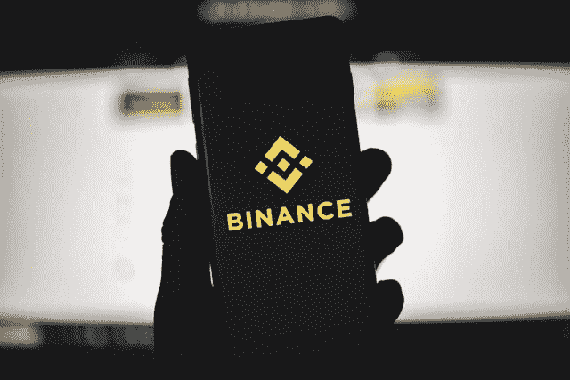

# 价值 10 亿美元的币安用户安全资产基金！

> 原文：<https://medium.com/coinmonks/binance-secure-asset-fund-for-users-valued-at-1-billion-5f7e2ce6e1b8?source=collection_archive---------7----------------------->

币安刚刚宣布其安全基金现在价值超过 10 亿美元。这笔钱**以比特币(BTC)** 的形式存储在两个不同的钱包里，只有在平台发生大规模黑客攻击或盗窃时才会使用。

Does Binance’s security fund now totals $ 1 billion ?

## 10 亿美元来保护币安用户