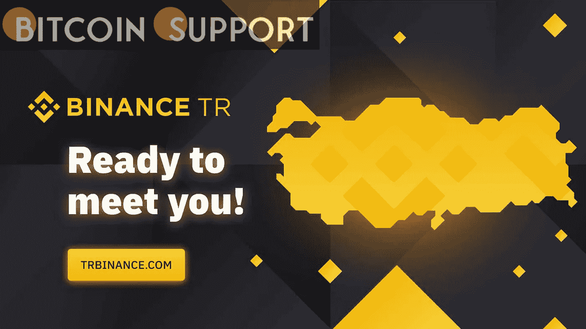

# 针对欺骗性广告牌广告，币安 TR 在土耳其采取了法律行动

> 原文：<https://medium.com/coinmonks/binance-tr-takes-legal-action-in-turkey-over-false-billboard-ads-ba8158ef8421?source=collection_archive---------27----------------------->

**For full blog visit:-**[**https://bitcoinsupports.com/binance-takes-legal-action-in-turkey-over-false-billboard-ads/**](https://bitcoinsupports.com/binance-takes-legal-action-in-turkey-over-false-billboard-ads/)

有人看到土耳其的骗子租用多个广告牌出售假冒的币安主题的机会，试图从币安在土耳其的受欢迎程度中获利。币安加密货币交易所的土耳其分公司币安 TR 向该地区的投资者发出警告，称正在进行的骗局涉及假冒币安品牌的广告牌和广告牌。根据 Similarweb 的数据，土耳其是大量加密投资者的家园，约占币安桌面浏览器主平台总流量的 7%。有人看到土耳其的骗子租用多个广告牌出售假冒的币安主题的机会，试图从币安在土耳其的受欢迎程度中获利。

[https://Twitter . com/币安 _ Turkish/status/1523393524393459712](https://twitter.com/Binance_Turkish/status/1523393524393459712)

来自币安土耳其的最新预警显示一个广告牌广告“币安旅游交流”，与实际的币安无关，由赵昌鹏创作。该广告还包含一些电话号码，一旦拨打，潜在受害者就会被引向骗子。以下是该警告的大致翻译:

**“类似下图的广告牌在土耳其各地醒目了一段时间与#币安无关！”**

鉴于出租广告牌和发布针对秘密投资者的欺诈性广告的责任人很容易被追踪到，币安已宣布打算采取攻势，对那些“明显参与欺诈活动”的人采取法律行动当粗心的投资者拨打虚假的联系电话时，他们经常会遇到一个冒充币安的骗子。人们已经看到骗子引导投资者开设新账户或传播现有的种子词，最终目的是以加密资产的形式窃取资金。上个月，也就是 4 月 15 日，币安在土耳其开设了第一个 24/7 全天候客户支持中心，因为它计划将这项服务扩展到全球。如前所述，币安在土耳其设立了客户支持部门，主要目的是在欺诈事件发生前主动减轻其影响。

认为自己被骗的投资者可以通过官方途径联系币安官方客服，如网站或手机应用。由于土耳其投资者对加密货币的兴趣很高，著名的加密交易所比特币基地显然正在考虑以 32 亿美元的价格收购当地的加密交易所 BtcTurk。两家加密交易所显然已经签署了一份交易单。然而，该协议仍有待官方确认。作为该公司正在进行的全球扩张的一部分，比特币基地还在土耳其发布了一个国家总监的职位空缺，该职位可以“在支持主要的监管/政策工作中发挥关键作用，并随后确保比特币基地的运营完全符合适用的当地监管要求”。

**完整博客访问:-**[**https://bitcoinsupports . com/币安-takes-legal-action-in-turkey-over-false-billboard-ads/**](https://bitcoinsupports.com/binance-takes-legal-action-in-turkey-over-false-billboard-ads/)

**免责声明:以上为作者观点，不应视为投资建议。读者应该自己做研究。**

> 加入 Coinmonks [电报频道](https://t.me/coincodecap)和 [Youtube 频道](https://www.youtube.com/c/coinmonks/videos)了解加密交易和投资

# 另外，阅读

*   [印度最佳 P2P 加密交易所](https://coincodecap.com/p2p-crypto-exchanges-in-india) | [柴犬钱包](https://coincodecap.com/baby-shiba-inu-wallets)
*   [8 大加密附属计划](https://coincodecap.com/crypto-affiliate-programs) | [eToro vs 比特币基地](https://coincodecap.com/etoro-vs-coinbase)
*   [最佳以太坊钱包](https://coincodecap.com/best-ethereum-wallets) | [电报上的加密货币机器人](https://coincodecap.com/telegram-crypto-bots)
*   [交易杠杆代币的最佳交易所](https://coincodecap.com/leveraged-token-exchanges) | [购买 Floki](https://coincodecap.com/buy-floki-inu-token)
*   [3Commas 对 Pionex 对 Cryptohopper](https://coincodecap.com/3commas-vs-pionex-vs-cryptohopper) | [Bingbon 评论](https://coincodecap.com/bingbon-review)