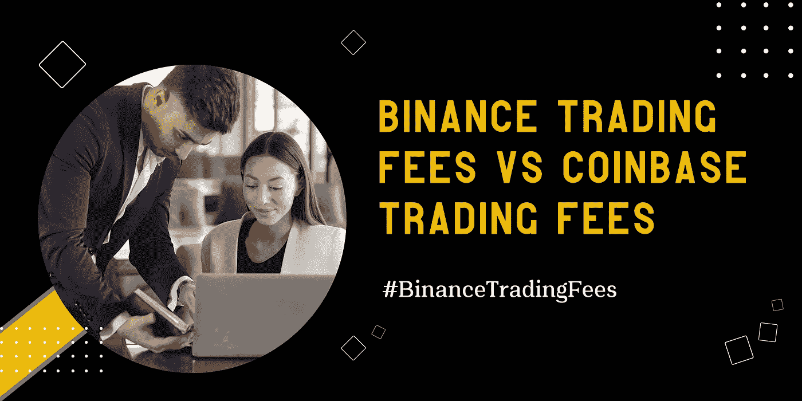
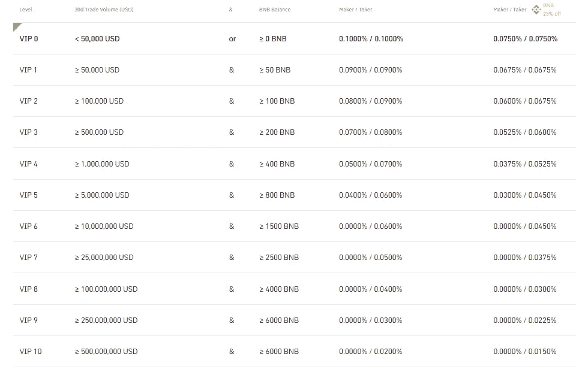
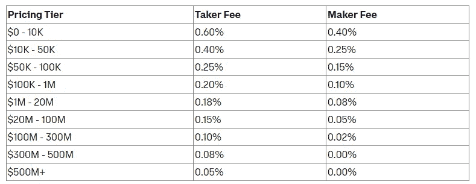

# 币安交易费 vs 比特币基地交易费

> 原文：<https://medium.com/coinmonks/binance-trading-fees-vs-coinbase-trading-fees-8df7db0fb7e7?source=collection_archive---------16----------------------->

交易费用。要是我们能避开它们就好了。这是我们为维持币安这样的经纪人/交易所完成交易而支付的费用。

把交易费想象成你每天的交易费。他们只是不得不招致。

**目录**

*[***币安交易费***](#4b75) ***∘***[***coin base 交易费***](#dd7a) ***∘***[***什么是滑点率？***](#34fd) ***∘***[***币安忠诚奖励计划(VIP 计划)***](#99d0) ***∘***[***结论***](#1e31)*

## *币安交易费*

*币安是加密货币交易所中交易费用最低的。*

*您在币安的交易费用将由您 30 天内的交易量和您账户中的 BNB 余额决定。*

*作为一个比南西亚人，拥有一些 BNB 意味着你的交易费减少 25%。因此，如果你交易活跃，并持有一些 BNB，你应该期待一些相当低的费用。*

*币安通常收取 0.1%的现货交易费和 0.5%的买卖加密费。*

****这里的币安手续费结构是根据 30 天的交易量和 BNB 余额> >****

**

## *比特币基地交易费*

*比特币基地根据做市商/接受者费用模型确定交易费用。这将取决于订单是提供流动性还是接受流动性。*

*因此，当一个人下了订单，订单马上就完成了，他们就被认为是接受者。*

*接受者将支付 0.05%到 0.60%的费用。*

*或者，当一个人下了一个订单，而它与任何订单都不匹配时，该订单将被记录在订单簿中。因此，当一个新客户下了一个与你相符的订单时，你就被视为一个创造者。*

**制造商将支付 0.00%至 0.40%的费用**

****这是比特币基地根据定价的收费结构****

**

## *什么是滑移率？*

*当交易结算的价格与最初要求的价格不同时，滑点就出现了。滑点大多发生在高波动但流动性低的市场。*

**进一步阐述；**

*当一个人创建市场订单时，交易所立即匹配您的订单，以限制订单簿上的订单数量。*

*本质上，订单簿会尽最大努力为您匹配最优惠的价格。然而，如果你的具体价格数量不足，你的订单可能会在订单链中被推高。*

*这通常会导致市场以不同的价格完成你的订单。*

*滑点不一定是坏的。事实上，如果你买入时价格下降，卖出时价格上升，这可能对你有好处。因此，这被称为*正滑动。**

*通过像币安智能链、Pancakeswap 和以太坊的 Uniswap 这样的平台，用户可以设置滑点容差水平。*

## *币安忠诚度奖励计划(VIP 计划)*

*币安在奖励方面做得很好，而 VIP 计划恰好是其顶级奖励计划之一。*

*在 VIP 计划中，币安为其高交易量交易者提供独特的福利，以增加他们的收入。*

*为了加入专属的币安 VIP 计划，交易者的钱包中必须有 500 英镑，现货交易的 30 天交易量为 50BTC，期货交易的 30 天交易量至少为 250BTC。*

****加入 VIP 计划有以下好处:****

*   *对 10，000 美元及以上订单的场外(OTC)独家支持*
*   *交易保证金借款利率提高*
*   *具有专门开发人员支持的币安 API*
*   *贵宾专属子账户服务*
*   *来自 VIP 客户经理的一对一支持*
*   *庆祝特殊场合的礼物和商品*
*   *与币安团队和合作伙伴的独家年度贵宾晚宴*
*   *面向合格 VIP 合作伙伴的做市商计划*

*如果你是一个高交易量的交易者，币安 VIP 计划可以帮你大幅降低交易费用。*

*[***今日加入币安> >***](https://accounts.binance.com/en/register?ref=431277160)*

*为了加入币安 VIP 计划，交易者必须向 vip@binance.com 发送电子邮件*

****币安零交易费推广至所有美元稳定币交易对****

***促销期:**2022–02–21 上午 00:00—2022–06–30 上午 00:00(协调世界时)*

*币安刚刚将零交易费的优惠扩大到所有 T21 稳定的货币交易对。这是为了增加 U S *D 交易对的流动性，为用户带来更好的交易体验。**

*如果你还没有加入币安的行列，这将是抓住机会的时候，因为你几乎没有美元交易费。*

*[***在此了解更多> >***](https://www.binance.com/en/support/announcement/70c3376388a74afca081798de12df349?ref=431277160)*

## *结论*

*币安仍然是最好的加密交易平台，拥有优质的服务和极低的交易费用。*

*如果你是一个交易者，正在寻找一个交易费用对用户友好的交易所，不言而喻，币安应该是你的首选。*

*[***从这里开始> >***](https://accounts.binance.com/en/register?ref=431277160)*

****关联披露:*** *本帖包含关联链接。如果您使用这些链接购买一些东西，我们可能会赚取佣金，对您没有额外的费用。感谢*。*