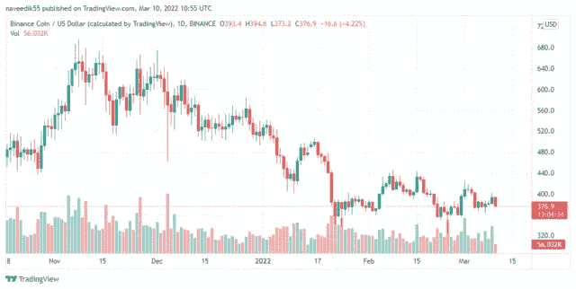

# 币安希望将加密产业的边界扩展到非加密业务

> 原文：<https://medium.com/coinmonks/binance-wants-to-expand-the-crypto-industrys-boundaries-to-non-crypto-businesses-4050f0a9289c?source=collection_archive---------68----------------------->

**Visit our website:-** [**https://bitcoinsupports.com/**](https://bitcoinsupports.com/)

全球最大的加密货币交易所的创始人兼首席执行官赵在接受英国《金融时报》采访时表示，该交易所打算投资非加密公司，以扩大加密领域的主流。

C.Z .补充；

***我们希望在每个经济领域中确定并投资一两个目标，并尝试将其纳入 crypto。因此，这个战略是要让密码产业变得更大。币安获得了美国杂志《福布斯》2 亿美元的股份，该杂志将在纽约证券交易所上市。大约一年前，这家大型交易所对《福布斯》提起诉讼，此后成为该出版商的两大股东之一。

《福布斯》CEO 迈克·弗德勒(Mike Ferdele)在投资时评论；

***随着币安对福布斯的投资，我们现在拥有了世界领先的密码交易所的经验、网络和资源，以及世界上最成功的区块链创新者之一。***

同样，世界上交易量最大的交易所是投资加密货币。它开发了自己的“法定到加密”支付机制 Bifinity，以帮助商家做好加密准备。它刚刚借给 eq onex 3600 万美元，这笔钱可以转化为所有权份额。Eqonex 是一个公开交易的数字资产平台，也是 Digivault 的母公司，去年首次获得金融行为管理局的监管批准。***

**Visit our website:-** [**https://bitcoinsupports.com/**](https://bitcoinsupports.com/)

**FCA vs 币安**

币安最近与 Paysafe 达成合作，以获得英国更快的支付服务，该服务使企业和个人能够在支付服务提供商之间快速转移支付。随后，FCA 对大规模交易发出警告，称一个加密平台已经接入了该国的主要支付网络。然而，官员们承认，尽管他们反对这类定居点的“权力有限”，但他们“对币安的担忧依然存在”

FCA 宣布回应 Bifinity 出借 Eqonex 的决定；

***Eqonex Limited 是 Digivault Limited 的母公司，digi vault Limited 是 FCA 根据洗钱条例(MLRs)注册的加密资产业务之一。作为交易的结果，币安集团的个人和实体可能成为 MLRs 中 Digivault 的受益所有人。***

FCA 在一篇官方博客文章中指出，他们的担忧将持续下去，直到与币安市场有限公司的任何未决问题被确定。它涵盖了去年监管函中被点名的所有与密码相关的企业。这意味着加密实体将被要求遵守制裁。

在前一年的打击行动中，监管机构数次将目标对准大型加密货币交易所币安。因此，据《金融时报》报道，该公司目前在英国雇佣了 70 名员工，其中大部分负责监管事务。

**访问我们的网站:-**[【https://bitcoinsupports.com/】T21](https://bitcoinsupports.com/)

**免责声明:以上为作者观点，不应视为投资建议。读者应该自己做研究。**