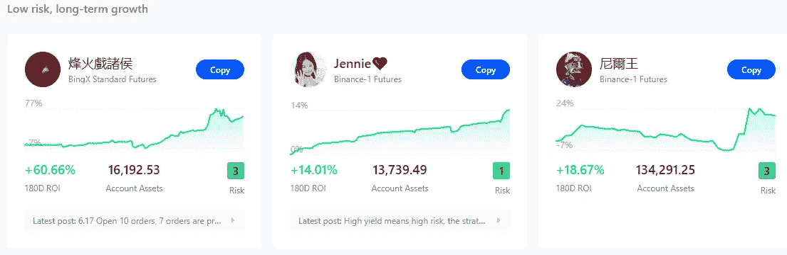
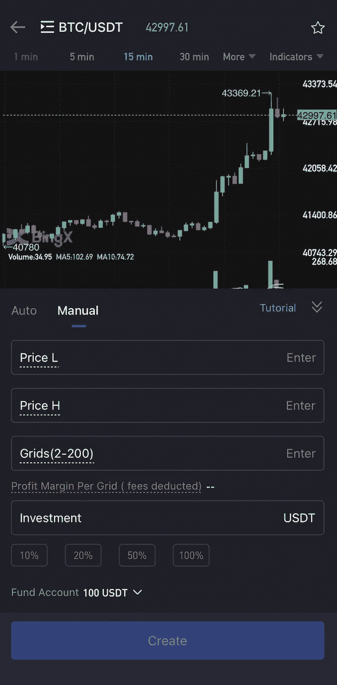
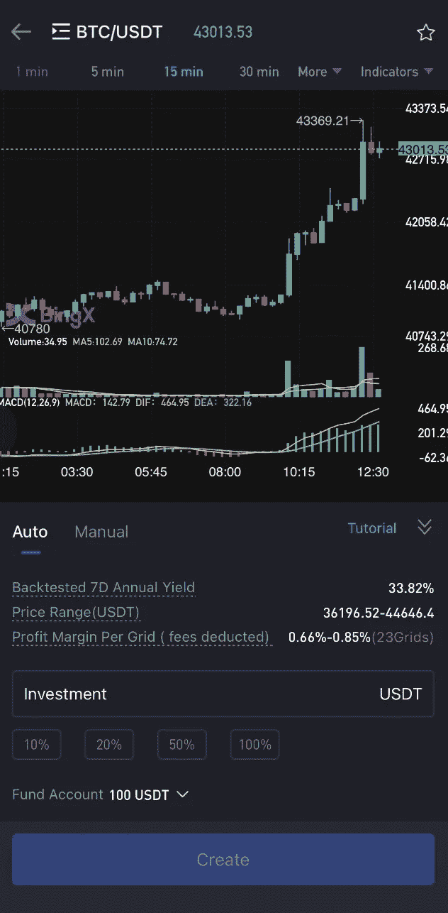
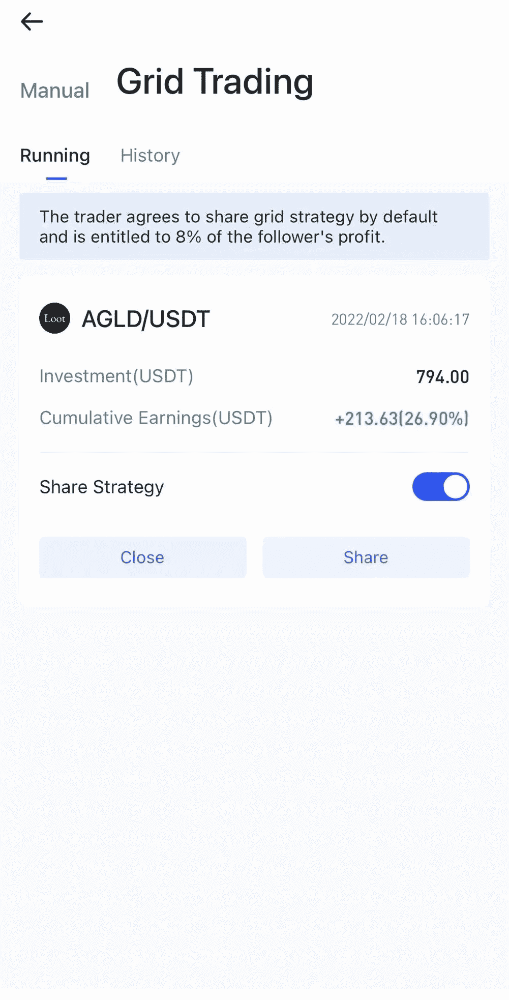
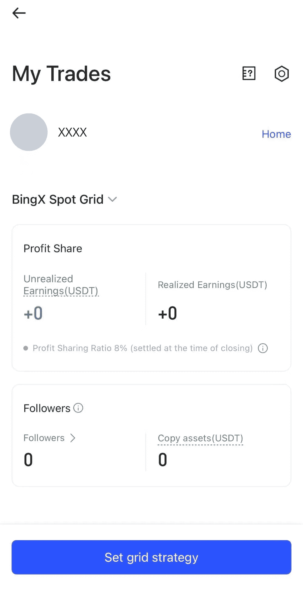

# BingX 推出新的现货网格复制交易系统

> 原文：<https://medium.com/coinmonks/bingx-launches-a-new-spot-grid-copy-trading-system-9248eda87efe?source=collection_archive---------18----------------------->

任何人都可以使用现货网格复制交易来执行一致的交易策略。

B [最大的加密社交交易平台 ingX](https://bingx.com/invite/HAWVNY) 在其平台上增加了新的现货网格副本交易工具，为用户提供了无与伦比的灵活性。

# 什么是现货网格复制交易，它是如何工作的？

顾名思义，这种策略结合了网格和复制交易的优势，利用专业交易者的策略从加密资产波动中获利。网格交易的工作方式类似于为 AMM dex 提供流动性，因为它在预定义的价格范围内建立渐进的买卖订单。只要价格在区间内波动，用户就能从价格变化中可靠地获利。

专业交易者制定策略，然后由[宾克斯](https://bingx.com/invite/HAWVNY)审查。该计划的发明者将获得追随者收入的 8%,激励他们尽可能提高效率和生产力。用户可以从各种方法中进行选择，这些方法可以根据投资额、过去的回报、预期年化回报和其他因素进行比较。

[BingX](https://bingx.com/invite/HAWVNY) 提供一款名为现货网格模仿交易的产品，允许普通投资者复制交易者的现货网格策略，参与现货市场套利。

他们鼓励成功的现货交易用户寻求交易者身份，以便他们可以通过现货网格副本交易协助其他用户套利并赚取佣金，从而实现双赢。

> 现货网格副本交易对新的加密用户非常有用，因为它很容易建立和忘记。在一个像 2022 年初这样的平幅市场中，稳定的收入可能是极其重要的。

“我们非常高兴地宣布推出我们的现货电网拷贝交易功能。我们承诺在 2022 年为我们的用户提供新的尖端功能，我们正在兑现这一承诺。在一个创新空前高涨的行业，BingX 通过创新保持竞争力的能力至关重要。我们的产品和营销团队一直在幕后努力工作，为交易者提供更大的价值，现货交易领域是重点。我们还认识到，成为该领域的先行者有许多好处，我们打算充分利用这些好处。用户应该关注更多的现货交易对，以及其他新颖的 BingX 产品。”——Elvisco， [BingX](https://bingx.com/invite/HAWVNY) 公关&传播总监。

> 超过 300 种现货加密货币已经在 BingX 上市，包括 Ape Coin、Chainlink、Shakita、STAKE、CVX 和 IDEX，并计划改善客户的现货投资体验。

# **BingX 交易员指南**

加入交易者俱乐部，尝试一些新功能。

1.手动或使用系统默认策略，创建新的网格交易策略。

注意:该算法将根据网格规格建议策略的最小投资。

2.默认情况下，交易者同意分享网格策略，并有权获得追随者所获利润的 8%。

3.当跟随者关闭复制的网格订单时，利润分成将被结算。要监控你的赢款，进入“股票交易”，15 分钟后，该策略将不再出现在现货网格列表中。

4.披露你用网格法赚了多少钱。

使用 Feed 和其他社交媒体积极交流你的交易方法，可以帮助你赢得更多的关注者。

5.如何才能[加入](https://bingx.com/invite/HAWVNY)现货网格列表？

100 USDT 投资
现货电网策略的年化收益率为 0
该策略必须持续一天以上。

## **跟随器指南**

 [## 现货网格复制交易

### 什么是现货网格复制交易？现货网格副本交易是 BingX 提供的一个功能，允许追随者(普通…

support.bingx.com](https://support.bingx.com/hc/en-001/articles/5042418864665-Spot-Grid-Copy-Trading-) 

# 关于 BINGX

BingX 是一个全球性的数字资产、现货和衍生品交易平台，提供了一个以用户为中心的开放生态系统，具有简单的社交交易功能。它成立于 2018 年。 [BingX](https://bingx.com/invite/HAWVNY) 是一个安全、可靠、用户友好的平台，供用户交易他们喜欢的资产。它的创建是为了让整个加密货币行业受益。

 [## BingX 评论:获得 150 美元的奖励

### BingX 是不是最好的密码社交交易平台？

medium.com](/coinmonks/bingx-review-grab-150-in-rewards-92aff4169cce) 

> 加入 Coinmonks [电报频道](https://t.me/coincodecap)和 [Youtube 频道](https://www.youtube.com/c/coinmonks/videos)了解加密交易和投资

# 另外，阅读

*   [BigONE 交易所评论](/coinmonks/bigone-exchange-review-64705d85a1d4) | [电网交易机器人](https://coincodecap.com/grid-trading)
*   [氹欞侊贸易评论](https://coincodecap.com/anny-trade-review) | [CoinSpot 评论](https://coincodecap.com/coinspot-review)
*   [新加坡十大最佳加密交易所](https://coincodecap.com/crypto-exchange-in-singapore) | [购买 AXS](https://coincodecap.com/buy-axs-token)
*   [投资印度的最佳加密软件](https://coincodecap.com/best-crypto-to-invest-in-india-in-2021) | [WazirX P2P](https://coincodecap.com/wazirx-p2p)
*   [西班牙 5 大最佳文案交易平台](https://coincodecap.com/copy-trading-spain)
*   [Pionex 双投](https://coincodecap.com/pionex-dual-investment) | [AdvCash 审核](https://coincodecap.com/advcash-review) | [支持审核](https://coincodecap.com/uphold-review)