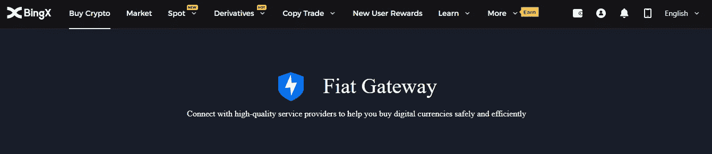
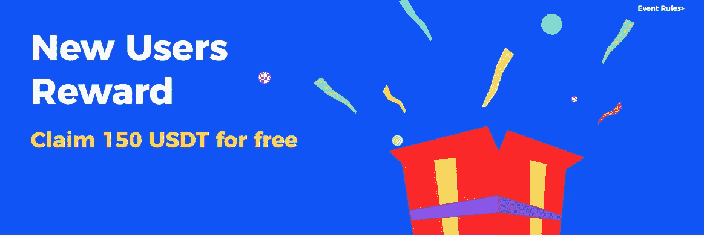
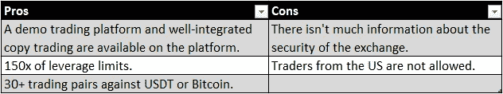

# BingX 评论:获得 150 美元的奖励

> 原文：<https://medium.com/coinmonks/bingx-review-grab-150-in-rewards-92aff4169cce?source=collection_archive---------5----------------------->

## BingX 是不是最好的密码社交交易平台？

# BingX 是什么？

[BingX](https://bingx.com/invite/HAWVNY)——社交交易网络——是一家提供加密货币现货和衍生品交易的加密货币交易所。2018 年，该平台进入加密货币行业。此外，作为一个加密社交交易网络， [BingX](https://bingx.com/invite/HAWVNY) exchange 致力于为用户提供加密货币交易理念，并保证用户以简单、吸引人和透明的方式进行交易。该平台还提供商品、全球指数、货币、自动复制交易功能和其他合约交易项目。

# BingX 有什么好处？

New Users Rewards : Claim 150 USDT for Free! BingX

[BingX](https://bingx.com/invite/HAWVNY) 加密交易平台提供超过 **30 个加密交易对**，接受 USDT 或 BTC 作为抵押品。

用户可以利用该平台与专业交易者互动，了解新的投资理念。

该平台是为数不多的为其交易员提供**自动副本交易的平台。**

> **新用户奖励——免费申领 150 USDT**

交易者可以通过扫描二维码直接从网站下载该应用程序，或者通过 [Playstore](https://bingx.com/invite/HAWVNY) 或 [App Store](https://bingx.com/invite/HAWVNY) 下载，因为它兼容 Android 和 iOS。

> 该网站不收取存放加密货币的押金。
> 该平台提供多种支付选项，包括加密货币、Apple Pay、MoonPay、Banxa 和借记卡或信用卡

# BingX 怎么入门？

1.  要开始您与 [BingX](https://bingx.com/invite/HAWVNY) 的交易之旅，您必须首先在 [BingX](https://bingx.com/invite/HAWVNY) 注册并创建一个账户。以下是注册和登录过程的分步指南:
2.  要创建帐户，请访问 BingX [网站](https://bingx.com/invite/HAWVNY)，点击右上角的登录/注册按钮。
3.  输入您的手机号码或电子邮件地址以及合适的密码进行注册。输入推荐代码:HAWVNY
4.  要登录，请重复该过程，输入您的手机号码/电子邮件地址和密码。
5.  点击提交按钮，输入发送给您的验证码。
6.  最后点击[注册](https://bingx.com/invite/HAWVNY)完成账号注册过程。

> 因为平台上没有 KYC 过程，所以您可以立即开始存款。

[BingX](https://bingx.com/invite/HAWVNY) 为**提供强大的客户支持**，人员一周七天、一天 24 小时待命。他们渴望回答你的询问，解决你可能有的任何顾虑。如果交易者遇到问题，他们可以在[support@bingX.com](mailto:support@bingX.com)联系客服。此外，您可以通过他们的实时聊天选项直接联系他们的客户服务，以获得即时帮助。

# BingX 是受监管的平台吗？

[BingX](https://bingx.com/invite/HAWVNY) 是一个在爱沙尼亚共和国注册的加密货币社交交易平台。此外，该网站获得金融犯罪执法网和监管机构澳大利亚研究中心颁发的 MSB 或货币服务业务许可证。

# 宾克斯评论:赞成和 CONS

# BingX 结论

BingX 是一个优秀的、有前途的交换平台，适合寻找顶级加密杠杆平台的用户。它被列入顶级加密货币交易所名单，适合新手和专家交易者。此外，该工具允许您完全自动化您的加密交易，只需点击一下就可以复制专业交易者。

[向](https://bingx.com/invite/HAWVNY) [BingX](https://bingx.com/invite/HAWVNY) 注册并获得高达 150 美元的欢迎奖金。

> 加入 Coinmonks [电报频道](https://t.me/coincodecap)和 [Youtube 频道](https://www.youtube.com/c/coinmonks/videos)了解加密交易和投资

# 另外，阅读

*   [有哪些交易信号？](https://coincodecap.com/trading-signal) | [Bitstamp vs 比特币基地](https://coincodecap.com/bitstamp-coinbase) | [买索拉纳](https://coincodecap.com/buy-solana)
*   [ProfitFarmers 回顾](https://coincodecap.com/profitfarmers-review) | [如何使用 Cornix Trading Bot](https://coincodecap.com/cornix-trading-bot)
*   [十大最佳加密货币博客](https://coincodecap.com/best-cryptocurrency-blogs) | [BingX 评论](https://coincodecap.com/bingbon-review)
*   [MyConstant 点评](https://coincodecap.com/myconstant-review) | [8 款最佳摇摆交易机器人](https://coincodecap.com/best-swing-trading-bots)
*   [MXC 交易所评论](/coinmonks/mxc-exchange-review-3af0ec1cba8c) | [Pionex vs 币安](https://coincodecap.com/pionex-vs-binance) | [Pionex 套利机器人](https://coincodecap.com/pionex-arbitrage-bot)