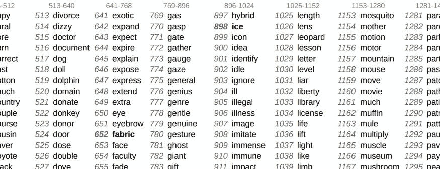
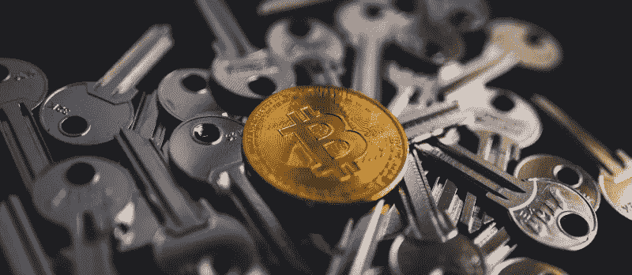

# BIP39 兼容钱包列表(2022 年更新)

> 原文：<https://medium.com/coinmonks/bip39-compatible-wallets-list-2022-updated-98a5e971edbe?source=collection_archive---------3----------------------->

想要检查哪些钱包支持 BIP39 助记符恢复种子短语？阅读下面的文章找出答案。

example of hardware wallets

# 什么是 BIP39

在过去，比特币和其他加密货币钱包是使用私钥创建和访问的。私钥有很多字符，由字母和数字组成，很难使用。

旧型比特币私钥的例子大概是这样的:
*8e 4616 c 0 b 8d 9 e 6d 60 D5 DDC 5 E0 b e 61 AC 492 CB 11 e 7737d 73 e 0 e EC 81 da 1 C1 FD 2 f 14*

随着 BIP39 的推出，创建和访问比特币和其他加密货币钱包的整个过程都得到了简化。这是为了简化生产更新种子的过程。BIP39 名称来自比特币改进提案№39。

使用 BIP39 恢复短语(也称为助记符)，用户可以备份和恢复比特币和其他加密货币钱包，而无需使用复杂的私钥。但是，使用自然语言中由单词组成的句子可以获得钱包。BIP39 允许用户使用一句话来访问他们的带有加密货币的钱包，而不是复杂的私钥。这句话由钱包软件翻译以生成确定的钱包地址。钱包软件使用算法生成你的 BIP39 字的私钥内容。

BIP39 助记短语的例子有 12 个单词:
*荣耀保持耸肩扩展饲料他们注意到类似的图表获取小时剃刀*

BIP39 协议使用了 2048 个精心挑选的英语单词。虽然存在不同语言的列表，但不建议使用它们，因为大多数钱包不支持除英语单词之外的其他单词。*查全* [*官方 BIP39 词表*](https://getcoinplate.com/blog/official-bip39-word-list-mnemonic-in-english-verified/?utm_source=medium.com&utm_medium=article&utm_campaign=m1) *。*

种子短语不仅授予您对您的地址(帐户)和资金的完全访问权限。这也是钱包知道你在区块链上有哪些地址(账户)的一种方式。钱包是确定性的，这意味着它们总是从给定的恢复短语创建相同的地址和私钥集。*阅读更多关于* [*种子短语和私钥*](https://getcoinplate.com/blog/is-a-seed-phrase-the-same-as-a-private-key-the-ultimate-guide-to-private-keys-and-recovery-seed-phrases/?utm_source=medium.com&utm_medium=article&utm_campaign=m1) *。*

钱包使用 12 到 24 个单词长的恢复短语。这取决于钱包制造商。例如，Trezor T 使用 12 个单词的种子短语，而 Ledger Nano S 使用 24 个单词的种子。

任何 BIP39 种子短语的最后一个字是校验和字。这意味着它是通过考虑所有先前的单词而生成的单词。这不是一个“随机”的词。

*Fragment of BIP39 wordlist*

# BIP39 种子短语安全性

理论上，更长的恢复周期=更安全的钱包。但即使是 12 个单词的助记短语也能为这一刻(2022 年 1 月)提供足够的安全感。在可预见的未来，24 个单词长的恢复短语将是黄金标准。

你写在一张纸上的助记短语，即使存放在一个锁着的保险箱里或埋在一堆其他文件里，也仍然是一张纸。不同种类的情况会将你的备份短语置于危险之中，使它在将来变得不可读。纸很容易被破坏。

这就是为什么你应该使用金属，最好是不锈钢的加密钱包，如 [Coinplate](https://getcoinplate.com/?utm_source=medium.com&utm_medium=article&utm_campaign=m1) ，来备份你的种子短语，它们是 BIP39 兼容的。例如，使用 [Coinplate Alpha](https://getcoinplate.com/product/coinplate-alpha/?utm_source=medium.com&utm_medium=article&utm_campaign=m1) ，您可以轻松备份 1 个 Ledger Nano S/X 钱包或 2 个 Trezor One/T 钱包。这种备份可以幸免于火灾，洪水，甚至房屋倒塌。

# BIP39 够找回一个钱包吗？

硬件和软件钱包用于恢复的系统基于多个行业标准。其中之一是 [BIP39](https://getcoinplate.com/blog/what-is-bip39-mnemonic-phrase-2022-update/?utm_source=medium.com&utm_medium=article&utm_campaign=m1) ，我们之前讨论过，它描述了如何使用 2048 个单词构建种子短语。

钱包不仅将种子短语用作密钥，还用作为存储在钱包中的所有内容设置所有地址和私钥的指令。这意味着它还需要一种方法来从[种子短语](https://getcoinplate.com/blog/is-a-seed-phrase-the-same-as-a-private-key-the-ultimate-guide-to-private-keys-and-recovery-seed-phrases/?utm_source=medium.com&utm_medium=article&utm_campaign=m1)构建这个数据。

当在完全不同的钱包中使用种子短语时，这非常重要。如果您使用同一提供商的钱包进行恢复，那就没问题了。但不同的供应商可以使用另一套指令，它可以生成不同的地址和密钥，这意味着你将无法访问你的资金。

还有其他标准，如 BIP44、BIP49 和 BIP84，它们描述了如何从给定的种子生成地址和密钥。如果您想在不同的钱包中找回您的钱包，您需要确保它们使用相同的一组指令。例如，如果您最初使用 Ledger Nano S 设置了您的 wallet 并生成了种子，并且想要在新的 Trezor T 上恢复您的 wallet，这组说明称为“派生路径”,它指示 wallet 如何从种子短语派生到地址的路径。

您可以查看钱包制造商/提供商提供的文档，了解其使用的衍生标准，从而确定是否可以安全地移动您的钱包。谈到派生路径，最重要的标准是 BIP44。

另一件重要的事情是检查钱包是否支持相同的硬币。如果另一个钱包不支持给定的硬币，它将不会创建到有效地址和密钥的派生路径。

# 我导入了正确的种子短语，但没有看到余额

由于 BIP39 标准的工作方式，有时仅仅写下一个种子短语是不够的。使用什么样的派生路径也很重要。有时，将种子短语导入不同供应商的不同钱包时，您的种子不会创建相同的地址集。这将向您显示空余额。这就是为什么确保您的钱包使用所有行业标准非常重要。但是为了安全起见，您应该知道您用来创建种子短语的钱包的类型或型号。通过这种方式，您可以找到使用了哪种派生路径创建方法。

# 种子短语的其他标准

BIP39 和前面提到的其他方法并不是钱包创建和恢复种子短语的唯一方法。例如，Electrum wallet 使用自己的系统，一些专家认为它优于我们讨论的常见的“BIP”系统。Electrum 系统使用单一的路径派生方法，它允许用户确保它将以相同的方式恢复。有些钱包可以导入各种种子短语，有些只有一个标准。请注意，不是每个 seed 短语都相同，并检查您的标准是什么。

# BIP39 兼容硬件钱包列表(A-Z):

*   BCVault
*   Bitbox02
*   冷卡
*   酷派钱包
*   硬币卡/硬币生物识别
*   埃利帕尔·泰坦
*   Keepkey
*   拱顶石/拱顶石平板电脑
*   莱杰纳米 S/S+/ X
*   n 平均零点
*   Opendime
*   护照
*   Prokey 优化
*   S1 安全公司
*   SeedSigner
*   Trezor One/T

# BIP39 兼容软件和手机钱包列表(A-Z):

*   AirGap 钱包
*   原子的
*   Bisq
*   比特币核心
*   比特
*   com
*   蓝色钱包
*   面包
*   Cobo 钱包
*   Coinomi
*   Eidoo
*   银金矿
*   金恩钱包
*   《出埃及记》
*   Jaxx
*   菌丝体
*   我的加密钱包
*   我的钱包
*   Ownbit
*   萨莫赖
*   信任钱包
*   芥末

支持 BIP39 恢复种子短语的钱包列表已于 2022 年 5 月更新。

> *加入 Coinmonks* [*电报频道*](https://t.me/coincodecap) *和* [*Youtube 频道*](https://www.youtube.com/c/coinmonks/videos) *了解加密交易和投资*

# 另外，阅读

*   [Bookmap 评论](https://coincodecap.com/bookmap-review-2021-best-trading-software) | [美国 5 大最佳加密交易所](https://coincodecap.com/crypto-exchange-usa)
*   最佳加密[硬件钱包](/coinmonks/hardware-wallets-dfa1211730c6) | [Bitbns 评论](/coinmonks/bitbns-review-38256a07e161)
*   [新加坡十大最佳加密交易所](https://coincodecap.com/crypto-exchange-in-singapore) | [购买 AXS](https://coincodecap.com/buy-axs-token)
*   [红狗赌场评论](https://coincodecap.com/red-dog-casino-review) | [Swyftx 评论](https://coincodecap.com/swyftx-review) | [CoinGate 评论](https://coincodecap.com/coingate-review)
*   [投资印度的最佳密码](https://coincodecap.com/best-crypto-to-invest-in-india-in-2021)|[WazirX P2P](https://coincodecap.com/wazirx-p2p)|[Hi Dollar Review](https://coincodecap.com/hi-dollar-review)
*   [加拿大最佳加密交易机器人](https://coincodecap.com/5-best-crypto-trading-bots-in-canada) | [库币评论](https://coincodecap.com/kucoin-review)
*   [用于 Huobi 的加密交易信号](https://coincodecap.com/huobi-crypto-trading-signals) | [HitBTC 审查](/coinmonks/hitbtc-review-c5143c5d53c2)
*   [如何在 FTX 交易所交易期货](https://coincodecap.com/ftx-futures-trading) | [OKEx vs 币安](https://coincodecap.com/okex-vs-binance)
*   [OKEx vs KuCoin](https://coincodecap.com/okex-kucoin) | [摄氏替代度](https://coincodecap.com/celsius-alternatives) | [如何购买 VeChain](https://coincodecap.com/buy-vechain)