# BirbicatorPro —战略构建—示例 1

> 原文：<https://medium.com/coinmonks/birbicatorpro-strategy-building-example-1-7e4def9c8841?source=collection_archive---------3----------------------->

## 介绍

本文的目的不仅是展示使用 BirbicatorPro 以及将该工具与您的策略相结合的好处，也是让我思考我的想法并以书面形式更广泛地分享我对该工具的想法的一种方法。

我不希望 BirbicatorPRO(姑且称之为 BPRO)只是你图表中的又一个指标，但我希望它成为你建立策略的主要结构。但是，如果你不了解一个工具是如何工作的，或者它能带来什么好处(如果有的话)，你怎么能围绕这个工具建立一个策略呢？

在这篇文章中，我将从头到尾以一种结构化的方式分享我如何围绕一个构建系统的想法来构建一个论文，最终我们将拥有一个完整的系统，可以在市场上应用。

对于本文，我将使用以下配置:

资产:比特币
时间范围:30 分钟
方:Long
BirbicatorPro 配置:
基线长度:200
慢 MA: SMA
快 MA: EMA
可用数据:2021 年 1 月 1 日至 2022 年 4 月 9 日

BirbicatorPro configurations

## 阶段 1:我们想要建立的系统背后的论文

在所有可自由交易的市场中，都有持续增长的时期，这被称为趋势市场，也有市场在价格之间停滞不前的时期，这被称为区间市场。
对于我们将要建立的这一战略，我将重点关注那些价格持续上涨或下跌的市场，这些市场会产生这一方向的趋势。

我们能系统地捕捉 50、100、1000 笔交易结束时扣除费用后的净利润趋势吗？

因此，让我们从查看图表的初始过程开始，围绕该策略的主要结构(即 BirbicatorPro)展开一篇论文。我们看到什么样的趋势模式可以利用？

多头头寸值得关注的上升趋势示例:

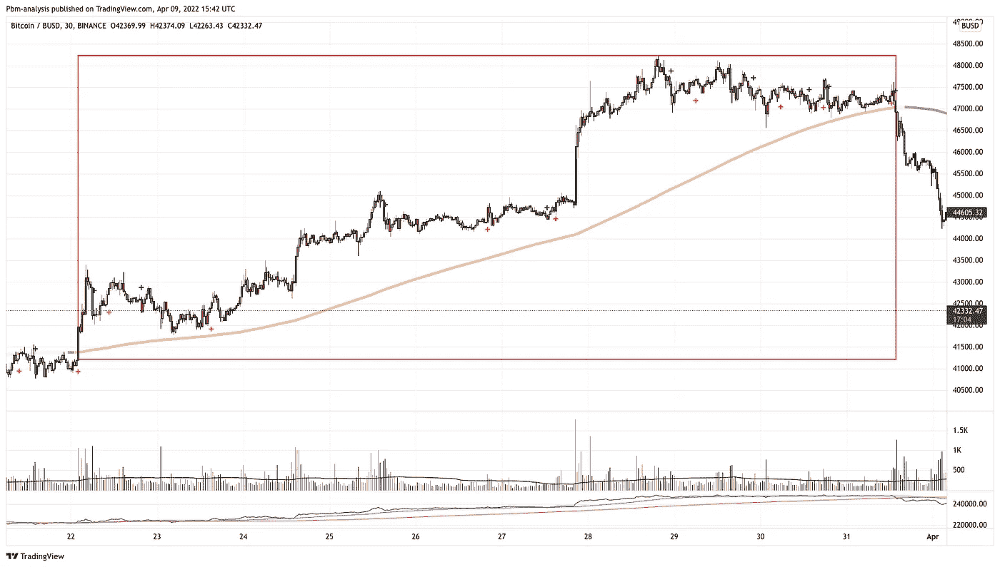

Picture 1

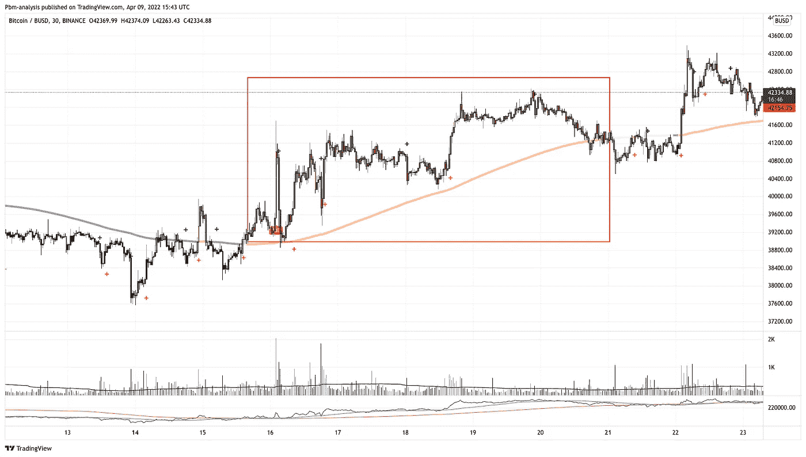

Picture 2

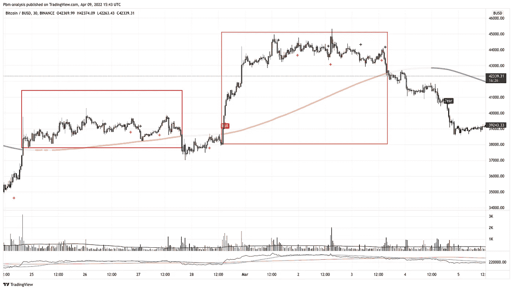

Picture 3

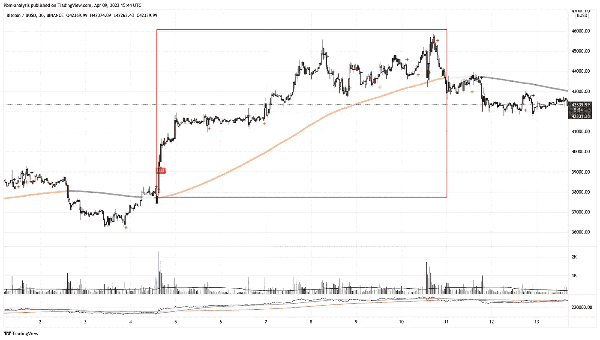

Picture 4

请注意，当价格高于基线水平时，以及当蜡烛线变成橙色时，BirbicatorPro 确实有助于早期识别这些趋势，这表明看涨势头。如果我们能在持续的基础上提取这些趋势的重要部分，我们就能产生长期的利润。现在，我们如何用一种系统的、可量化的方法来瞄准这种趋势呢？我们开始吧。

## 阶段 2:使用数据寻找边缘

我们已经确定了我们的目标，也就是趋势，让我们将这些信息输入 excel 表格，并开始处理数据。您可以从 tradingview 中导出数据，只需将其导出为 csv 文件，如下图所示。

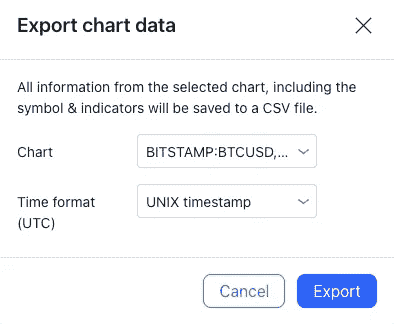

TradingView Data Export

我们现在已经将数据导出到我们的计算机中，并准备使用它。

首先，我们需要将我们的数据分成两部分:
1–50%的数据，我们将努力找到边缘。
2–50%的数据，我们将测试我们发现的边缘是否真实，或者我们是否针对特定数据集过度优化了我们的系统。

您可能会问自己，为什么我将数据分成两部分，而不是简单地测试整个数据集的参数？

许多建立这种系统的交易者和投资者跳过了这个阶段，让自己暴露在以后可能出现的大的过度拟合问题中。有很多比我聪明的人写的文章非常详细地解释了过度拟合的问题，但是为了这篇文章的目的，我将总结一下这会给我们的系统带来的问题。

当我们根据现有数据努力寻找市场优势时，我们假设这些数据代表了过去，也代表了未来。这不是一个好的假设，因为市场流动性很强，动态会随着时间而变化。过去有效的策略在未来不再有效，当您优化策略以使其成为该数据集的最佳策略时，您很可能会优化参数以使其仅适用于该特定数据集。

避免这一问题的一种方法是将数据分成 2 或 3 组，只处理一组，当系统准备好进行测试时，我们就进入下一组，检查我们是否真的有长期优势，或者我们是否只是在测试时过度优化了我们的参数。

Excel Data Division

因此，我们已经划分了数据，现在我们将开始制定策略。
让我们从主要假设开始，我们希望从 BirbicatorPro 的基线看到看涨的迹象，所以我们希望看到价格接近基线，以便我们进入。

为了筛选更好的条目，我们还希望看到我们的结束条在 Ichimoku 基线之上(基线长度:52)。

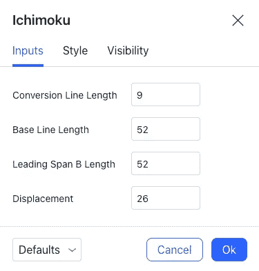

此外，当前收盘价需要高于过去 55 根棒线的平均收盘价。所以我们看过去 55 根棒线的平均收盘价，当前收盘价需要高于它。

我们也需要我们的进场，在所有这些标准都满足之后，在日线 50 简单移动平均线之上，所以我们在往更高的时间框架方向交易。

总结一下我们的进场信号:
——采用引言中所述的 BPRO 配置，棒线收于当前基线之上；
-在上述配置下，接近市町村基线的酒吧；
-收盘价高于 55 日均线；
——日线收在 50 简单移动平均线上方。

我们的退出信号将是:
-低于 BPRO 当前基线，使用介绍中指定的 BPRO 配置。

现在，让我们将所有这些数据放在 excel 表格中，看看我们是否发现了任何优势。

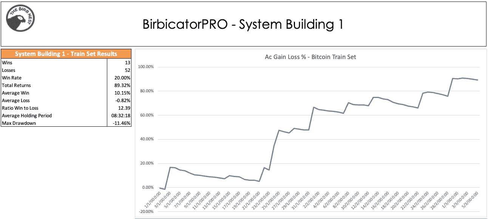

TrainSet Data

上图显示了我们用来优化策略参数的数据集的回溯测试结果。我们设法在 65 次交易后取得了积极的结果，总回报率为 89%，胜率为 20%。因为盈亏比高达 12.39，所以可能产生非常一致的结果。现在下一步是验证我们是否过度适应，或者它是否真的是一个可行的系统。
在我们找到可能具有优势的策略后，我们来分析测试数据集。

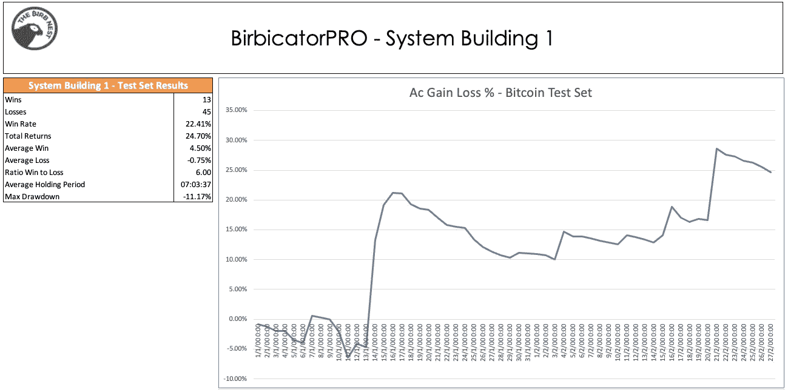

TestSet Data

你可以看到，我们取得了与训练集数据几乎相同的结果，在市场艰难时期，我们能够实现 24%的总回报率。

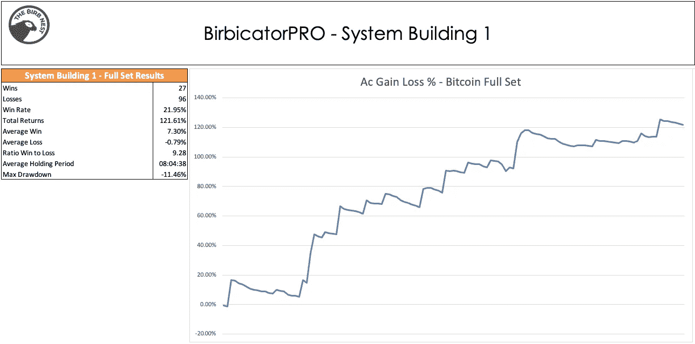

FullSet Data

上图显示了两个数据集的结果。非常有趣的结果，我们将在结论部分讨论该系统的结果。还有工作要做！

我们设法找到了一个在 123 次交易后回报为正的策略。虽然这个交易总数对于测试一个策略来说是一个相当大的数字，但是对于一个短期系统来说，这仍然是一个低水平的交易。我们希望尽可能多的交易了解策略的结果。
当我们没有更多特定资产的可用数据时，获取更多数据的一种方法是获取相关资产并对该数据进行测试。如果该策略对高度相关的资产不起作用，这意味着我们过度优化了特定的数据，正如我们在本文前面所讨论的。如果资产大体上以同样的方式移动，那么同样的策略在理论上也应该适用于这些资产。

因此，让我们继续在$ETH、$AVAX 和$BNB 上测试该策略。

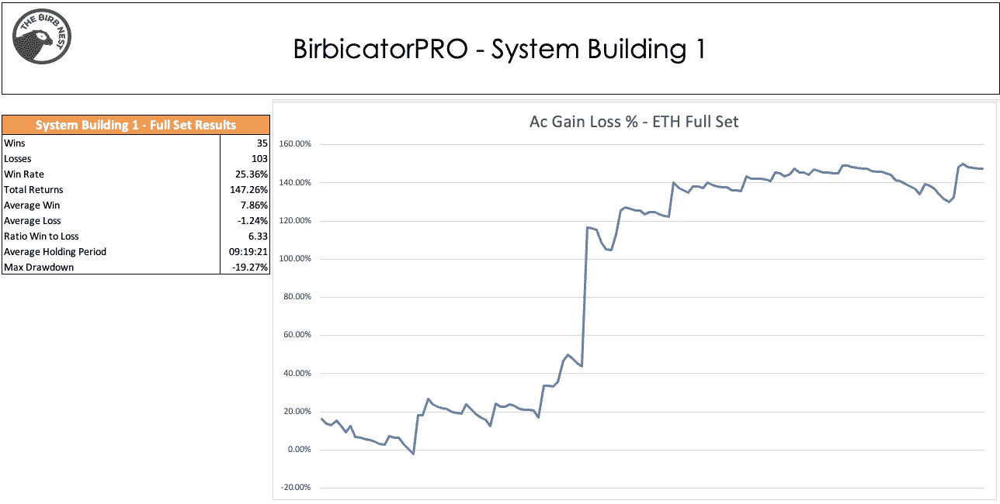

ETH Full Set

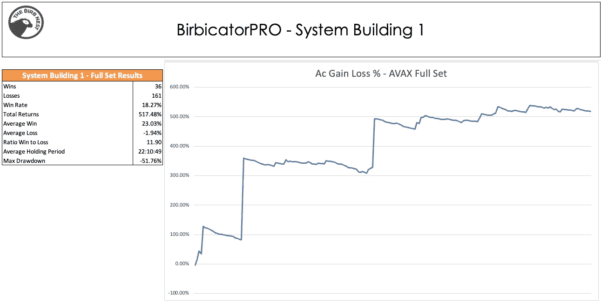

AVAXUSDT

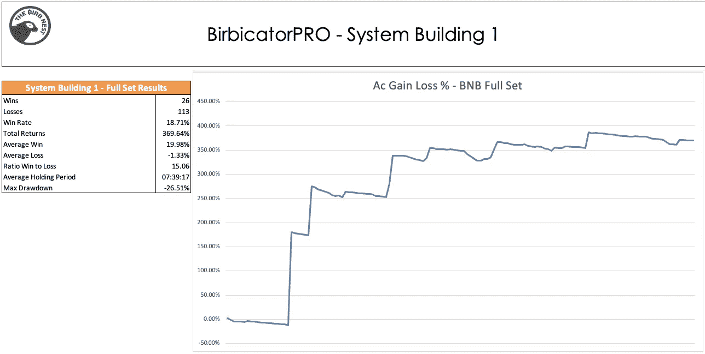

BNBUSDT

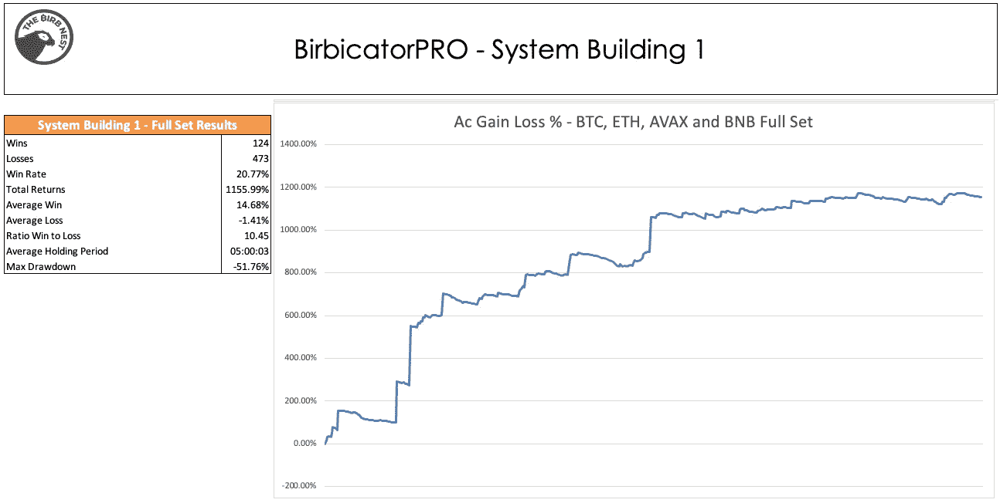

All Assets Trades Merged

## 第三阶段:关于结果的结论

在单独分析了多项资产，并用所有资产进行了 597 次交易后，我们对这个系统的优势有了很好的认识。

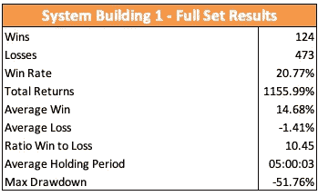

这是一个趋势跟随系统，自然产生了这种低胜率。胜率低本身不是坏事，要用平均胜败比来分析。我们可以看到，即使有 20.77%的胜率，我们也会产生非常一致和稳健的结果，因为我们可以从趋势中提取最大价值。作为趋势跟踪者，我们的目标是下足够的赌注，这样当趋势出现时，我们就可以参与其中。我们不怕承担损失，因为损失是可以预期的，我们害怕错过大趋势。

大多数交易者会看到一个 20%胜率的策略而不使用它，因为这不是他们认为的交易。他们认为交易应该有 70%或 80%的胜率。是的，有这种系统，在我看来，为了获得这种胜率，你必须放弃一些长期的稳健性或系统的系统化。

我倾向于关注胜率较低的系统，因为大多数交易者和机构对这些系统的关注较少，这使得它们更加强大，长期来看不太可能被利用，从而降低你的优势。作为商人，我们的目标是拥有一个有利可图的企业，就像所有企业一样，我们必须在市场上推出我们的产品。作为交易者，我们的产品是交易系统，我们希望每个产品都能工作。但是像任何企业一样，我们不希望为了企业的长期运转而极度依赖于一种产品。

这些文章的目标是帮助人们建立自己的交易业务，并更详细地探讨这个想法。

我希望我已经用简单的方式展示了建立趋势跟踪策略的过程。我将发布更多这样的指南，不仅有趋势跟踪策略，还有均值回归策略。

这个系统是建立在 BirbicatorPro 之上的，如果你有兴趣自己测试，这里有指标的链接:
【https://www.thebirbnest.com/products/birbicatorpro/】T2

> 加入 Coinmonks [电报频道](https://t.me/coincodecap)和 [Youtube 频道](https://www.youtube.com/c/coinmonks/videos)了解加密交易和投资

# 另外，阅读

*   [在美国如何使用 BitMEX？](https://coincodecap.com/use-bitmex-in-usa) | [BitMEX 评论](https://coincodecap.com/bitmex-review)
*   [最佳期货交易信号](https://coincodecap.com/futures-trading-signals) | [流动性交易所评论](https://coincodecap.com/liquid-exchange-review)
*   [南非的加密交易所](https://coincodecap.com/crypto-exchanges-in-south-africa) | [BitMEX 加密信号](https://coincodecap.com/bitmex-crypto-signals)
*   [MoonXBT 副本交易](https://coincodecap.com/moonxbt-copy-trading) | [阿联酋的加密钱包](https://coincodecap.com/crypto-wallets-in-uae)
*   [雷米塔诺评论](https://coincodecap.com/remitano-review)|[1 inch 协议指南](https://coincodecap.com/1inch) | [购买 Floki](https://coincodecap.com/buy-floki-inu-token)