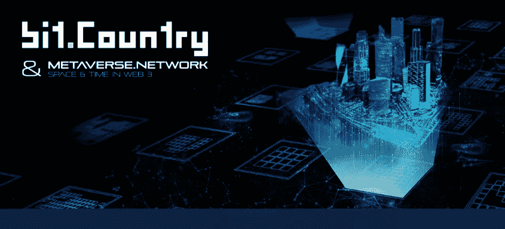

# 有点。国家:值得关注的元宇宙

> 原文：<https://medium.com/coinmonks/bit-country-a-metaverse-to-watch-684ed8f69532?source=collection_archive---------44----------------------->

有点。国家元宇宙网络是一个区块链和应用框架的元诗句和用户创建的游戏。它的目标是允许用户开发他们自己的元经文，而不需要有技术知识。这么一点。Country 在设计时考虑到了传统的互联网用户，以一种易于消化的方式将分散模式带给大众，以促进采用和支持增长。

这项工程的区块链已经建成。国家工作队使用基底和 Rust，它与包含元宇宙项目协议的 EVM 兼容。开发人员可以使用 Solidity 或 Ink 实现智能合约。这个项目可以分为区块链和 Polkadot 应用框架(Bit。国家元宇宙网络)和区块链以及草间弥生应用框架。国家先锋网)。

到位。你可以成为你想要的元诗句的成员。用户可以铸造独特的收藏和项目，如数字艺术作品。出于业务和所有权转移的目的，可以将国家/地区创建为 NFT(这种所有权可以共享，即不同的用户拥有一个 NFT)。例如，元宇宙的所有者可以创建一个 NFT 作为整个元宇宙的标题。另一个方面是，NFT 商业天然气费可以免除使用位上的会员功能。乡村平台。它也可以根据 NFT 追随者的数量和交易者的声誉进行调整。

此外，Bit.country 拥有强大的技术，因此您可以构建自己的完全可定制的元宇宙。有点。国家脱颖而出:

**3D 视图:** WIP 截图。

**模板:**元宇宙有一个标准化的设计。它们由平台或其他用户创建，提供了一种简单的方法来开始使用块部分。

**主题:**决定了元宇宙的审美。由平台或其他用户创建。主题决定了用于设计地板、墙壁等的纹理/图像。

**地球区块地图:**地图下方是 3D 世界，用户可以潜水并滚动到特定位置。细分(地产区块内的可建筑区域)也在地图上可见。未来的事件和兴趣点也可以在地图上进行可视化宣传。

**土地开发:**用户可以使用体素系统开发土地(允许用户在土地上建造)。所有者可以在他的土地上放置虚拟 dApps、NFT 和其他资产(没有智能合同关联的 3D 模型或图像)。

**创建服务:**通过虚拟 dApp(结合 3D 资产和智能合约行为)。第三方可以在元宇宙网络和其他媒体资产中创建智能合同，以合并为智能资产。这些智能资产可以通过平台上可用的智能合同或区块功能来促进地块内的事件和服务。

**高架互动:**地面上的建筑可以有自己的内部空间，用户可以进入建筑，与里面的服务进行互动。通过空投等活动，街区所有者可以推广他们的服务和其他 NFT，推动社区参与和意识。

**地方治理和政策制定:**成员可以通过元宇宙的治理表达自己的意愿。元宇宙可能会为新成员的加入制定政策(一些可能会对加入给予奖励，而另一些可能需要通过申请甚至收费来申请居住权)。居民可以对政策进行投票，提出新政策等(如增加地块供应)。

你可以在你的元宇宙中携带或投掷代币。您的令牌可用于在专用的元宇宙市场上购买物品。拍卖可以在市场上举行。这将由区块链管辖，并将支持本地资产链和外国资产(NFT)。

**社交:**用户可以通过多种方式进行互动和社交。维度视图是多人的，不同用户之间可以同步。有点。国家打算提供**通信和贸易系统**。因此，用户可以接近同一街区的另一个人并进行交换。此外，用户可以通过虚拟 dApp 利用 block 功能来实现现场表演等。语音聊天甚至视频聊天也在考虑之中。

**元素、效果和事件的创建:**API 提供了一系列“块特征”来与维度的查看者的世界进行交互。特性包括生成项目、效果和运行事件的能力。一个事件可以是空投，硬币从天上掉下来，注册参加该事件的居民必须跑过去收集硬币，以确保他们预先分配的金额。

**本地任务或游戏:**用户可能会因为特定的游戏模式或任务(如寻宝)而进入你的世界。API 将允许开发者创建他们自己的任务和游戏模式。

**营销和推广:**用户可以使用地形特征来推广他们的数字资产。以下是一些推广方法的例子:

- WIP 截图:在广告时段显示 NFT。

-在展出的 NFT 附近空投代币。

*   把 NFT 附加到智能资产上，智能资产有吸引人的活动。

另一个要考虑的方面是**连续体**，元经文的母舰，繁荣文明的集合。Continuum 是元对比的网格图，坐标数量有限。它未来的形式将完全由社区成员驱动。将根据链算法建议新的时隙。提议新空间的参数包括元数量、地块、人口和生态系统活动。

**num**持有者将决定新空间的位置。num 是跨平台的本地货币，也是 metaverse.network 协议的货币。另一方面， **NEER** 是草间弥生平台的原生货币。num 因其多样的用途而脱颖而出，因为您可以:

为平台的安全而冒险。

购买资源的通用货币。如土块。

广告和促销

交易的燃气费

在商店购买虚拟 dApp

市场交易

汇兑

社交令牌挖掘

商业钻头

监视和流动性

治理:num 持有者和委员会将共同治理网络:*民主*技术委员会*财政委员会*元宇宙委员会*元宇宙级别

有必要说的是，NEER 的公用事业和 num 的公用事业是一样的。然而，虽然 num 的总供应量为 10 亿，但 NEER 的总供应量为 1 亿(通货紧缩)。

关于 Bit 的**元宇宙。国家**，它是由**钻头**制成的，是基料，也是能源。钻头被开采了。拥有土地单位的用户拥有一点采矿权。采矿权由总土地单元和土地所属的元宇宙等级决定。钻头。国家平台定期开展活动，根据用户的采矿能力分配计算出的位数。用户可以在该时间段内执行不同的任务来赚取比特。用户可以从参与活动中获得 BIT。当你抓取地面上的物品时会消耗 10 点.用户可以使用$BIT 来更新某些对象。

最后提一下，总共有 10 万块地。未来的供给或通货膨胀将由总理事会的政府决定。元宇宙地图是由几块陆地组成的。一个地块最多可以有 100 个细分的土地单元。一组土地单元构成一个地产。

凭借出色的价值主张以及他们拥有的优秀团队和支持，Bit。国家被假定为未来雷达上的元诗句之一。

最后，如果你能在推特上关注我，我会很感激的。

> 加入 Coinmonks [电报频道](https://t.me/coincodecap)和 [Youtube 频道](https://www.youtube.com/c/coinmonks/videos)了解加密交易和投资

# 另外，阅读

*   [CoinDCX 点评](/coinmonks/coindcx-review-8444db3621a2) | [加密保证金交易交易所](https://coincodecap.com/crypto-margin-trading-exchanges)
*   [红狗赌场评论](https://coincodecap.com/red-dog-casino-review) | [Swyftx 评论](https://coincodecap.com/swyftx-review) | [CoinGate 评论](https://coincodecap.com/coingate-review)
*   [Bookmap 评论](https://coincodecap.com/bookmap-review-2021-best-trading-software) | [美国 5 大最佳加密交易所](https://coincodecap.com/crypto-exchange-usa)
*   [如何在 FTX 交易所交易期货](https://coincodecap.com/ftx-futures-trading) | [OKEx vs 币安](https://coincodecap.com/okex-vs-binance)
*   [CoinLoan 审查](https://coincodecap.com/coinloan-review) | [YouHodler 审查](/coinmonks/youhodler-4-easy-ways-to-make-money-98969b9689f2) | [BlockFi 审查](https://coincodecap.com/blockfi-review)
*   《XT.COM 评论》的|