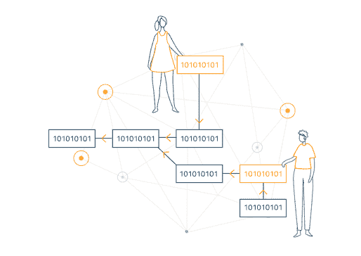

# 比特币 101

> 原文：<https://medium.com/coinmonks/bitcoin-101-5e44635d9a80?source=collection_archive---------46----------------------->

## 获得加密基础知识的小版本

比特币是一切开始的地方。它为 web3 的后现代世界奠定了基础。

# 见见中本聪。

比特币创造者的真实身份不得而知。令我惊讶的是，我们甚至在今天都不知道这个人是谁。

The creator of Bitcoin

# 比特币白皮书

该白皮书受到 2008 年金融危机的启发。

摘要:电子现金的纯点对点版本将允许在线支付直接从一方发送到另一方，而无需通过金融机构。

网络通过将事务散列到正在进行的基于散列的**工作证明**的**链**中来给事务加时间戳，形成一个不重做工作证明就无法更改的记录。

# **区块链**

区块链是整个比特币网络所依赖的共享公共账本。所有确认的交易都包含在区块链中。它允许比特币钱包计算其可消费余额，以便新的交易可以得到验证，从而确保它们归消费者所有。区块链的完整性和时间顺序是通过**加密**实现的。

# **交易**

交易是包含在区块链中的比特币钱包之间的价值转移。比特币钱包保存了一份被称为**私钥**或种子的秘密数据，用于**签署交易**，提供来自钱包所有者的数学证明。签名还防止交易一旦发出就被任何人修改。所有交易都被广播到网络上，通常在 10-20 分钟内开始确认，通过一个叫做**挖掘**的过程。

# **采矿**

挖掘是一个分布式共识系统，用于通过将未决事务包含在区块链中来确认未决事务。它在区块链中强制执行时间顺序，保护网络的中立性，并允许不同的计算机就系统的状态达成一致。为了得到确认，交易必须被打包在一个符合非常严格的加密规则的块中，这些规则将被网络验证。这些规则防止前面的块被修改，因为这样做会使所有后面的块无效。

# **工作证明**

PoW 要求网络上的节点提供**证据**，证明它们已经以分散的方式花费了计算能力来达成共识。

它涉及到迭代 **SHA-256** 哈希算法。然而，一轮散列的“赢家”将来自 mempool 的事务聚集并记录到下一个块中。因为“赢家”是随机选择的，与完成的工作成比例，它激励网络上的每个人诚实行事，只记录真实的交易。

> 目前开采一个区块的奖励是 6.25 BTC，相当于₹2 克罗。

# 摘要

安全和去中心化是比特币的支柱。这很可能是未来持有和转移资金的唯一安全方式。

***参考文献***

[https://bitcoin.org/en/](https://bitcoin.org/en/)