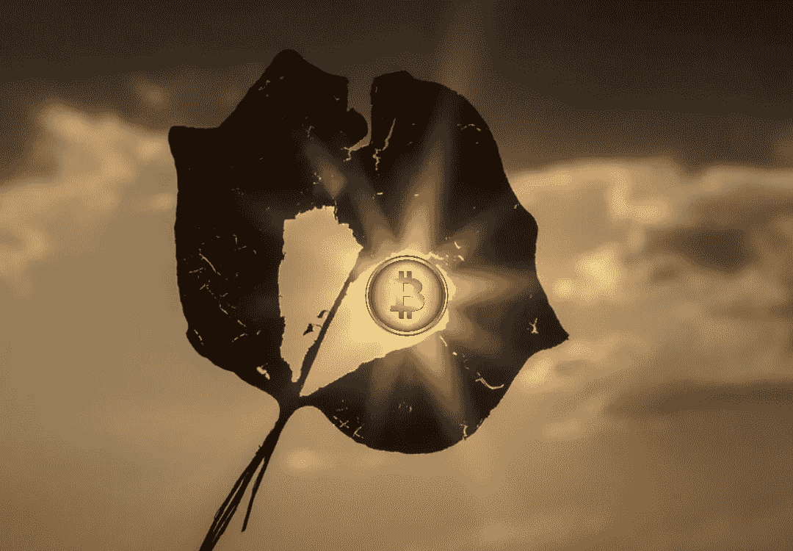

# 比特币:重新评估

> 原文：<https://medium.com/coinmonks/bitcoin-a-re-evaluation-ddf822ba0dc6?source=collection_archive---------11----------------------->

我知道比特币很重要，但我从来都不是支持者。最近在 [Invest Answers](https://www.youtube.com/c/InvestAnswers) 上的一次采访彻底改变了我的观点。

Image: PixTeller

# 底线在前面(又名 TL；博士)

1.比特币(BTC)一直是货币的统称

2.比特币被视为一种战略资产，这是一种范式转变

3.大规模采用即将到来

4.称我为重生的比特币传道者吧

# 作为货币的比特币

正如我在这篇[文章](https://blog.cryptostars.is/is-it-time-for-crypto-investors-to-consciously-uncouple-from-bitcoin-b2795e5aefe9)和这篇[文章](/coinmonks/is-bitcoin-perfect-money-nope-fb05d29a1603)中所说，我认为比特币作为货币有一些缺陷。我仍然认为，Tether 和 Bitfinex 的价格操纵是比特币 2021 年高点的主要推动因素。我现在意识到，这些高点和更多高点将以这样或那样的方式到来。

然而，当 CryptoBanter 上的知名嘉宾吹捧“比特币是完美的货币”时，我不同意。我的论点分为四个部分，即比特币(作为货币)有以下风险:

1.基础设施脆弱性

2.主权俘获

3.显著的钱包集中度

4.难以确定“公平”价值

如果将比特币视为纯粹的货币资产，这些风险仍然很大。35%的比特币在美国。如果美国监管机构想阻止这种情况发生，他们完全可以做到。这样做目前在政治上是不可行的，但这并不意味着它会永远这样。

类似地，主权国家(政府)没收比特币也是小事一桩。这种事经常发生。此外，“鲸鱼”控制着大量的比特币，这些集中只会随着时间的推移而增加。最后，比特币缺乏“内在”价值。基本论点是，“解决一个数学问题值多少钱？”

我的回答是“零”。单独来看，作为一种纯粹的货币工具，我不认为比特币能够取代美元。美元有太多的动力。然而，从战略角度来看，比特币改变了一切。

很多。

# 零信任，平等访问

从本质上讲，比特币是一个交易账本。这是一份不可改变的记录，记录了从世界上最贵的[披萨](https://www.investopedia.com/news/bitcoin-pizza-day-celebrating-20-million-pizza-order/)开始的所有比特币交易。比特币也很稀缺。

永远只能有 2100 万 BTC。此外，大量 BTC 丢失或无法恢复。剩下的大部分集中在少数人手中。换句话说，供应紧张正在逼近。

为什么这很重要？

比特币是一个零信任网络。作为一个用户，只要我拥有我的私钥，我的比特币就是我的比特币。我不需要信任邻居、银行，甚至政府来获取我的比特币。

作为个人，我可能会被迫放弃我的比特币。这个小问题属于我前面提到的“主权俘获”风险。但是对于一个*国家*，这是另一回事。

## 杰森·洛维里

[杰森·p·洛维里](https://www.linkedin.com/in/jason-lowery-648830151/)是麻省理工学院的美国国防研究员。他认为(我也同意)在主权层面，比特币网络不可改变、安全和零信任的特性使其成为不可或缺的技术。

美国军方通过使用动能对抗质量来保证对陆地、空中、海洋和太空的零信任平等进入。比特币网络(在很大程度上)不受这种力量的影响。电和哈希速率没有质量。

任何拥有电力和散列率的民族国家都可以保持对比特币网络的零信任访问。这是一件大事，因为就目前的情况来看，世界上大多数国家必须信任美国才能进入全球货币体系。

美国通常会取消对美元网络的访问。他们刚刚对俄国人做了。还有伊朗人。美元也碰巧将其价值膨胀到每年 10-15%的程度，这取决于你如何衡量它。

# 大规模采用比特币

大规模采用比特币的货币论据是，为什么一个出口国会用其有价值的商品换取贬值的美元，而他们可以用比特币代替股票？军方认为，最终，他们将别无选择。

此外，从零信任、平等接入的角度来看，拥有电力和散列率使这些国家与包括美国在内的任何国家平起平坐。朝鲜如此努力获取核武器是有原因的。这些核武器保证了他们永远可以零信任、平等地进入自己的国土，即使是针对美国。

电力和杂凑利率将保证任何国家都可以确保零信任、平等地访问一个去中心化、安全的全球经济交易账本。换句话说，它们不能被国际货币基金组织或通过快速禁令或任何其他遗留金融系统切断。

一个采用比特币的国家在主权金融上等同于建造自己的核武器。从这个意义上说，比特币可能是有史以来发明的最强大的“武器”。就像核武器一样，一旦一个国家拥有了核武器，迟早每个人都会想要加入。

与核武器不同，比特币不需要特殊材料或特殊工艺。它只需要电力和杂碎率。如果你是玻利维亚，或者津巴布韦，或者乌兹别克斯坦，或者实际上是俄罗斯，为什么你不能确保你能进入那个金融网络？

你的国家再也不会缺钱了。萨尔瓦多发现了这一点。随着美国通胀完全失控，其他国家也会发现这一点。我敢打赌，下一次大规模(很可能是不可避免的)金融危机可能会让人们明白这一点。

# BTC 不多，但美元却不少

地球上几乎每个国家都持有美元储备。当美元贬值(或继续贬值)时，你认为这些美元会走向何方？在过去几年，它们可能会流向黄金。但是黄金很难移动，很难储存，也很难交易。

比特币不是。

如果当前的货币体系能够在生命维持系统上再坚持几年，它可能会稳定下来。问题是，整个世界都过度负债了。美元基本上是一个巨大的，全球性的墓叉。“挂钩”崩溃只是时间问题。

世界经济现在如此脆弱，一个蝴蝶的屁就能毁掉整个工程。如果这只蝴蝶放屁，大部分金融活动可能会全部转移到比特币上。我很确定这对 BTC 是“利好”消息。

如果你是一个坐拥大量自由落体美元储备的国家，你会坐视这些储备化为乌有吗？或者，你会加入萨尔瓦多的零信任全球支付系统，用那些正在贬值的美元跳上去吗？

我打赌是后者。富达数字资产[似乎同意](https://www.fidelitydigitalassets.com/articles/2021-trends-impact)(即使没有美元的崩溃)。我只能说，从现在开始，我知道我的钱会去哪里。

# 我道歉…

给任何一个我怀疑过或拉屎过的比特币“maxi”。我错了。一个麻省理工学院的研究生给我指明了方向。不过，我现在正走在正确的道路上。如果你是一个经常阅读的人，我从迈克尔·塞勒那里得到了一段很棒的引言，它概括了整篇文章…

> 购买比特币

当然，这些只是我 ***的观点*。**我不是财务顾问，这不是财务建议，而且总是 [DYOR](/coinmonks/crypto-investing-how-to-dyor-1e6dabdb1de9) 。遵循这些想法中的任何一个都可能会让你失去所有的钱。我对此 100%认真。我喜欢摆弄这些东西，但我公开表现得像个彻头彻尾的狒狒。相应投资。

直到下一次，安全，聪明，一定要[绑骆驼](https://www.oxfordreference.com/view/10.1093/acref/9780199539536.001.0001/acref-9780199539536-e-2318)。

> 加入 Coinmonks [电报频道](https://t.me/coincodecap)和 [Youtube 频道](https://www.youtube.com/c/coinmonks/videos)了解加密交易和投资

# 另外，阅读

*   [CoinDCX 评论](/coinmonks/coindcx-review-8444db3621a2) | [加密保证金交易交易所](https://coincodecap.com/crypto-margin-trading-exchanges)
*   [红狗赌场评论](https://coincodecap.com/red-dog-casino-review) | [Swyftx 评论](https://coincodecap.com/swyftx-review) | [CoinGate 评论](https://coincodecap.com/coingate-review)
*   [Bookmap 评论](https://coincodecap.com/bookmap-review-2021-best-trading-software) | [美国 5 大最佳加密交易所](https://coincodecap.com/crypto-exchange-usa)
*   [如何在 FTX 交易所交易期货](https://coincodecap.com/ftx-futures-trading) | [OKEx vs 币安](https://coincodecap.com/okex-vs-binance)
*   [CoinLoan 审核](https://coincodecap.com/coinloan-review) | [YouHodler 审核](/coinmonks/youhodler-4-easy-ways-to-make-money-98969b9689f2) | [BlockFi 审核](https://coincodecap.com/blockfi-review)