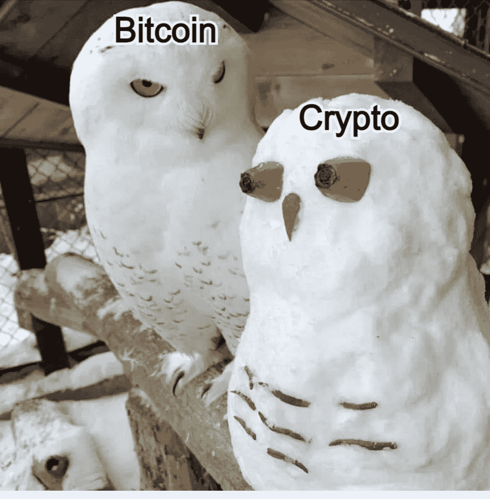

# 比特币:中下层阶级的革命

> 原文：<https://medium.com/coinmonks/bitcoin-a-revolution-for-middle-and-lower-classes-5772c25c56ed?source=collection_archive---------83----------------------->

通货膨胀和通货紧缩是市场现象，是以前行动的结果，与任何道德无关。它们被触发了。在市场经济中，它们是自愿和真正的决定。当两者都发生在一个被操纵的经济中，或者更糟，在一个指令/控制的经济中，问题就出现了。在这种情况下，它们的存在是人为的，就像黑夜之后的白天一样，一种现象的强迫将随后引发另一种被故意压制的现象的出现。

在当前的经济环境下，通胀压力主要与供应相关的因素有关。如果我们特别考虑一下过去两年，我们会注意到某种程度的加速:在需求方面，我们经历了关闭、物流问题和消费者恐慌；但在供应方面，我们有欧洲央行 8 万亿€的资产负债表，通过福利国家提供的大量资金，更大规模货币发行数字的重大变化以及飙升的公共债务。一句话:价格上涨不可避免。

阻止其对应现象的健康挤压，加大赤字和央行印钞的力度，是人为支持上述两种现象之一的确凿证据。但这是随后通货紧缩的错吗？不，这意味着将自己的失败归咎于日/夜循环。这是做市商(就我们而言是国家和央行)推动一种或另一种现象，是失衡和经济错误背后需要清理的真正原因，以及我们今天看到的日益严重的损害。

1985 年至 1990 年间，美联储让利率上升了 325 个基点，与此同时，在加息周期拖垮墨西哥和加州等州的新兴经济体之前，标准普尔 500 指数上涨了 45%。后来，美联储改变了方针。1993 年至 2000 年间，美联储让利率上升了 325 个基点，与此同时，在本世纪初的衰退爆发之前，股市上涨了 225%。后来，美联储改变了方针。从 2003 年到 2007 年，美联储将利率维持在 375 个基点，同时市场增长了 30%，之后加息周期导致了房地产泡沫的破裂。后来，美联储改变了方针。2015 年至 2020 年间，利率上升了 200 个基点，同时市场上涨了 65%，之后美联储在市场小幅回调后逆转了方向。

历史告诉我们，中央银行更关心金融资产，而不是消费价格。2016 年初，S&P500 指数面临 11.3%的回调，尽管美联储宣布了四次加息，但当年只加息一次。2018 年 12 月，美国股市下跌 9%，2019 年 1 月又下跌 3.5%。紧接着，美联储宣布中断加息周期。

迄今为止，虽然宣布了新一轮加息，但尚未实施。如果实施的话，回旋的余地是有限的:150 个基点。但如果股票跌得“够”就会反转。在过去的 30 年里，央行在捍卫市场方面变得越来越积极，正是因为它们的干预让市场越来越腐败。在这些扭曲之后,“膨胀或死亡”陷阱的绞索已经套在了央行的脖子上。

中央银行系统是当今社会主义盛行及其虚伪的最好例子。马克思/恩格斯在他们 1848 年的著作中所倡导的，我们今天注意到，当华尔街陷入困境时，干预是多么迅速，但当主街陷入困境时，干预是多么缓慢。例如，当持续下跌的危险略微惊吓到金融市场时，美联储立即逆转了路线(即 2013 年、2020 年等)。);另一方面，它继续喋喋不休地谈论加息，并寻找借口(即“暂时的”)，尽管价格继续飙升。

这是一个不能改革的系统，任何持这种立场的人都在呼吁更多的社会主义。这一体系是无法废除的，运行这一体系的中央计划者在此基础上建立了一个特权框架，他们竭力通过反市场行动来支持这一框架。这个系统只能被绕过并导致过时，比特币目前正在以极高的效率完成这项任务。随着时间的推移，人们越来越清楚地认识到，国家获取和保持控制的主要手段是货币。武器有帮助，权威也有帮助，但最终是金钱的控制让人们处于奴役状态。比特币最初只是为书呆子准备的，现在它已经成为政府手中拯救中下层阶级免于经济/社会毁灭的工具。“工人革命”正在走一条不同于 19 世纪任何人想象的道路。