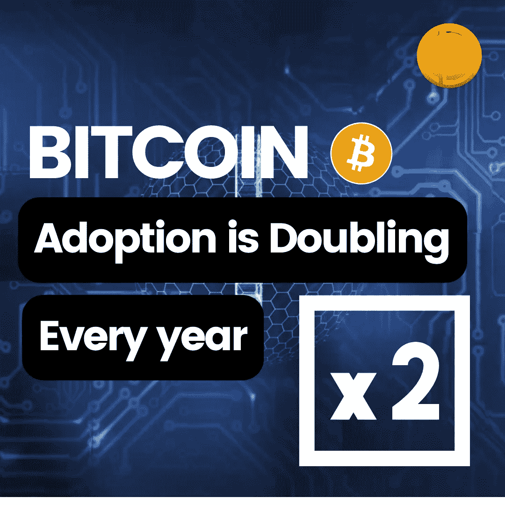

# 比特币的采用率每年都在翻倍

> 原文：<https://medium.com/coinmonks/bitcoin-adoption-is-doubling-every-year-703a70f4703e?source=collection_archive---------65----------------------->

在过去的几年里，我们见证了加密货币每年都在翻倍。比特币人士认为，到今年年底，比特币将达到六位数。

自成立以来，比特币已经增长了数千倍。在 Genesis 区块开采后，加密货币的价格从未停止，并随着大量采用而继续上涨。

更多秘密新闻-[https://www.coindhan.com/](https://www.coindhan.com/)

> 加入 Coinmonks [电报频道](https://t.me/coincodecap)和 [Youtube 频道](https://www.youtube.com/c/coinmonks/videos)了解加密交易和投资

# 另外，阅读

*   [A-Ads 审查](https://coincodecap.com/a-ads-review) | [Bingbon 审查](https://coincodecap.com/bingbon-review) | [Mudrex 投资](https://coincodecap.com/mudrex-invest-review-the-best-way-to-invest-in-crypto)
*   [瓦济里克斯 NFT 评论](https://coincodecap.com/wazirx-nft-review)|[Bitsgap vs Pionex](https://coincodecap.com/bitsgap-vs-pionex)|[Tangem 评论](https://coincodecap.com/tangem-wallet-review)
*   [如何使用 Solidity 在以太坊上创建 DApp？](https://coincodecap.com/create-a-dapp-on-ethereum-using-solidity)
*   [最好的卡达诺钱包](https://coincodecap.com/best-cardano-wallets) | [Bingbon 副本交易](https://coincodecap.com/bingbon-copy-trading)
*   [氹欞侊贸易评论](https://coincodecap.com/anny-trade-review) | [Paybis 评论](https://coincodecap.com/paybis-review) | [Keevo 钱包评论](https://coincodecap.com/keevo-wallet-review)