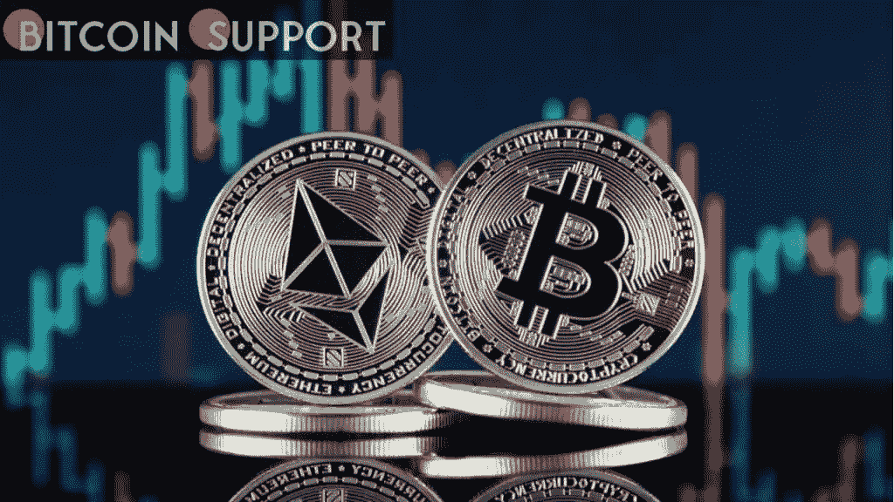
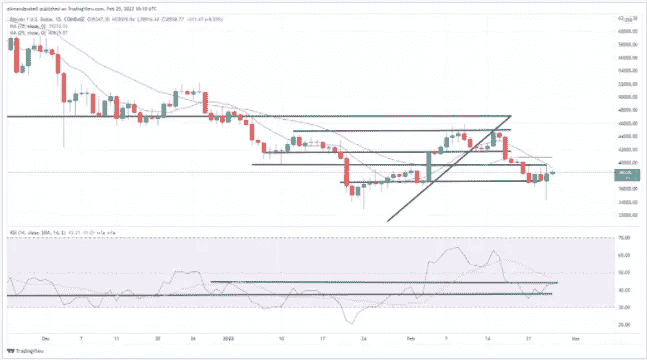
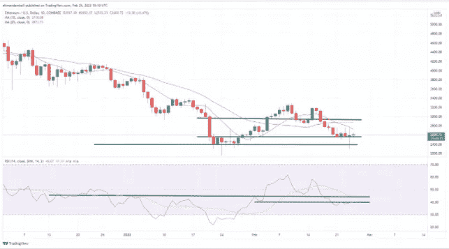

# 比特币和以太坊技术分析:比特币在俄罗斯入侵乌克兰后反弹

> 原文：<https://medium.com/coinmonks/bitcoin-and-ethereum-technical-analysis-bitcoin-rebounds-in-the-wake-of-russias-invasion-of-1b52c7cf23d8?source=collection_archive---------59----------------------->

**Visit our website:-** [**https://bitcoinsupports.com/**](https://bitcoinsupports.com/)

俄罗斯入侵乌克兰后，比特币和以太坊的价值一直波动不定，周四双双跌至一个月低点。此后，两者都从这些低点回升，似乎进入了盘整期。

**比特币**

在撰写本文时，加密货币市场周五上涨超过 7%，比特币在周末上涨 8%。

紧随昨日低点 34，997.01 美元之后，BTC/美元在早盘达到日内高点 38，968.84 美元。BTC 周五短暂反弹，逼近关键的 40，000 美元关口，本周初以来从未触及。

**Visit our website:-** [**https://bitcoinsupports.com/**](https://bitcoinsupports.com/)

14 天 RSI 也有所下降，现在似乎在 43.8 关口下方盘整。只要价格保持在 37，240 美元的下限和 39，640 美元的上限之间，市场的不确定性预计将持续存在。

另一方面，目前的情绪似乎更加悲观，因为 10 天移动平均线继续走低。以太坊

ETH 的价格也略有上涨，因为多头不愿意让世界第二大加密货币跌破其长期支撑。

在撰写本文时，ETH/USD 交易上涨 9.20%，在周四跌至 2，341.72 美元的盘中低点后，曾触及 2，689.05 美元的高点。价格力度也有所增强，14 天 RSI 突破近期阻力位 39.60，交易于 40.80。

**Visit our website:-** [**https://bitcoinsupports.com/**](https://bitcoinsupports.com/)

在上涨之后，ETH 目前略高于 2550 美元的更强支撑位，此前该支撑位曾引发多次牛市。尽管如此，预计交易者仍将保持谨慎，因为许多人认为俄罗斯对乌克兰的入侵可能会进一步恶化，促使投资者采取规避风险的立场。

**访问我们的网站:-**[**https://bitcoinsupports.com/**](https://bitcoinsupports.com/)

**免责声明:以上为作者观点，不应视为投资建议。读者应该自己做研究。**

> *加入 Coinmonks* [*电报频道*](https://t.me/coincodecap) *和* [*Youtube 频道*](https://www.youtube.com/c/coinmonks/videos) *了解加密交易和投资*

# 另外，阅读

*   [有哪些交易信号？](https://coincodecap.com/trading-signal) | [Bitstamp vs 比特币基地](https://coincodecap.com/bitstamp-coinbase) | [买索拉纳](https://coincodecap.com/buy-solana)
*   [ProfitFarmers 回顾](https://coincodecap.com/profitfarmers-review) | [如何使用 Cornix 交易机器人](https://coincodecap.com/cornix-trading-bot)
*   [十大最佳加密货币博客](https://coincodecap.com/best-cryptocurrency-blogs) | [YouHodler 评论](https://coincodecap.com/youhodler-review)
*   [my constant Review](https://coincodecap.com/myconstant-review)|[8 款最佳摇摆交易机器人](https://coincodecap.com/best-swing-trading-bots)
*   [MXC 交易所评论](/coinmonks/mxc-exchange-review-3af0ec1cba8c) | [Pionex vs 币安](https://coincodecap.com/pionex-vs-binance) | [Pionex 套利机器人](https://coincodecap.com/pionex-arbitrage-bot)
*   [我的密码交易经验](/coinmonks/my-experience-with-crypto-copy-trading-d6feb2ce3ac5) | [《比特币基地评论》](/coinmonks/coinbase-review-6ef4e0f56064)
*   [CoinFLEX 评论](https://coincodecap.com/coinflex-review) | [AEX 交易所评论](https://coincodecap.com/aex-exchange-review) | [UPbit 评论](https://coincodecap.com/upbit-review)