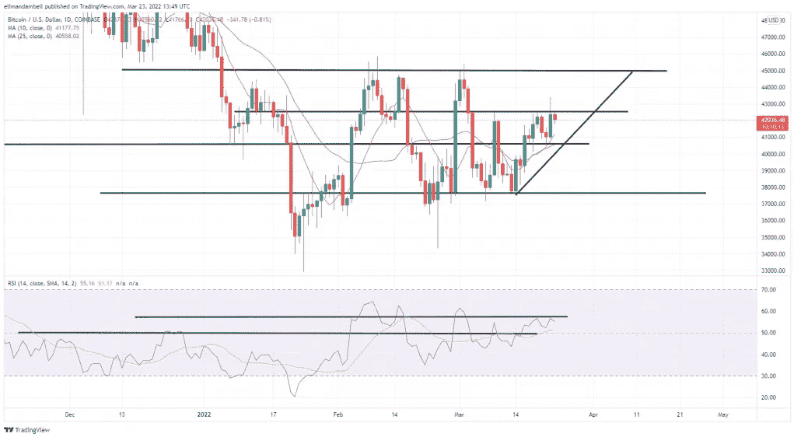
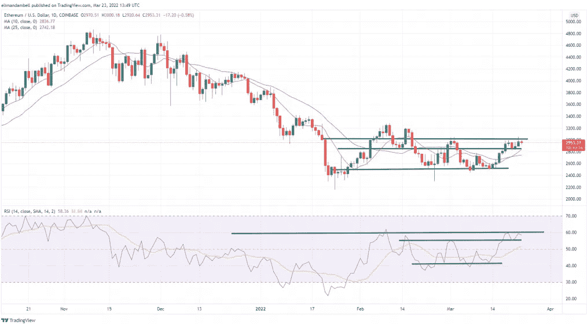

# 比特币和以太坊技术分析:ETH 跌破 3000 美元，加密收益碰壁

> 原文：<https://medium.com/coinmonks/bitcoin-and-ethereum-technical-analysis-eth-drops-below-3-000-as-crypto-gains-hit-a-wall-20ed311382d8?source=collection_archive---------59----------------------->

**Visit our website:-** [**https://bitcoinsupports.com/**](https://bitcoinsupports.com/)

在本周中期，比特币和以太坊的价格都触及阻力点。今天，ETH 跌破了 3000 美元的水平，BTC 跌破了 42500 美元的长期上限。

**比特币**
继周二触及 43，336 美元的高点后，BTC 兑美元汇率周三跌至 41，877.51 美元的低点。发生这种情况是因为 BTC 未能守住昨天从 42500 美元阻力位的突破，多头可能已经卖出了他们的头寸，以保持他们的收益。

**Visit our website:-** [**https://bitcoinsupports.com/**](https://bitcoinsupports.com/)

尽管如此，势头仍然在上升，10 天(红色)移动平均线穿过 25 天(蓝色)移动平均线。

因此，比特币现在比上周几乎高出 5%，尽管最近比特币的价格存在很大的不确定性。

57 RSI 水平肯定有破位，20 多天没发生了。

**以太坊**

昨日，以太坊创下一个月新高。周三，随着近期涨势有所减弱，金价跌破 3000 美元。今天价格下跌了 1.78%，因为以太坊触及了 3020 美元的价格水平。迄今为止，已经有一些人将 2844 美元的支撑位视为 ETH 可能的价格目标。已跌至 2933.31 美元的盘中低点。

**Visit our website:-** [**https://bitcoinsupports.com/**](https://bitcoinsupports.com/)

看起来像 BTC，但是 ETH 图上的 14 天 RSI 指标在阻力下方徘徊。如果这种情况持续下去，我们可能会看到一个更低的低点。

不过 ETH 依然有很大的多头压力，所以突破 3200 美元水平也是有可能的。

**访问我们的网站:-**[**https://bitcoinsupports.com/**](https://bitcoinsupports.com/)

**免责声明:以上为作者观点，不应视为投资建议。读者应该自己做研究。**

> 加入 Coinmonks [电报频道](https://t.me/coincodecap)和 [Youtube 频道](https://www.youtube.com/c/coinmonks/videos)了解加密交易和投资

# 另外，阅读

*   [CoinLoan 评论](https://coincodecap.com/coinloan-review) | [YouHodler 评论](/coinmonks/youhodler-4-easy-ways-to-make-money-98969b9689f2) | [BlockFi 评论](https://coincodecap.com/blockfi-review)
*   XT.COM 评论 | [币安评论](https://coincodecap.com/xt-com-review)
*   [SmithBot 评论](https://coincodecap.com/smithbot-review) | [4 款最佳免费开源交易机器人](https://coincodecap.com/free-open-source-trading-bots)
*   [比特币基地僵尸程序](/coinmonks/coinbase-bots-ac6359e897f3) | [AscendEX 审查](/coinmonks/ascendex-review-53e829cf75fa) | [OKEx 交易僵尸程序](/coinmonks/okex-trading-bots-234920f61e60)
*   [如何在印度购买比特币？](/coinmonks/buy-bitcoin-in-india-feb50ddfef94) | [瓦济克斯审查](/coinmonks/wazirx-review-5c811b074f5b)
*   [隐翅虫替代品](/coinmonks/cryptohopper-alternatives-d67287b16d27) | [HitBTC 审查](/coinmonks/hitbtc-review-c5143c5d53c2)