# 2022 年的比特币和地缘政治

> 原文：<https://medium.com/coinmonks/bitcoin-and-geopolitics-in-2022-7b4a31cde529?source=collection_archive---------7----------------------->

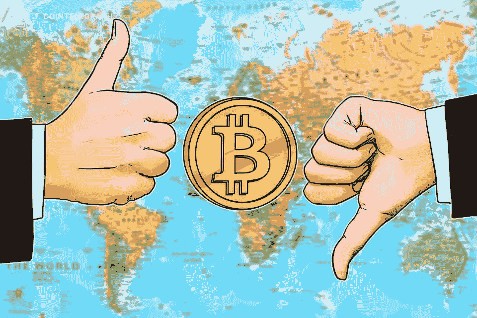

当你听到比特币时，你首先想到的可能不是地缘政治，但去中心化的资产和生态系统现在正变得越来越地缘政治化。在我们展望未来之前，让我们快速回顾一下。

最值得注意的事件之一是中国在 2021 年初禁止比特币挖矿。中国对禁止与比特币相关的活动并不陌生，但这次打击对网络和价格的影响比其他行动更大。在宣布在全国范围内打击比特币挖矿活动后，价格在夏季跌至 3 万美元的低点，杂凑率也大幅下降，导致网络整体安全性下降。

值得注意的是，散列率现在处于历史最高水平，使网络比以往任何时候都更安全。与此同时，随着美联储威胁加息并停止量化宽松，比特币价格继续下跌。

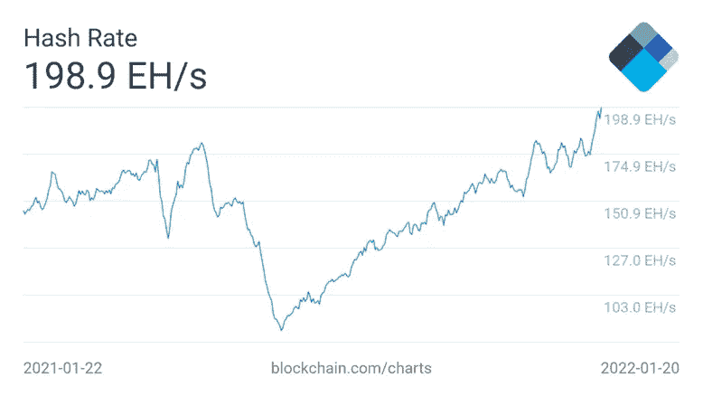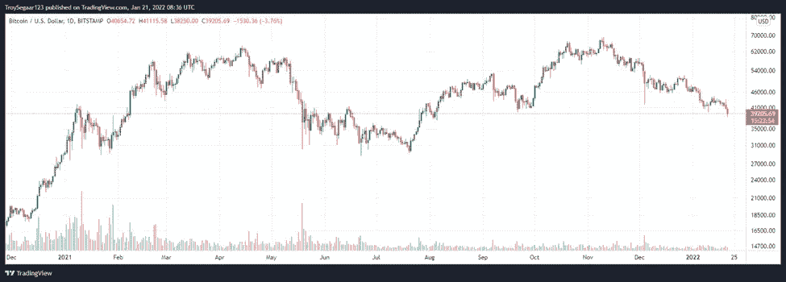

今年夏天，一些人和媒体渠道再次全力宣布比特币的死亡，但这次矿工迁移对整个网络来说是一件积极的事情。

2019 年，中国控制了大约 [75%的全球哈希比率](https://indianexpress.com/article/technology/crypto/bitcoin-hashrate-approaches-full-recovery-from-china-crackdown-7670096/#:~:text=According%20to%20Cambridge%20Bitcoin%20Electricity,of%20the%20world's%20Bitcoin%20mining.)，这一数字正在逐渐下降，但在 2021 年初仍保持在 50%以上。现在 2022 年初，这个数字[已经下降到 0%。](https://ccaf.io/cbeci/mining_map)中国比特币矿工的大规模外流导致了全球散列率的更大分布和更分散的网络。下图描绘了中国的杂凑率份额是如何分散到其他国家的。

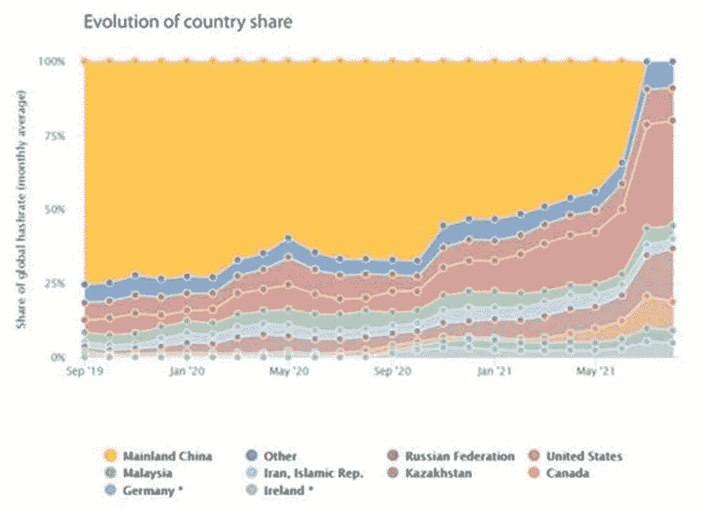

Source: [Cambridge Bitcoin Electricity Consumption Index](https://ccaf.io/cbeci/mining_map)

这是巨大的。在我看来，最突出也是最合理的反比特币论点之一是，中国对全球比特币网络的控制太多，这使得协同攻击变得更容易。

好吧，这种协同攻击考虑到杂凑率恢复快，不算成功。这场大轮换的大赢家主要是俄罗斯、哈萨克斯坦和美国。

这是积极的，但也带来了新的挑战。其中之一是哈萨克斯坦将其散列率提高到总网络的约 18%，并成为第二大比特币开采国。由于高油价和极度的财富不平等，这个国家最近陷入了由反腐败运动领导的暴力抗议。

在全国各地的暴乱中，超过 [160 人被杀，6000 人被捕](https://www.aljazeera.com/news/2022/1/9/more-than-5000-arrested-since-riots-erupted-a-week-ago)。杂凑利率立即下跌 15%，比特币价格也很快跌破 40.000 美元，随后暂时回升。

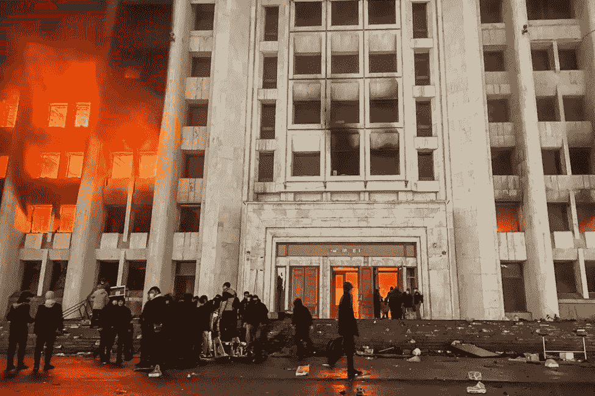

Source: [Best News Studio](https://bestnewsstudio.com/kazakhstan-164-people-were-killed-thousands-arrested-in-violent-protests/)

由于寒冷的气候、数十家废弃的工厂和极其廉价的能源，这里看起来是建立比特币采矿业务的完美地点，但现在却变成了一场不确定的灾难。

抗议期间，前总统努尔苏丹·纳扎尔巴耶夫被解除安全委员会主席职务，互联网在全国范围内被关闭。由俄罗斯领导的，隶属于[集体安全条约组织](https://www.globalsecurity.org/military/world/int/csto.htm) (CSTO)，一个由后苏联国家组成的军事联盟的军队也在这个国家漫游。

这使得比特币矿工的环境变得极其不稳定。他们正面临着冰冻的机器，普遍的动荡，俄罗斯军队监视着这个国家，这意味着离开不是一个选项。对于当地矿工来说，这是又一个不幸的事件，几个月来已经出现了并发症。

那些因为能源价格低而搬迁到哈萨克斯坦的人发现，该国老化的电网无法应对能源消费的突然飙升。突然之间，采矿业占到了该国总发电量的 8%,导致停电和断电，导致政府对注册的矿工实行配给供电，如果电网超负荷，就会切断供电。

最大的问题是有限的互联网接入。当地矿工希望情况会有所改善，互联网会恢复正常，现在情况已经有所平静。然而，这种情况突显出，为什么矿商越来越有兴趣在政治稳定的管辖区寻找自己的位置。

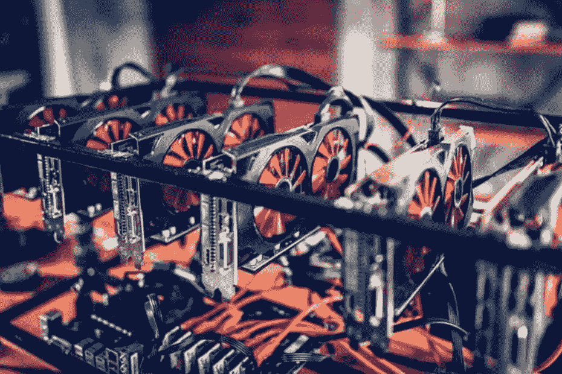

Source: [G9IJA](https://g9ija.com/2022/01/11/spanish-lawmaker-sees-opportunity-amid-kazakhstans-bitcoin-mining-collapse/)

俄罗斯的加密和采矿领域也出现了类似的动荡。俄罗斯中央银行提议禁止在俄罗斯境内使用和开采加密货币，理由是对公民福祉、金融稳定和货币政策主权构成威胁。不足为奇的是，像俄罗斯和中国这样的威权国家并不热衷于失去对资金的垄断控制。

有趣的是，哈萨克斯坦的不稳定引发了即时反应，证实了围绕比特币挖矿的博弈理论。公民党[的一名西班牙代表提出一项法案](https://g9ija.com/2022/01/11/spanish-lawmaker-sees-opportunity-amid-kazakhstans-bitcoin-mining-collapse/)，以哈萨克斯坦的不稳定为由，使西班牙成为比特币矿工的一个有吸引力的目的地。她的政党希望将西班牙定位为欧盟的重要参与者，以吸引加密货币领域的投资。对比特币矿工的通融可能是这种情况的催化剂。

全球散列率分布的另一个挑战是美国统治的危险。美国很快将其散列率提高了两倍，尽管美国肯定比中国更适合比特币矿工，但仍存在大量挑战。

美国正在根据环境、社会和治理运动制定可持续性法规。其结果可能是“绿色比特币”被高价出售，因为它们是“可持续”开采的[。](https://www.forbes.com/sites/christopherhelman/2021/08/02/green-bitcoin-mining-the-big-profits-in-clean-crypto/?sh=25622ea334ce)

这可能会增加人们对比特币可替代性的怀疑，而且这与作为比特币基本组成部分的自由市场精神背道而驰。像伊丽莎白·沃伦这样的政治家不断指责比特币矿工加剧了“气候变化”危机，并试图打击它。

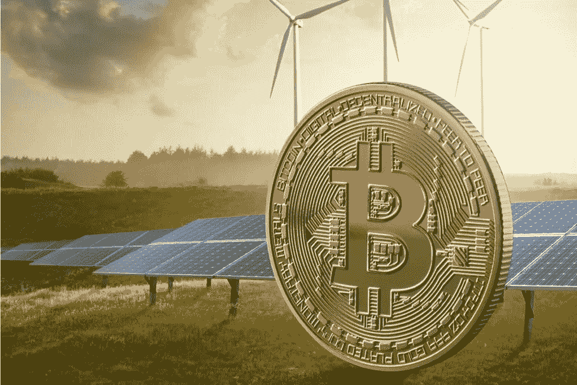

Source: [Green Smart Eco](https://greensmarteco.com/energy/bitcoin-network-consumes-more-energy-than-whole-countries)

除此之外，监管机构对比特币矿工的抓捕也是一个问题。国家可以完全控制比特币矿工，而不是实施禁令。萨尔瓦多宣布了国有地热能源开采，尽管这是一个非常有趣的发展，但国家对比特币矿工的过多控制可能是一个令人担忧的趋势。

**民族国家采用**

谈到萨尔瓦多，2021 年对于比特币的采用来说是值得纪念的一年。萨尔瓦多是第一个将比特币作为法定货币并承认其为官方货币的国家。萨尔瓦多是一个美元化的国家，很大程度上依赖于外国汇款，比特币使他们能够通过比特币网络几乎即时、无成本地接收来自国外的资金。鉴于他们不能印刷自己的货币，拥有美元的替代品是一个受欢迎的补充。这也是试图摆脱国际货币基金组织的影响，走向更多的金融主权。

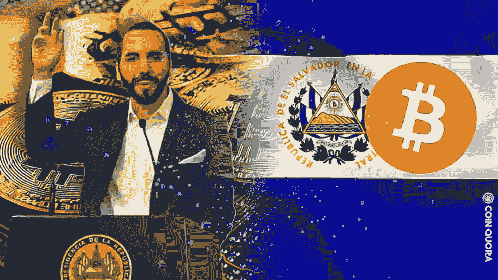

Source: [Coin Quora](https://coinquora.com/el-salvador-could-make-bitcoin-a-legal-tender/)

各国采用比特币的博弈理论早就被[讨论过](https://bitcoinmagazine.com/culture/the-game-theory-of-bitcoin)。通常，没有一个国家想成为第一个采取这种大胆举措的国家，但如果这是一个成功的举措，那么也没有一个国家想成为落后者。这一举动可能会在其他国家引起连锁反应，以采用比特币，帮助公民接收汇款，为没有银行账户的人提供银行服务，并在传统金融体系之外提供一种货币资产。

这一声明发布后，一批拉美政治家表示，他们也受到了鼓舞，效仿萨尔瓦多，提出支持比特币的立法。他们中的许多人在他们的推特个人资料图片上装备了[激光眼](https://bitcoinmagazine.com/laser-eyes)。目前还不清楚这些是严肃的评论还是仅仅是一种搭乘炒作列车的方式，但比特币往往会“逐渐地，然后突然地”移动

富达投资(Fidelity Investments)在一份财务报告中也提到了民族国家采用比特币的博弈论方面，证实了其他主权国家收购比特币并使其成为法定货币的高风险和潜力。

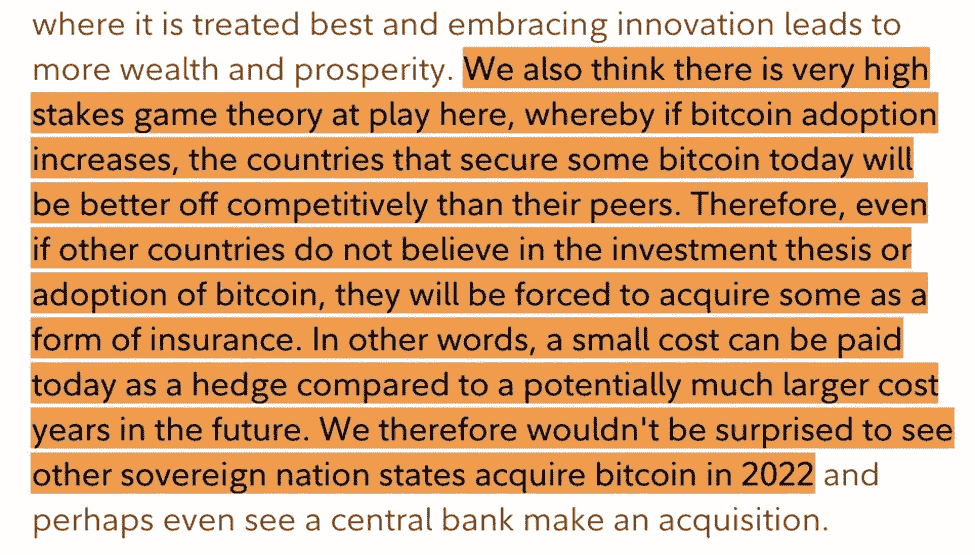

Source: [Fidelity Digital Assets](https://www.fidelitydigitalassets.com/articles/2021-trends-impact)

汤加是一个没有被甩在后面的小国。太平洋小岛国[的前国会议员 Fusitu'a 勋爵表示](https://cointelegraph.com/news/tonga-to-copy-el-salvador-bill-making-bitcoin-legal-tender-says-former-mp)他们将使比特币成为法定货币，并复制萨尔瓦多的剧本。

此举可能会让超过 10 万汤加人加入比特币网络。作为动机，他分享了汇款案例，他说收养会引起:

> *“可支配收入增加 30%。有了这额外的 30%，一些人会把它存起来，而不是投入到经济中去，堆积 sat。”*

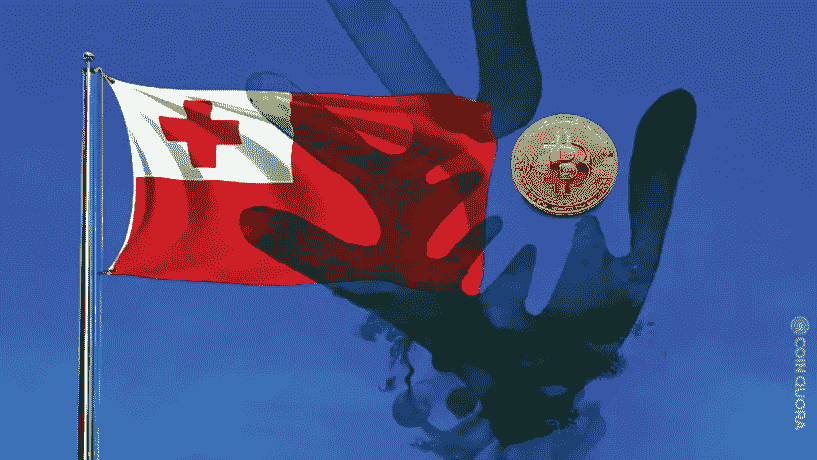

Source: [Coin Quora](https://coinquora.com/will-tonga-be-the-next-nation-to-adopt-bitcoin/)

**普遍采用**

这些年来，比特币的使用总体上呈爆炸式增长，目前估计有 1 . 06 亿比特币所有者，从难民到政府官员和大型机构投资者。粗略估计，如今全球有 4%到 5%的人口拥有比特币。**这堪比 1999 年的互联网。**事实上，根据目前 80%的年采用率，预计到 2025 年比特币将达到 10 亿用户。这是一个比互联网更快的增长。

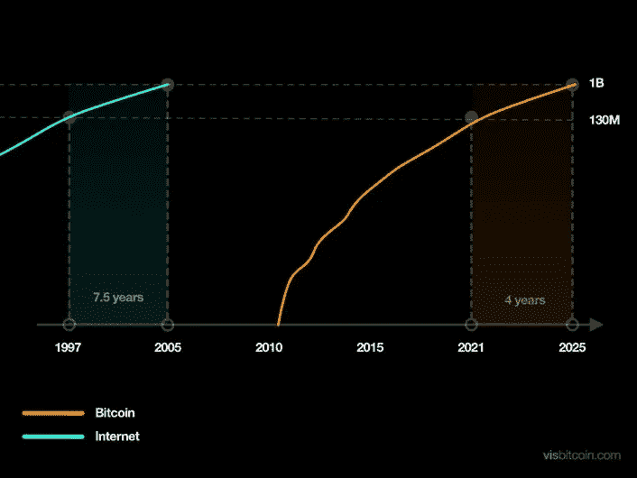

Source: Visbitcoin.com

更乐观的是闪电网络的增长。这种相对较新的技术能够实现近乎即时和几乎免费的微交易。这是让全世界数十亿人参与进来的方式。去年，闪电网络容量大幅增长，自 2021 年夏季以来，容量和开放频道几乎增加了两倍。

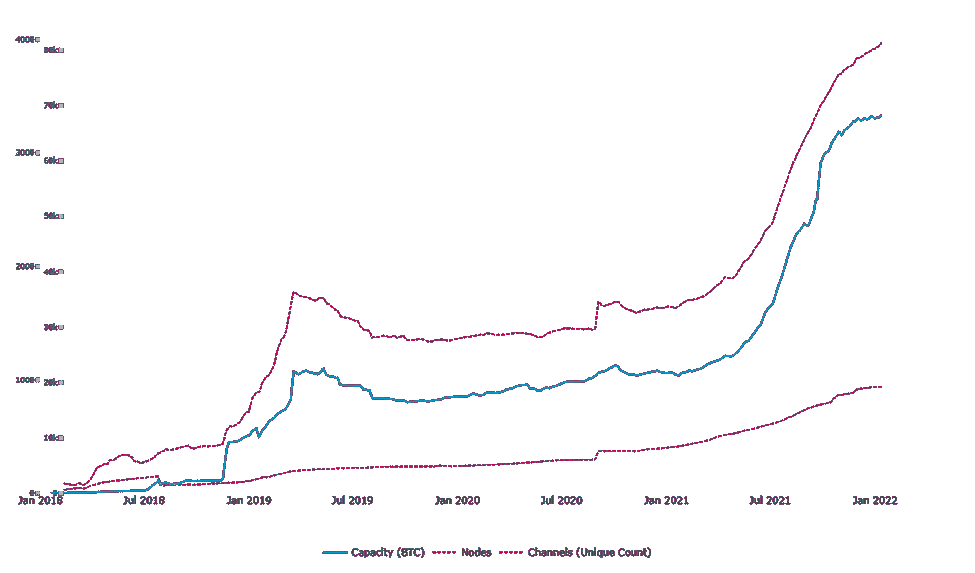

Source: [Woobull](https://charts.woobull.com/bitcoin-lightning-network/)

你可能认为比特币的采用主要是由拥有友好监管框架的国家推动的，但事实未必如此。尼日利亚、巴基斯坦、印度、中国和土耳其等国家都对比特币怀有敌意，但它们的人均比特币使用率非常高。

尼日利亚政府于 2021 年 2 月禁止加密货币，后来他们宣布了自己的 CBDC，以限制使用私人加密货币的激励措施。尽管有禁令，但日常交易仍保持增长，人们试图在政治压迫、货币管制和严重通货膨胀的环境下寻找替代支付方式。

2021 年 9 月，埃尔多安[向加密宣战](https://en.cryptonomist.ch/2021/09/21/turkey-erdogan-war-on-crypto/)，声称土耳其将打击加密货币，以确保他们自己的数字货币繁荣发展。与此同时，土耳其里拉进一步下跌，蒸发了土耳其人民的购买力。尽管“对加密的战争”，土耳其人民已经[将他们的钱](https://www.wsj.com/articles/turks-pile-into-bitcoin-and-tether-to-escape-plunging-lira-11641982077)投入比特币，并设法逃离里拉。

布克勒现在正在土耳其与埃尔多安会谈，而埃尔多安最近向议会提交了一项新的[加密法案](https://decrypt.co/89311/turkey-president-crypto-law-headed-parliament)。早些时候，土耳其政府明确表示，土耳其[“绝对无意采用加密货币”](https://www.bloomberght.com/erdogan-kripto-paralara-karsi-ayri-bir-savasimiz-var-2287867)，但我们之前已经看到了突然的转变。鉴于土耳其目前的通胀环境，这是一个值得关注的问题。

*Source:* [*Twitter*](https://twitter.com/nayibbukele/status/1483903670135795716/photo/1)

莫迪在 2021 年 11 月禁止了加密货币，并宣布了他们自己的 CBDC。他表示，加密货币可能会“糟蹋我们的青春”。不出所料，使用量几乎没有下降，现在第一只在美国以外基于比特币和以太坊期货的 ETF[宣布](https://www.outlookindia.com/website/story/business-news-indias-first-bitcoin-and-ethereum-exchange-traded-funds-etfs-on-the-anvil/409620)登陆印度市场。

这几乎就像全世界的政府都在拼命阻止人们逃离他们不断贬值的法定货币，并取得了不同程度的成功。在我看来，禁止某些事情只会让调查*变得更有趣。*

对于大多数西方人来说，比特币仍被视为高风险投机资产，但对于一些生活在不那么幸运的环境下的人来说，比特币被视为当地法定货币之外的救生艇。纳瓦尔尼就是一个例子，该公司多年来一直使用比特币来规避普京当局关闭其银行账户并审查其交易的事实。

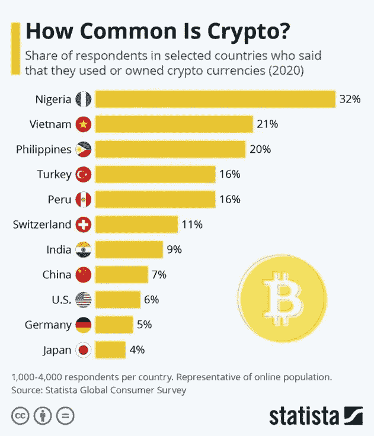

[*Source: Statista*](https://www.statista.com/chart/18345/crypto-currency-adoption/)

## **稳定的货币政策和法规**

当谈到监管时，2022 年将成为比特币和加密技术有趣的一年。许多国家正在考虑监管稳定的货币，世界各国政府和中央银行都认为这是一种金融风险。

在某种程度上，他们是对的，稳定的货币是秘密经济的重要组成部分。如果一种稳定的货币开始失去金融稳定性或价值，那将对整个生态系统造成相当大的损害。对稳定债券发行人突然缺乏信心可能会导致灾难性的流动性冲击，类似于传统的银行挤兑。

围绕着最受欢迎的稳定硬币系绳，有许多恐惧、不确定和怀疑。人们指责 Tether 人为地将比特币的价格保持在高位，并且没有为其铸造的硬币提供足够的支持。该公司甚至被称为自麦道夫庞氏骗局以来最大的诈骗案。

尽管围绕着 Tether 的所有神秘和指控，他们的市场资本总额保持增长，今天达到惊人的 780 亿美元。还有其他新兴的稳定资本，USDC 慢慢地蚕食了一部分 Tether 的市值。USDC 现在几乎占了稳定硬币供应总量的 30%,也许是因为系绳的不确定性。

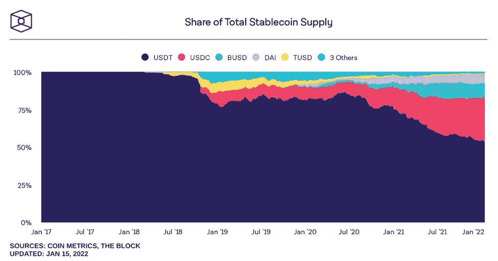

*Source:* [*The Block Crypto*](https://www.theblockcrypto.com/data/decentralized-finance/stablecoins)

各国政府越来越希望监管稳定的信贷，称它们除了带来流动性风险外，还会带来洗钱和恐怖融资等风险。美联储提出了两种不同的方法来处理稳定的硬币。

第一种是通过由 FDIC 担保的美国银行发行或用美国国债 1:1 支持它们，将它们转化为相当于公共资金的东西，这是一个类似于美国银行存款监管的框架*。*第二个解决方案是引入 CBDCs，简单地取消税收稳定账户，基本上用公共资金完全取代私人资金。加密领域的 Stablecoins，如 Tether 和 USDC，可能会被美国的 CBDCs 所取代。

这将不可避免地导致其他大国的报复。欧盟、中国、俄罗斯和许多其他大国都渴望摆脱美元主导的金融体系，因此，如果引入美元主导的发展中国家，所有这些国家都可能发行由本国货币支持的类似稳定货币。

这种情况将加剧地缘政治货币战争，并将其扩展到加密货币生态系统。无论是哪种情况，稳定资本都将面临巨大挑战，并将受到更多监管。毫无疑问，今年将会变得更加清晰，哪些国家选择走中国的道路并决定禁止比特币，哪些国家将会看到在友好的监管框架下接受比特币的机会。

与此同时，我们仍然处于相对早期的 S 曲线采用阶段。赢家和输家可能要到十年后才会明朗。

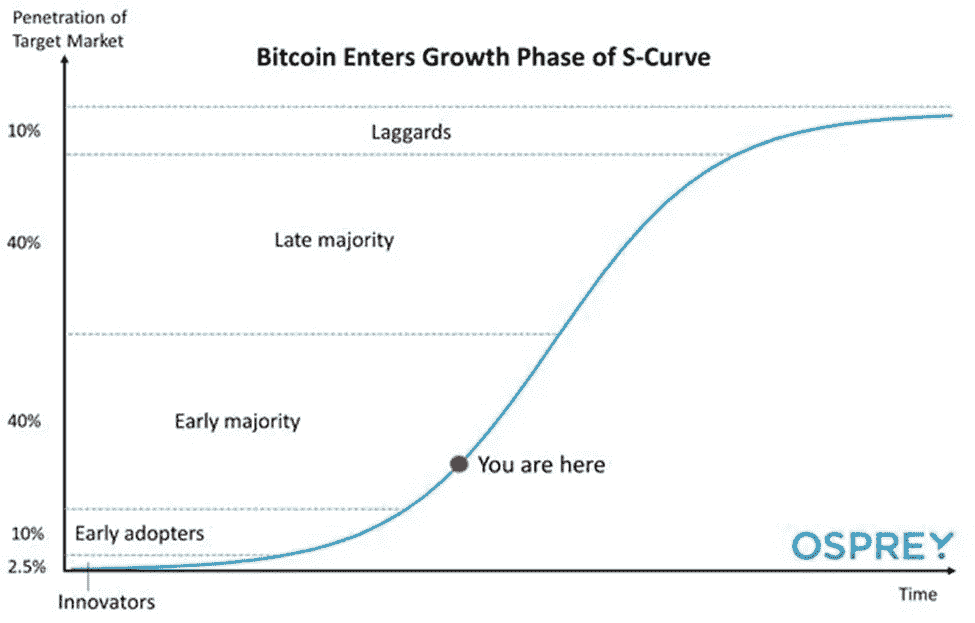

*Source:* [*Osprey Funds*](https://ospreyfunds.io/newsletter/bitcoin-and-the-adoption-s-curve/)

> 加入 Coinmonks [电报频道](https://t.me/coincodecap)和 [Youtube 频道](https://www.youtube.com/c/coinmonks/videos)了解加密交易和投资

## 另外，阅读

*   [有哪些交易信号？](https://blog.coincodecap.com/trading-signal) | [Bitstamp vs 比特币基地](https://blog.coincodecap.com/bitstamp-coinbase) | [买索拉纳](https://blog.coincodecap.com/buy-solana)
*   [风暴增益评论](https://blog.coincodecap.com/stormgain-review) | [普罗比特评论](https://blog.coincodecap.com/probit-review) | [北海巨妖评论](/coinmonks/kraken-review-6165fc1056ac)
*   [如何在势不可挡的域名上购买域名？](https://blog.coincodecap.com/buy-domain-on-unstoppable-domains)
*   [印度的秘密税](https://blog.coincodecap.com/crypto-tax-india) | [altFINS 审查](https://blog.coincodecap.com/altfins-review) | [Prokey 审查](/coinmonks/prokey-review-26611173c13c)
*   [区块链 vs 比特币基地](https://blog.coincodecap.com/blockfi-vs-coinbase) | [BitKan 评论](https://blog.coincodecap.com/bitkan-review) | [期货交易机器人](/coinmonks/futures-trading-bots-5a282ccee3f5)
*   [南非的加密交易所](https://blog.coincodecap.com/crypto-exchanges-in-south-africa) | [BitMEX 加密信号](https://blog.coincodecap.com/bitmex-crypto-signals)
*   [如何在 WazirX 上购买柴犬(SHIB)币？](https://blog.coincodecap.com/buy-shiba-wazirx)
*   [MoonXBT 副本交易](https://blog.coincodecap.com/moonxbt-copy-trading) | [阿联酋](https://blog.coincodecap.com/crypto-wallets-in-uae)的加密钱包
*   [MoonXBT vs Bybit vs 币安](https://blog.coincodecap.com/bybit-binance-moonxbt) | [硬件钱包](/coinmonks/hardware-wallets-dfa1211730c6)
*   [雷米塔诺审查](https://blog.coincodecap.com/remitano-review)|[1 英寸协议指南](https://blog.coincodecap.com/1inch)
*   [十大最佳加密货币博客](https://blog.coincodecap.com/best-cryptocurrency-blogs) | [YouHodler 评论](https://blog.coincodecap.com/youhodler-review)
*   [KuCoin vs 币安](https://blog.coincodecap.com/kucoin-vs-binance) | [Bitrue 点评](https://blog.coincodecap.com/bitrue-review) | [Jet-Bot 点评](https://blog.coincodecap.com/jet-bot-review)
*   [购买 PancakeSwap(蛋糕)](https://blog.coincodecap.com/buy-pancakeswap)|[matrix export Review](https://blog.coincodecap.com/matrixport-review)