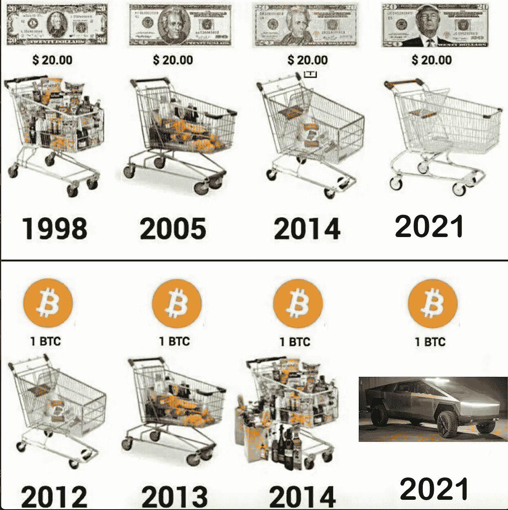

# 比特币和通货膨胀:你需要知道的

> 原文：<https://medium.com/coinmonks/bitcoin-and-inflation-what-you-need-to-know-ef26389a5bbc?source=collection_archive---------58----------------------->

我们一直将比特币称为对冲通胀的工具，因为我们认为，由于一个国家的政府印了更多的钱，法定货币总是会贬值。

众所周知，比特币的固定供应量为 2100 万枚，这使其成为一种对冲通胀的工具。

在这篇文章中，你将了解通货膨胀的含义，通货膨胀如何影响比特币，以及为什么比特币被认为是一种很好的对冲通货膨胀的工具。

# 什么是通货膨胀？

我们可以将通货膨胀定义为一种货币(如美元)的贬值导致商品和服务价格随着时间的推移而上涨的过程。

另一方面，它很容易被称为商品和服务价格的持续上涨。

通货膨胀是我们需要更多的货币来购买一定数量的商品和服务的原因。简而言之，降低了消费者的购买能力。

# 加密货币会经历通货膨胀吗？

是的，加密货币会经历通货膨胀。被称为通胀对冲工具的比特币也并非完全不受通胀影响。

由于加密货币被机构作为投资品持有，它们有时会与总体市场趋势保持一致。这表明，当市场下跌时，加密货币同样会出现价格下跌。

随着越来越多的比特币被开采，比特币也经历了通货膨胀。但是，前提是比特币的开采每四年自动减少 50%，它就会一直增值。

出于这些原因，比特币无法抵御通胀，但多年来，它一直是法定货币的合适替代品。

然而，并不是所有的加密货币都像比特币一样被创造出来。一些加密货币尤其是稳定货币可能表现不同。

稳定的货币容易受到通货膨胀的影响，随着时间的推移可能会贬值，因为它们与法定货币挂钩。随着法定货币价值的下降，稳定货币的价值也会下降。

# 为什么比特币是最好的通胀对冲工具？

通胀对冲是一种投资，被认为是为了保护货币因价格上涨而贬值所导致的贬值。

多年来，黄金一直被典型地用作通胀对冲，但黄金目前缺乏这种能力。

一些投资者认为黄金不是很好的对冲工具。他们认为比特币会更好，为什么？

*   比特币保持着有限的供应量。这意味着当比特币达到最大供应量时，没有新的比特币可以流通，从而降低了通货膨胀的风险。
*   它耐用、安全、稀缺，并且易于转让。世界上任何人都可以存储并轻松保护自己的比特币。你可以随时轻松地保存和出售你的比特币，因为它随时可用。
*   它不与任何货币或政府挂钩。这意味着比特币不能被任何群体、公司、政府或利益相关者控制。

总之，虽然不能忽视黄金等传统对冲方法，但加密货币现在提供了一种现代类型的资产，人们可以在确定通胀如何积极影响其投资组合时加以利用。

> *加入 Coinmonks* [*电报频道*](https://t.me/coincodecap) *和* [*Youtube 频道*](https://www.youtube.com/c/coinmonks/videos) *了解加密交易和投资*

# 另外，阅读

*   [3 商业评论](/coinmonks/3commas-review-an-excellent-crypto-trading-bot-2020-1313a58bec92) | [Pionex 评论](https://coincodecap.com/pionex-review-exchange-with-crypto-trading-bot) | [Coinrule 评论](/coinmonks/coinrule-review-2021-a-beginner-friendly-crypto-trading-bot-daf0504848ba)
*   [莱杰 vs n 格拉夫](/coinmonks/ledger-vs-ngrave-zero-7e40f0c1d694) | [莱杰纳诺 s vs x](/coinmonks/ledger-nano-s-vs-x-battery-hardware-price-storage-59a6663fe3b0) | [币安评论](/coinmonks/binance-review-ee10d3bf3b6e)
*   [Bybit Exchange 审查](/coinmonks/bybit-exchange-review-dbd570019b71) | [Bityard 审查](https://coincodecap.com/bityard-reivew) | [Jet-Bot 审查](https://coincodecap.com/jet-bot-review)
*   [3 commas vs crypto hopper](/coinmonks/3commas-vs-pionex-vs-cryptohopper-best-crypto-bot-6a98d2baa203)|[赚取加密利息](/coinmonks/earn-crypto-interest-b10b810fdda3)
*   最好的比特币[硬件钱包](/coinmonks/hardware-wallets-dfa1211730c6) | [BitBox02 回顾](/coinmonks/bitbox02-review-your-swiss-bitcoin-hardware-wallet-c36c88fff29)