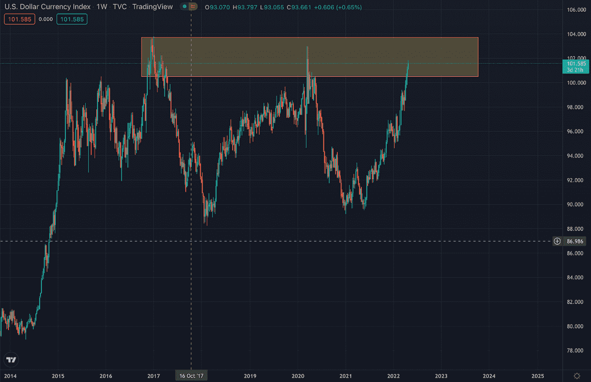

# 比特币和 DXY:可能的场景

> 原文：<https://medium.com/coinmonks/bitcoin-and-the-dxy-possible-scenarios-6921d428c00c?source=collection_archive---------30----------------------->

加密货币市场最近一直萎靡不振，一个原因可能是由于美元指数(DXY)。因此，跟踪 DXY 的走势对于为我们提供加密货币市场未来可能走向的更清晰的宏观视角非常重要。

**什么是 DXY？**

DXY 是相对于像欧元这样的一篮子外币来衡量的。本质上，DXY 值的上升意味着投资者选择持有现金，而不是股票或密码等风险更高的资产，这代表了一种避险环境。当 DXY 下跌时，这意味着投资者正在从 DXY 转向风险更高的资产，标志着风险环境。

目前，DXY 在周线上处于强劲的上升趋势，如下图所示。阻力区已经标出，对应于 DXY 估值见顶时的价格，2017 年和 2020 年各一次。DXY 估值的这些逆转对应于 2017 年和 2020 年的加密牛市。

**Crypto vs DXY**

通常，加密货币价格与 DXY 相反。也就是说，如果 DXY 上升，密码价格下降。如果 DXY 下跌，密码价格就会上涨。这是因为如前所述，DXY 代表了市场中的市场情绪。目前，随着全球形势的不确定性和世界范围内实施的经济紧缩措施，现在不是最有利于投资的环境。因此，投资者开始规避风险，转向传统上被视为最安全资产之一的现金。

随着投资者持有更多美元，在加密和股票等其他投资上的支出减少，这就是加密货币价格受到如此沉重打击的原因。也就是说，DXY 目前正遭遇阻力。这是否意味着 DXY 将逆转并允许 crypto 很快再次运行？

**可能的场景:**

一种情况是，如果 DXY 被电阻拒绝，随后下降。这对 crypto 来说将是一个好消息，因为它标志着投资者变得更有信心，更愿意将资金投入 crypto 等风险更高的资产，这是绝对可能的，因为 DXY 阻力已经超过 10 年没有被打破了(上次 DXY 高于 104 是在 2003 年 2 月)。由于美元的供应量仍然处于历史最高水平，许多投资者认为 DXY 将被坚决拒绝，事实上，这是一种可能的情况。

故事的另一面是，如果 DXY 设法突破阻力，这将是一个坏消息。截至目前，美联储已宣布 5 月份每月加息 0.5%，这是自互联网泡沫以来从未出现过的。除此之外，美联储还宣布了量化紧缩措施，即央行出售债券和资产，以减少资产负债表。这些当前的经济状况与 2017 年和 2020 年的经济状况有很大不同，2017 年加息幅度较小，2020 年不会加息。此外，量化紧缩措施现在也比 2017 年更加积极，目前美联储的目标是每月从资产负债表上清除 950 亿美元的资产，而 2017 年底每月约为 300 亿美元。因此，对美元的巨大需求可能会推动美元兑日元突破阻力。这对 crypto 来说是个坏消息，投资者有一个最坏情况的计划是很重要的。

**结论:**

总而言之，DXY 与加密货币价格呈负相关。随着利率上升，DXY 何时反转并下跌仍有待观察。归根结底，与美元供应相比，紧缩措施的力度有多大(基础经济学)。因此，请留意任何不那么激进的紧缩措施的消息。总体而言，这将对加密货币和市场构成利好。

在这种不确定的经济条件下，谨慎的做法是对两种情况都做好准备。即使我们个人希望加密货币价格上涨，我们也必须做好最坏的打算。因此，本文快速浏览了故事的两个方面，以提供一个公正的市场观点。请在下面分享你的想法和观点。你认为 DXY 会继续上涨还是会遭遇阻力？

> 加入 Coinmonks [电报频道](https://t.me/coincodecap)和 [Youtube 频道](https://www.youtube.com/c/coinmonks/videos)了解加密交易和投资

# 另外，阅读

*   [币安 vs FTX](https://coincodecap.com/binance-vs-ftx) | [最佳(SOL)索拉纳钱包](https://coincodecap.com/solana-wallets)
*   [如何在 Uniswap 上交换加密？](https://coincodecap.com/swap-crypto-on-uniswap) | [A-Ads 审查](https://coincodecap.com/a-ads-review)
*   [加密货币储蓄账户](/coinmonks/cryptocurrency-savings-accounts-be3bc0feffbf) | [YoBit 审核](/coinmonks/yobit-review-175464162c62)
*   [Botsfolio vs nap bots vs Mudrex](/coinmonks/botsfolio-vs-napbots-vs-mudrex-c81344970c02)|[gate . io 交流回顾](/coinmonks/gate-io-exchange-review-61bf87b7078f)
*   [CoinFLEX 评论](https://coincodecap.com/coinflex-review) | [AEX 交易所评论](https://coincodecap.com/aex-exchange-review) | [UPbit 评论](https://coincodecap.com/upbit-review)
*   [AscendEx 保证金交易](https://coincodecap.com/ascendex-margin-trading) | [Bitfinex 赌注](https://coincodecap.com/bitfinex-staking) | [bitFlyer 审核](https://coincodecap.com/bitflyer-review)