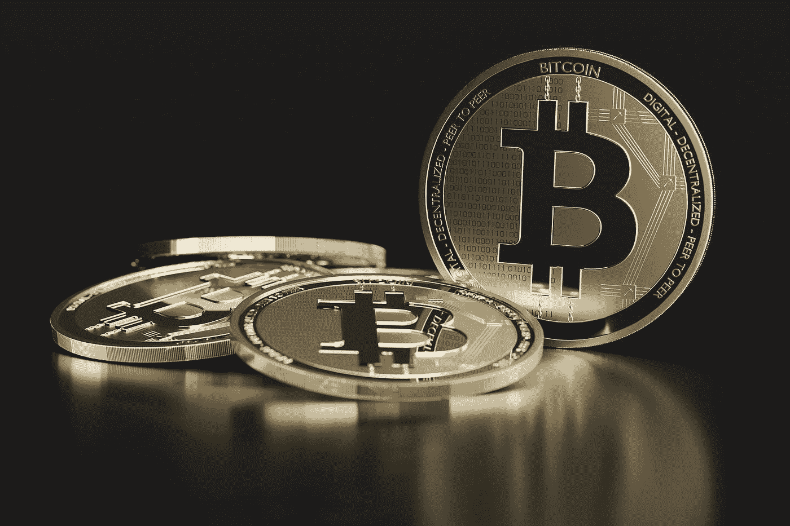
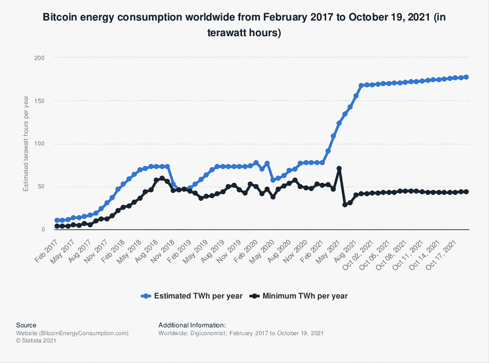
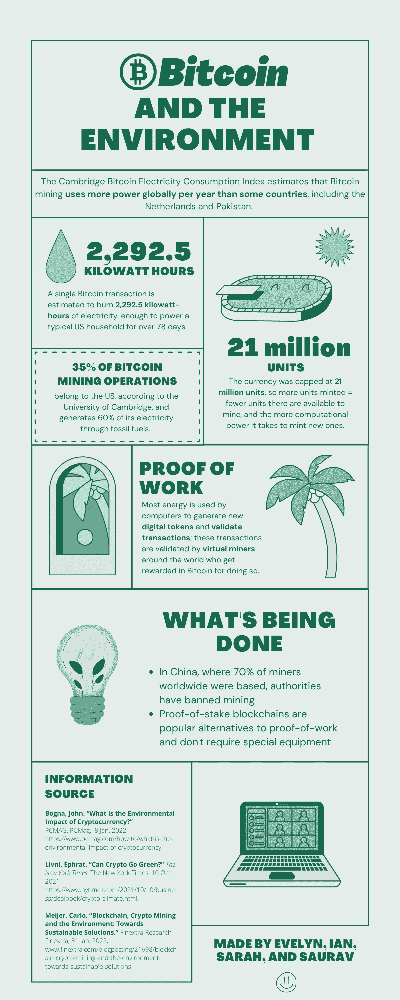

# 比特币与环境

> 原文：<https://medium.com/coinmonks/bitcoin-and-the-environment-b70422f34ddf?source=collection_archive---------26----------------------->

仅仅因为它是数字化的，并不意味着它没有对我们的世界产生切实的影响。

[Electronic mining can consume more energy than midsize countries](https://www.newyorker.com/news/our-columnists/bitcoins-troubles-go-far-beyond-elon-musk)

# 你好！欢迎来到我们的最终项目。

我们是伊芙琳、伊恩、莎拉和绍拉夫——西雅图华盛顿大学的学生。对于 INFO 350，我们的任务是选择一个信息道德和政策领域，并以某种方式与我们社区之外的人合作完成我们的最终项目。这篇文章强调了我们的头脑风暴和研究，以及我们的可交付成果的影响。

(对于那些只想看看我们最后做了什么的人，你可以滚动到最底部。但是我们还是希望你能花时间读完这些。)

# 介绍

在一个日益数字化的世界中，人们很容易迷失在这一切看似环保的本质中——有了 Kindles，书籍不再需要用纸制成，有了云，存储不再需要在物理闪存驱动器上进行。现在，随着加密货币的出现，就连货币也变得数字化了。然而，由于这些技术进步的无形本质，我们经常忘记这些创新对我们的环境产生了有形的影响。

这是我们最终项目想法的基础。我们认为，对于那些投资或考虑投资比特币的人来说，有机会认识到区块链带来的负面影响极其重要。无论是通过碳排放还是高能耗，加密货币都不是许多人认为的具有环保意识的法定货币新解决方案。

通过我们的项目，我们希望让更多的人了解加密货币。

莎拉

Fun fact: physical Bitcoins are called Casascius Bitcoins

# 我们完成的研究

当我们缩小项目范围时，我们看到了哥伦比亚大学的一篇关于比特币对环境和气候影响的研究文章。

这篇内容广泛的文章通过图片、文章和采访谈论了当前的状况、比特币采矿的未来影响，以及采矿系统需要如何改变才能看到更好的环境努力。这个来源对我们非常有用，因为我们正在考虑将信息图分成具体的部分。我们希望能够设计一个故事，讲述采矿的最初学习，当前的环境条件，未来的影响，以及在一定程度上解决这些问题的方法。

Photo by [Hal Gatewood](https://unsplash.com/@halacious?utm_source=medium&utm_medium=referral) on [Unsplash](https://unsplash.com?utm_source=medium&utm_medium=referral)

这个路线图将与这篇文章保持一致，因为我们希望通过一个故事恰当地教育我们的读者，同时也使它在视觉上吸引人，以理解这个主题及其背后的规范伦理的重要性。

总之，我们可以将我们的信息图视为本文的摘要，因为我们能够在需要完成的一小部分工作中提供带有相关统计数据的简明信息。此外，我们超越了这篇文章，因为我们的注意力集中在比特币上，但这也引出了其他不遵循股权证明概念的加密货币。

-绍拉夫

Statista 是一家专注于消费者和市场数据的德国公司。它包含了超过 80，000 个主题，并且每个主题都有详细的统计数据。

Photo by [Pierre Borthiry](https://unsplash.com/@peiobty?utm_source=medium&utm_medium=referral) on [Unsplash](https://unsplash.com?utm_source=medium&utm_medium=referral)

[这个特别的发现](https://www.statista.com/statistics/881472/worldwide-bitcoin-energy-consumption/)是关于 2017 年 2 月至 2021 年 10 月比特币的能源消耗。此外，这与我们正在做的事情非常相似，因为我们希望使用统计数据和分析趋势来添加到我们的信息图中。

这将增加我们的论点，即比特币采矿对环境有害，我们将能够解释它将在多大程度上影响我们的气候。这个项目是我们路线图的一个模型，因为我们可以在我们的信息图中使用统计数据，还可以将它与它可能导致的其他外部影响联系起来。

此外，可视化描述了比特币能耗相对于每年采矿能耗的重要性，以及两者之间的巨大差异。

最后，该项目还教授如何测量能源消耗单位，这对于了解这一过程如何工作以及如何提高效率非常重要。我们的项目偏离了这种统计可视化，因为我们强调了环境的负外部性以及它如何影响我们的日常生活，并且有教育成分。来自 Statista 的项目只是强调了能源消耗，但不能提供教育途径或解决这一危机的方法。

各种文章和信息视频并没有把我们的信息图能够创造的环境灾难的不同部分结合起来。他们磨练成一个子主题是统计数据，目前的影响，或一个可能的解决方案，但我们的项目处理所有三个概念，让用户通读。

比较-AN

# 影响

我们选择了一个信息图作为最终项目媒介，因为我们觉得这是与人们有效沟通的最佳方式，这些人可能不想阅读关于该问题的冗长的官方文章，但也希望对问题和当前解决方案有一个总体的了解。

信息图表可以很容易地通过社交媒体分享，这将导致比我们坚持最初的想法更广泛的影响点，即在 R 中创建数据可视化，这将大大增加分享的难度。此外，我们制作的信息图中没有太多会淹没观众的信息，因为我们希望获得一个易于消化、美观的可信信息来源，可以快速共享。

Photo by [dole777](https://unsplash.com/@dole777?utm_source=medium&utm_medium=referral) on [Unsplash](https://unsplash.com?utm_source=medium&utm_medium=referral)

下一步，我们将创造更多的深度，更多的图形，可以在一个集合中共享，让观众阅读更多关于这个问题的许多不同方面的详细信息。此外，添加一个资源或请愿书的列表可能会有所帮助，如果人们愿意加入，他们可以捐赠或签名。为想要开始比特币挖掘的人提供步骤也将非常有效，但要以更可持续的方式进行。

-伊芙琳

# 我们的信息图

感谢您花时间阅读更多关于比特币采矿及其对我们环境的影响的信息。下面是我们最终的信息图——请欣赏！

Our final product!

# 引用的作品

20，R. C. |S .，Cho，r .，Dexfolio，j .，S，e .，Ishita，Nerad，S .，Joad，t .，& Dallaire，L. (2021 年 9 月 16 日)。*比特币对气候和环境的影响*。地球的状态。检索于 2022 年 2 月 28 日，来自[https://news . climate . Columbia . edu/2021/09/20/bitcoins-impacts-on-climate-and-the-environment/](https://news.climate.columbia.edu/2021/09/20/bitcoins-impacts-on-climate-and-the-environment/)

贝斯特河。(2021 年 10 月 21 日)。*2017–2021 年全球比特币能源消耗*。Statista。2022 年 2 月 28 日检索，来自[https://www . statista . com/statistics/881472/world wide-bit coin-energy-consumption/](https://www.statista.com/statistics/881472/worldwide-bitcoin-energy-consumption/)

> 加入 Coinmonks [电报频道](https://t.me/coincodecap)和 [Youtube 频道](https://www.youtube.com/c/coinmonks/videos)了解加密交易和投资

# 另外，阅读

*   [最好的卡达诺钱包](https://coincodecap.com/best-cardano-wallets) | [Bingbon 副本交易](https://coincodecap.com/bingbon-copy-trading)
*   [印度最佳 P2P 加密交易所](https://coincodecap.com/p2p-crypto-exchanges-in-india) | [柴犬钱包](https://coincodecap.com/baby-shiba-inu-wallets)
*   [八大加密附属计划](https://coincodecap.com/crypto-affiliate-programs) | [eToro vs 比特币基地](https://coincodecap.com/etoro-vs-coinbase)
*   [最佳以太坊钱包](https://coincodecap.com/best-ethereum-wallets) | [电报上的加密货币机器人](https://coincodecap.com/telegram-crypto-bots)
*   [交易杠杆代币的最佳交易所](https://coincodecap.com/leveraged-token-exchanges) | [购买 Floki](https://coincodecap.com/buy-floki-inu-token)
*   [3 commas vs . Pionex vs . crypto hopper](https://coincodecap.com/3commas-vs-pionex-vs-cryptohopper)|[Bingbon Review](https://coincodecap.com/bingbon-review)