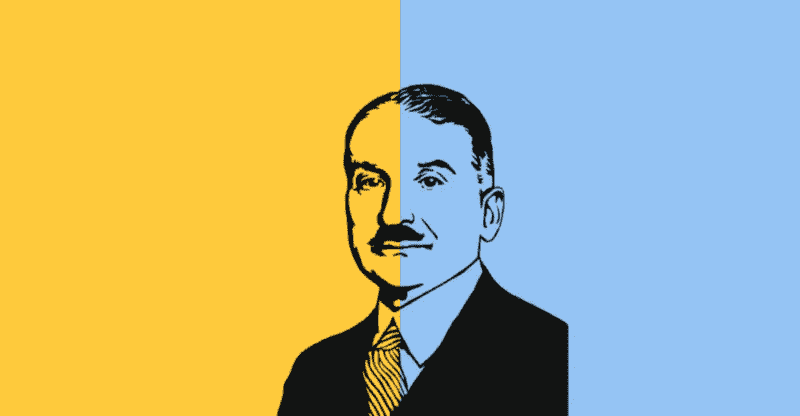

# 第 6 部分:比特币和回归定理

> 原文：<https://medium.com/coinmonks/bitcoin-and-the-regression-theorem-2d290167ccf1?source=collection_archive---------29----------------------->

这是我的系列文章的第 6 部分，我从奥地利经济学的角度来审视比特币。在他的部分中，我探讨了比特币如何符合回归定理。我在 [*第五部分*](https://satoshibaggins.medium.com/the-regression-theorem-and-proto-money-paradox-9747550392f5) *讲过回归定理。这里看其他部分:*

*第一部分:* [*奥地利经济学概论*](https://satoshibaggins.medium.com/introduction-to-austrian-economics-54adae65d38b?source=your_stories_page-------------------------------------) *第二部分:* [*货币的起源*](https://satoshibaggins.medium.com/origin-of-money-e04e756578e7) *第三部分:* [*货币的功能和属性*](https://satoshibaggins.medium.com/the-function-and-properties-of-money-975c8f52857)

*第四部分:* [*透过奥地利经济学的镜头看比特币的出现*](https://satoshibaggins.medium.com/the-emergence-of-bitcoin-through-the-lens-of-austrian-economics-36cf7bcd09ff)

*第五部分:* [*回归定理和原型货币悖论*](http://the%20regression%20theorem%20and%20proto%20money%20paradox/)

*第六部分:* [*比特币与回归定理*](https://satoshibaggins.medium.com/bitcoin-and-the-regression-theorem-2d290167ccf1) *第七部分:* [*比特币的畅销*](https://satoshibaggins.medium.com/salability-of-bitcoin-845f393ec844)

—

关于比特币是否“违反”米塞斯回归定理，一直有一些讨论。许多人认为它与比特币不兼容，而其他人则提出了各种解释，解释为什么奥地利学派和比特币理论之间没有冲突。这一部分深入探讨了这个定理，以及比特币是如何与之相适应的。另一种观点也将出现，比特币被比作原始货币，这是尼克·萨伯在他的著作中使用的术语。

在米塞斯将主观价值理论应用于货币之前，奥地利经济学家在试图解释货币价值时经历了循环:货币之所以有价值，是因为你可以用它交换商品。你可以和他们交换货物，因为它很有价值。这里少了点什么。

米塞斯在门格尔的最畅销商品理论的基础上，引入了他的回归定理。该定理解释说，货币的价值可以用其未来的购买力来解释。个人可以推测它的购买力，因为他们昨天观察了它。回归定理描述了商品如何作为交换媒介获得原始需求。根据这个定理，在积累交换媒介需求之前，一件商品必须有一个优先的产生价值的直接用途。简而言之，该定理表明货币商品的购买力回归到直接使用需求。

这种回归会一直持续到商品因直接消费而被估价的那一天，也就是说，为商品本身而估价的那一天。经济学家 jrg Guido hülsmann 在他的书《货币生产的道德规范》中解释说，最初为商品的非货币用途支付的价格使得买家能够估计这些商品的未来销售价格。在不知道过去价格的情况下，购买一种商品进行间接交易是非常危险的，因此，当这种知识缺乏时，交易媒介就无法出现。

然而，必须指出，交换媒介之所以成为货币，不是因为它们的直接效用(消费)，而是因为它们的可销售性(流动性)。许多商品被用作货币，直到它们被停止流通，因为新的、更易销售的、交易成本更低的货币出现了。在[第二部分](https://satoshibaggins.medium.com/origin-of-money-e04e756578e7)中考察了可以成为畅销商品的属性。

> 抱歉这样打断你的阅读！但是你想要更多但是不同的比特币内容吗？我可能有你需要的东西。
> 
> 它叫做 TLDR 比特币。
> 
> 每周我花 20 个小时看比特币新闻。每个星期天，我都会在一封 3 分钟的邮件里分享我学到的东西。
> 
> 我会一勺一勺地给你讲最好的比特币故事，还夹杂着一些堕落的幽默。
> 
> 你可以在这里订阅:【https://tldrbtc.substack.com/】T4
> 
> 下周日见，
> 
> 巴金斯
> 
> 好吧，回到奥地利经济学

**比特币和回归定理**

乍一看，比特币作为交换媒介的出现似乎并不符合米塞斯的回归定理，因为比特币除了交换用途之外，从未有过任何直接用途。试图让比特币符合回归定理的第一次尝试是一个普遍的论点，即回归定理只适用于没有现有货币价格的易货经济。

Walter **Block 和 Laura Davidson** 认为比特币并不违反该定理。根据他们的观点，一种商品在两种情况下可以成为交换媒介:(1)它需要出现在没有货币价格的纯粹易货经济中(回归到它的直接使用价值),或者(2)它出现在现有货币已经有价格的经济中。后者描述了比特币是如何出现的，因为一个复杂的经济存在货币的价格结构。在这种情况下，比特币的出现并不违反米塞斯定理。康拉德·格拉夫还认为，比特币设法提升了其购买力，因为先进的相对货币价格已经存在，缓解了比特币的进化挑战。

格拉夫提到一些可能的“直接用途”是神秘价值、极客吸引力、好奇心、对爱好者的挑战和社交信号。遵循方法论个人主义和主观价值理论，这些直接使用不需要被除了个人自己之外的任何人认可。

然而，有人试图指出关于回归定理的逻辑矛盾。奥地利经济学的一些支柱是主观价值和边际效用理论，在[第一部分](https://satoshibaggins.medium.com/introduction-to-austrian-economics-54adae65d38b)中有解释。 [Eric Voskuil 论证](https://github.com/libbitcoin/libbitcoin-system/wiki/Regression-Fallacy)该定理违背了主观价值理论，尽管它依赖于主观价值理论；价值总是主观的，因此可以基于几乎任何东西，就比特币而言，可以基于作为交易媒介的效用。像所有其他商品一样，货币受制于我们基于其效用的估价。边际效用定律不涉及“客观”使用价值，而是涉及主观使用价值。这意味着它不关心商品的价格或物理或客观属性，而是关心它在满足个人自我感知需求方面的相关性。商品的效用是满足需求。因此，任何满足需求的东西都有效用，这反过来又在个人心目中赋予好的价值，从而使商品具有购买力。由于比特币的特性，一些用户认为持有比特币有用，并将比特币及其特性视为满足其需求的一种手段。

由于之前使用过比特币，所以它有一个价格或流动性来满足一种需要；它有效用。这种效用是直接的还是金钱上的并不重要。这就引出了直接使用和货币价值之间的区别是否必要的问题。货币是满足流动性需要的商品，流动性来源于交换的需要。比特币获得最初流动性的原因最有可能是投机以及为迎合这种投机而出现的市场。这使得从商品到交换媒介的转变成为可能。一种商品从直接交换过渡到间接交换所需要的是对这种商品更多的需求，不管这种需求的原因是什么。从这一点来看，潜在的间接交换机会的数量增加了。

Satoshi 提出，人们可以通过预见比特币对交换的潜在用途来获得其初始价值，甚至提到收藏家最初可以激发初始价值。 **Szabo 解释说**这种个人收集稀有物品的倾向可以促进货币化进程。无论是投机还是之前提到的其他用例，这些都是直接使用，因为它们没有用于间接交换。这些用途需要满足的是一个经验性的问题，只能问参与这些行动的个人。

从历史上来说，最早的交换媒介可能是 12 万年前由贝壳制成的可佩戴的珠子，除了具有很好的收藏价值外，似乎没有什么使用价值。然而，这些珠子是人们想要的商品。虽然这些奇特的装饰性原始货币/收藏品具有使其可销售的品质，但这些原始货币似乎不需要使用价值就能成功地成为货币媒介。它们的出现是因为它们具有有利于货币功能的特征:部落间的交易以签订契约，长期储存价值，并将其转移给下一代。经济学和人类行为的公理并不关心行为的合理性，而只关心如何最好地满足需求。因此，前面提到的这些比特币用途并不相关；它们之所以重要，是因为它们存在过。

在《T4》第二部中，货币的出现被描述为一个有机的市场过程，在这个过程中没有人创造它。虽然比特币不是创立的，而是有明确目的发明的，但它仍然遵循理论。它是由感知利益的个人自愿采用的:个人试图满足他们的需求，不管这些需求是什么。没有人被迫使用比特币。比特币被提供给市场，作为一个非常古老现象的工具:促进现在或未来的交换。

**比特币作为原始货币**

参见我在第五部分中对原型货币的讨论。

大多数交换媒介都有一定的流动性，这是它们在货币化过程中的某个时刻获得的。然而，前面提到的“原型货币”似乎缺乏流动性:交易很少发生。虽然这些原始货币出现的时代与现代不同，但将早期的原始货币与比特币进行比较可能会有所帮助。虽然时代不同，但个人投机的动机和倾向似乎是人类与生俱来的。这是因为，就像比特币一样，在许多情况下，它们似乎除了作为交换媒介之外没有其他用途。

如果人们一开始就将比特币视为原始货币，那么就可以看到早期采用者可能与早期人类有着相同的使命:预测其他人会想要什么东西。比他们的对手更成功的投机者通过囤积想要的东西来获得财富。这可以和比特币形成对比。可以看出早期用户是如何囤积比特币的，因为在评估了比特币的潜在可销售性足够高之后，他们推测未来会有其他人需要比特币。新兴投机市场加剧了这种投机，如早期的比特币交易所 MtGox。这一过程自然会使个体集中在少数几个主导对象上，形成一个反馈回路。

当被视为原始货币或“收藏品”时，个人尽早购买比特币是有意义的，因为用户相信比特币有一天会成为货币。比特币使用量的增加最终使其越过了原始货币阶段。具有这些特征(耐磨性、隐藏能力)的原始货币，个人天生就意识到用“真正的商品”交换这些看似“无用”的物品的好处，可能认为这些漂亮的物品也会被其他人需要，这些人也会意识到拥有它们的好处。比特币也可能被视为“无用”，因为拥有它的好处并不明显。然而，有趣的是，比特币交易所 MtGox 在成为交易比特币的地方之前，是一个交易其他类型收藏品的交易所，即“魔法:在线聚会”卡片。

可以说，在最初几年，当比特币没有价格或购买力时，它可以被描述为收藏品或原型货币。只有少数人有洞察力和信心，认为比特币有可能成为一种流动性货币商品。像奇怪的原始货币一样，比特币满足了某些人的需求，后来积累了货币价值。“使用价值”和“交换价值”的区分是否有必要，值得商榷。购买交易媒介是一种隐含的经济声明，即这种商品(比特币)是有需求的。随着越来越多的人效仿这种行为，比特币可以发展成为“纯粹的收藏品”

*在* [*第七部分*](https://satoshibaggins.medium.com/salability-of-bitcoin-845f393ec844) 、*中，我将通过关注三个维度来更深入地考察比特币的畅销性。*