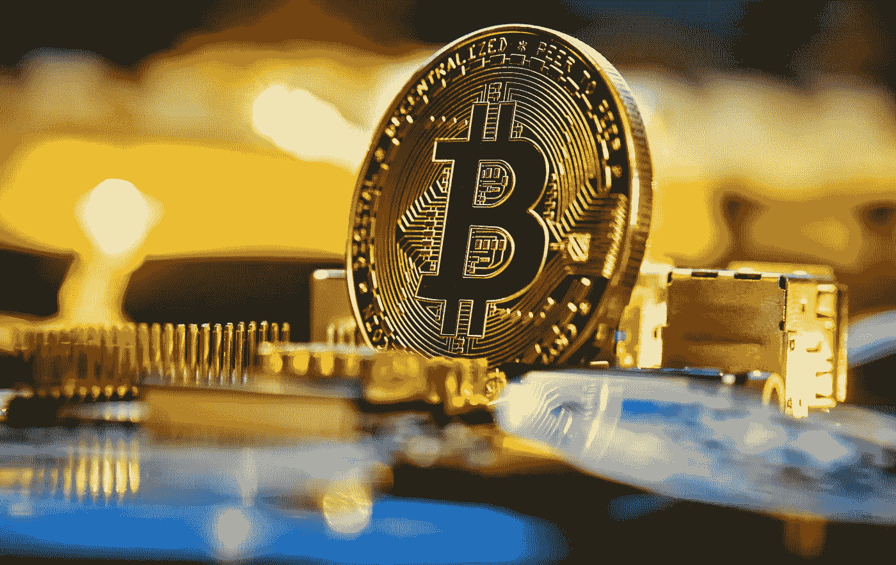

# 比特币和信任都是不可避免的

> 原文：<https://medium.com/coinmonks/bitcoin-and-trust-are-both-inevitable-f89fa0bdedad?source=collection_archive---------50----------------------->

Source photo Unplash.com

我最初是在阅读“Gnu 隐私手册”时接触到信任网的概念的，任何优秀的隐私倡导者都会这样做。电子邮件中的 PGP 是安全专家和爱好者在 20 世纪 90 年代末产生时讨论的一个专门问题，尽管它今天仍然普遍使用，但我们通常希望为我们处理端到端加密。PGP 和比特币一样，都是基于公钥的…