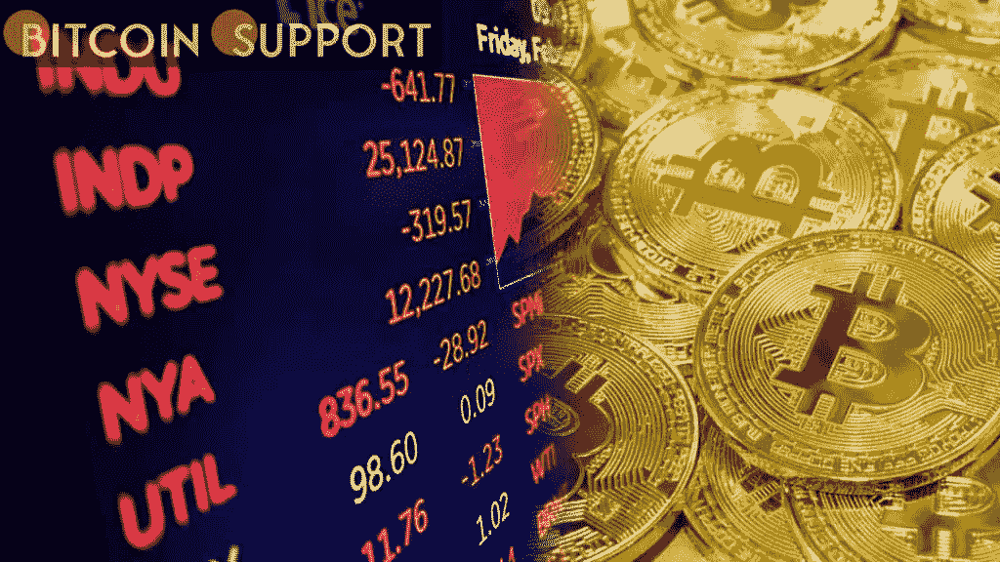

# 随着核威胁在全球市场蔓延，比特币和美国股市双双下跌

> 原文：<https://medium.com/coinmonks/bitcoin-and-us-stocks-both-fall-as-the-nuclear-threat-spreads-through-the-worlds-markets-f17f4bd2842e?source=collection_archive---------82----------------------->

**Visit our website:-** [**https://bitcoinsupports.com/**](https://bitcoinsupports.com/)

BTC/美元在两天内下跌超过 10%,加剧了对乌克兰事件的担忧。在 3 月 4 日的华尔街公开赛上，比特币(BTC)的多头几乎没有喘息的机会，因为 40，000 美元的支撑位越来越大。

**市场“不稳定”，但比特币可能反弹**

TradingView 数据显示，BTC/美元在 Bitstamp 上创下 3 月新低，为 40551 美元，两天的跌幅达到 10.2%。对乌克兰核基础设施安全的担忧不仅拖累了加密市场，也拖累了传统市场，标准普尔 500 指数下跌 1.4%，与欧洲指数一致。

“随着乌克兰紧张局势升级，比特币正在修正，随着黄金飙升，焦虑情绪也在上升。”

“我们可能会看到反弹；如果是这样，我会在 43.1-43.5 美元寻找阻力，”市场普遍不稳定，替代硬币也在下降。与此同时，持谨慎态度的 Pentoshi 警告称，由于大宗商品通胀、各国央行遏制通胀的能力下降，以及过去两年冠状病毒应对措施造成的现有损害，宏观经济预测似乎令人沮丧。

“你已经可以看到其他市场的基础出现了巨大的裂缝；香港已经逆转了 100%的后 covid 涨幅，欧洲市场似乎也在跟进，”他周四在一系列关于这种情况的推文中发了一条推文。“我不知道一个人怎么能在回顾过去的时候对未来保持乐观。”本周，石油继续是一个很好的例子，WTI 原油价格达到了十年来的最高水平，布伦特原油突破了每桶 112 美元。另一方面，尽管俄罗斯的石油供应有很大的折扣，但却很难找到消费者。

**价格的盘整是“意料之中的”**

然而，并不是所有人都对比特币感到悲观。通过分析最近的图表走势，热门账户 BTCfuel 确定了一个即将到来的反弹。“比特币似乎正在建立一个反转结构，”他用一张图片描绘了 BTC 两种可能的价格轨迹。https://twitter.com/BTCfuel/status/1499748578457178113

其他人，如推特用户 Kaleo，仍然无动于衷。

“不出所料，盘整于 40.5K — 42K 区域上方支撑。”我对从这个区间反弹保持乐观，”他周五写道。

**访问我们的网站:-**[**https://bitcoinsupports.com/**](https://bitcoinsupports.com/)

**免责声明:以上为作者观点，不应视为投资建议。读者应该自己做研究。**