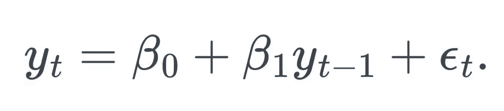
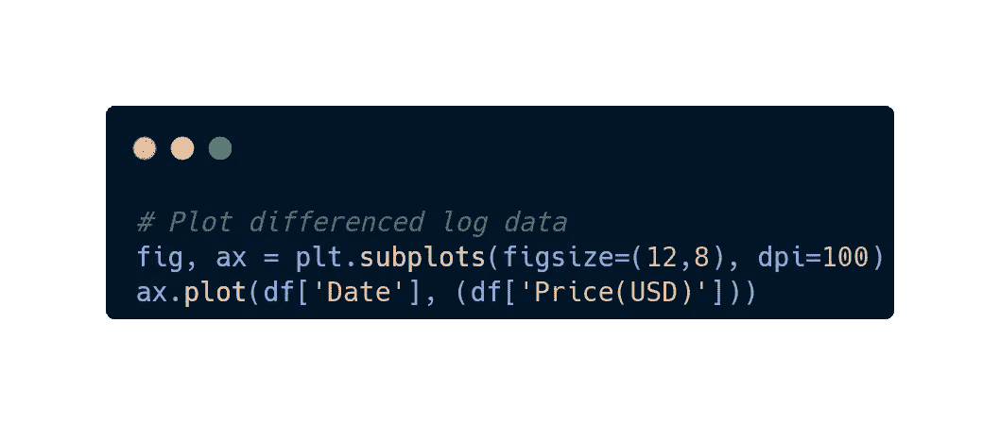
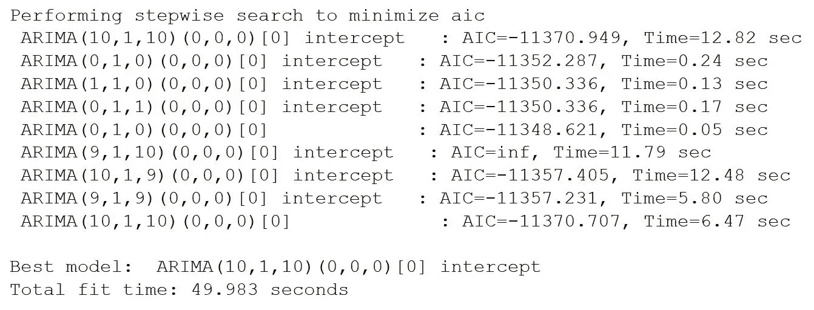
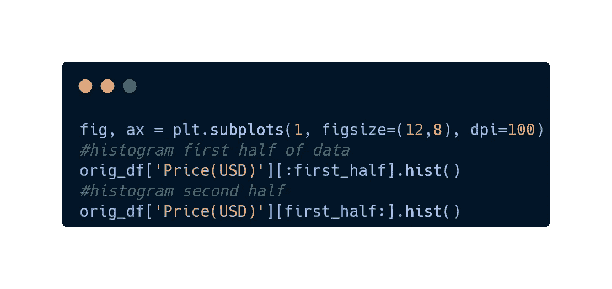
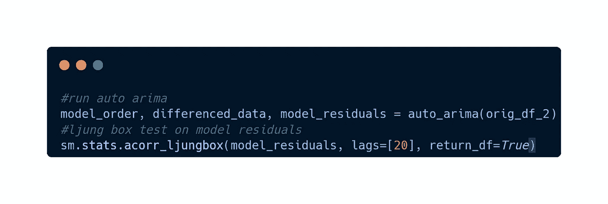

# 我用 ARIMA 模拟了比特币的价格，所以你不需要这么做

> 原文：<https://medium.com/coinmonks/bitcoin-arima-model-f22456bd1fa9?source=collection_archive---------2----------------------->

Photo by [André François McKenzie](https://unsplash.com/@silverhousehd?utm_source=medium&utm_medium=referral) on [Unsplash](https://unsplash.com?utm_source=medium&utm_medium=referral)

如今，无论走到哪里，都很难不听到有人喋喋不休地谈论比特币，以及赚快钱是多么容易。然而，尽管上涨看起来令人难以置信，但也并非没有突然的市场崩盘和看到投资组合价值缩水 50%的痛苦日子。但是，如果有可能在市场上进行跳跃，并预测未来几天、几周或几个月的价格会是多少呢？想象一下，如果我们能在价格崩盘前卖掉我们的资产，然后在价格触底时再回购。我使用了一种叫做 ARIMA 的时间序列预测技术来尝试预测比特币的未来价格，得到了一些有趣的结果！

## 什么是 ARIMA？

ARIMA 模型代表自回归综合移动平均，用于时间序列数据；一段时间内对相同数据的一系列测量，例如比特币的每日价格。ARIMA 是两种模式的产物；自回归模型(AR)和移动平均模型(MA ),它们是使用过去值(滞后值)预测未来值的回归模型。为了理解 ARIMA 背后的理论，我将首先分别解释这两个组成部分。

## AR 模型

因为 AR 模型基于过去值影响当前值的概念，所以它在分析时变过程时很受欢迎。在 AR 模型中，我们可以通过使用变量过去值的线性组合来预测感兴趣的变量。然而，由于它们完全基于历史数据，它们天真地假设影响过去价格的基本力量不会随着时间的推移而改变，从而导致潜在的意外和不准确的预测。该模型可以用以下公式表示:

其中:

*   **β0:** 常数项。
*   **β1γτ-1:** 时间序列中以前值的回归，其中:
    **- γτ-1** :本期
    **前 1 个时段的值- β1** :本期前 1 个时段的系数
*   **ετ** :模型残差。

上述等式表示 AR(1)模型，这意味着预测值是使用当前期间之前的第一个期间预测的。AR(2)模型的公式类似，但是，“β1γτ-1 + β2γτ-2”将代替“β1γτ-1”，这意味着预测值是使用当前期间之前的前两个期间预测的。为了确定模型项的滞后数量，使用并分析了偏自相关函数(PACF ),以查看滞后中是否有任何统计上显著的信号，表明以前的值会影响将来的值。

## 马模型

移动平均模型不是在回归中使用过去的预测值，而是在类似回归的模型中使用过去的预测误差。该模型基于这样一个概念，即我们可以通过了解我们昨天的预测与实际值相比有多远来调整模型，以提高其预测能力。该模型可以用以下公式表示:

其中:

*   **:** 常数
*   **θ1ψτ-1:**时间序列上一次残差的回归其中:
    **- θ1:** 本期前 1 个时段的系数
    **-ψτ-1:**本期前 1 个时段的残差
*   **πτ:**当前时段的残差

上述等式表示 MA(1)模型，这意味着预测值是使用当前期间之前的第一个期间预测的。MA(2)模型的等式类似，但是，“θ1πτ-1+θ2πτ-2”将代替“θ1πτ-1”，这意味着预测值是使用当前期间之前的前两个期间预测的。为了确定模型项的滞后数量，使用并分析自相关函数(ACF ),以查看滞后中是否有任何统计上显著的信号，表明以前的误差影响将来的值。

## 那么什么是 I 呢？

所以你可能想知道 ARIMA 的 I 代表什么。
简单地说，I 是一个术语，它指定了应用于时间序列的差分顺序，以使其“平稳”差分就是从时间序列的当前值中减去以前的值。“I”代表的值是达到平稳性的次数。当时间序列的属性(如均值和方差)不受测量时间的影响时，该时间序列就是静态的。因此，具有长期特征模式(即周期、趋势或季节性)的时间序列不是静止的。因此，如果对时间序列进行一次差分后没有得出恒定的平均值和方差，则应重复该过程，直到达到这一点，但要小心，不要过度差分。

## 让我们赚点钱吧！

该演示将在 Python 中完成，同时从 coin geckos 免费公共 API-[https://www.coingecko.com/en/api](https://www.coingecko.com/en/api)访问历史每日比特币价格

# 导入包

使用以下软件包:

*   请求:用于从 coin gecko 的 rest API 请求数据的包。
*   JSON:用于将来自 API 的响应对象解析成 JSON 格式。
*   Datetime:用于日期争论。
*   Matplotlib:用于可视化数据。
*   熊猫:将数据解析为数据框架并用于争论目的。
*   出于争论的目的
*   stats models:ARIMA 模型和其他统计工具有助于模型拟合过程。
*   pmdarima:包含 Auto-Arima 的包。

# 检索数据

为了预测未来，我们需要历史数据来训练我们的模型。访问 coin gecko 的公共 API 可以轻松获取每日历史价格。请注意，我们将变量“chosen _ currency”赋值为“比特币”。我们有可能将它改为“以太坊”,并获得该硬币的所有历史价格。此外，“num_days”表示我们需要多少天的历史数据。我已经将它设置为一个值，确保它获得所有可能可用的数据。然后，响应变量被转换为 JSON 格式，我们可以看到现在可用的数据。

# 将数据解析到数据框并清理

接下来，需要将数据解析为 pandas 数据帧，并进行一些清理。列被重命名为更直观，日期列是 ms 格式，我们将把它转换为 day 格式。此外，有些日期有两个价格条目。在这些情况下，我们希望采用最后的价格，以便在我们的数据集中保持一致，并且每天都有最新的价格列表。

# 平稳性测试

如前所述，我们的时间序列必须是平稳的。首先，我们可以绘制数据并直观地观察它的表现。

## 减少差异

有一个明显的上升趋势，一个描绘非平稳时间序列的非恒定方差。使数列平稳的第一步是稳定方差。对数据执行对数转换会有所帮助。

虽然有所改进，但从视觉上看，该系列似乎还不是静态的，我们可能需要做进一步的转换来实现平稳性。然而，可以执行两个测试来查看时间序列是否是平稳的。这些是:

*   **增广的 Dicky Fuller 检验(ADF 检验):**用于检验数列非平稳的零假设。数字越负，对时间序列非平稳的零假设的拒绝就越显著。进一步，如果 p 值是< 0.05，我们可以拒绝零假设。
*   **科维亚特科夫斯基-菲利普斯-施密特-申(KPSS):** 用于检验序列平稳的零假设。检验统计量越高，对序列平稳的零假设的拒绝就越显著。进一步，如果 p 值是< 0.05，我们可以拒绝零假设。

当我们进行这些初始测试时，我们得到了结果:

*   **ADF:**
    - ***ADF 统计:****-1.006950*
    -***p 值:*** 0.750721
*   **KPSS:
    - *检验统计:***0.403042
    ***-p 值:*** 0.010000

上述结果表明，ADF 未能拒绝零假设，而 KPSS 拒绝零假设，这意味着序列是非平稳的。

## 差异数据

为了找到差分数据的最佳次数，我设置了一个连续循环来继续差分，直到 p 值变得显著。

一次迭代后，循环退出，因为它已经达到了显著的 p 值，我们对差异数据执行 KPSS 测试，并观察结果:

*   **ADF:**
    - ***ADF 统计:***-14.878432
    -***p 值:*** 0.000000
*   **KPSS:**
    -**-*检验统计:*-**0.061985
    -**-*p 值:*-**0.100000

对数据进行一阶差分后，ADF 的零假设被拒绝，而 KPSS 的零假设不能被拒绝，这表明时间序列现在是平稳的。此外，如果我们形象化这个系列，它现在显示一个恒定的平均值和恒定的方差。

## ACF & PACF

下一步是确定模型中 AR 和 MA 部分的术语。获得这些项的一种方法是使用 statsmodels 自相关函数(ACF)和部分自相关函数(PACF)绘图函数。ACF 图显示时间序列与其滞后值之间的相关系数。它解释了给定时间序列的现值如何与以前的值相关联。同样，PACF 解释了序列和它的滞后之间的部分相关性；但是，它关联了γ(τ)和γ(τ-3)中没有被γ(τ-1) γ(τ-2)预测的方面。当观察这两个图时，我们寻找阴影区域之外的重要点和几何衰减，如果我们处理的是 ARIMA 可能适用的时间序列。

现在观察一下 ACF 和 PACF 的图表，有些事情似乎有点古怪。虽然有一些显著点，但没有几何衰减，滞后 0 后有急剧的下降。通过使用这些图表来定义模型的术语是复杂的，并且容易出错，相对来说，我们看到的很可能是 ARIMA(0，1，0)模型，但是我们可能会被愚弄，以为我们的 AR 和 MA 术语有 6 和 10 的任意组合。如果我们确实在处理 ARIMA(0，1，0)模型，我们的差分数据将是所谓的“白噪声”，这意味着我们的原始数据是所谓的“随机游走”。在继续之前，有必要讨论一下这两个概念。

如果变量独立且同分布，均值为零，则时间序列是白噪声。此外，随机游走是一系列数字，其中每个值都是前一个值的函数。当随机游走取第一个差时，留下一个白噪声序列。伯顿·马尔基尔在《华尔街的随机漫步》中提出的理论是，所有的股票/证券价格都是随机游走的，它们在有效市场内运行，因此可以做出的最佳预测是使用前一时间步的观察结果来预测下一时间步将会发生什么。

所以现在我们有几个问题:

*   我们需要知道我们的时间序列是否是随机游走。
*   我们需要知道该型号的订购条件是什么。

我们可以基本上一致地完成这些步骤。如果我们把数据从中间分开，我们可以看到均值和标准差几乎相同；但是，值的分布略有不同。

我们可以使用 l jung-Box 检验来确定时间序列中的任何自相关组是否不为零，而不是用我们的眼睛来解释。该测试可定义为:

*   H0:数据是独立分布的。
*   Ha:数据不是随机分布的；相反，它们表现出序列相关性。

该测试可应用于我们的数据和拟合模型的残差。如果零假设被拒绝，我们有统计证据表明数据包含序列相关性，而不是白噪声。另一方面，当我们对模型的残差进行测试时，拟合良好的模型应该返回残差是白噪声的统计证据，因为这意味着我们的模型已经捕获了数据中所有相关的方面，剩下的只是噪声。对数据进行测试后，我们得到 p 值为 0.000046，这意味着我们有统计证据来拒绝零假设，并且数据不是随机分布的，也不是白噪声。

## 拟合模型

虽然我们可以手动测试和拟合我们自己的各种模型，但一个名为“Auto-Arima”的自动化功能会自动拟合和测试一组模型，并返回具有最低 AIC 值的模型。我应用这个函数，它返回的结果是最佳拟合是 a (10，1，10)。

然后，我们对模型的残差应用 l jung–Box 检验，得到 p 值为 0.919387，这意味着我们不能拒绝零假设，我们的残差是白噪声。

## 做预测

我们现在有了一个模型，可以对未来做出预测。所以让我们继续预测下一周，并想象一下这个预测。

上图显示了我们对未来七天的模型预测，并描绘了我们有 95%把握可以预期的价格范围。橙色线是平均预测，而紫色阴影区域有上下置信区间。

## 是时候赚钱了！

Photo by [Erik Mclean](https://unsplash.com/@introspectivedsgn?utm_source=medium&utm_medium=referral) on [Unsplash](https://unsplash.com?utm_source=medium&utm_medium=referral)

那么我们有钱了吗？不完全是。正如你们之前所回忆的，有明显的证据表明我们在处理随机漫步。虽然认为我已经解决了如此复杂的问题无疑会纵容我的自负，但我会表现出一些谦卑，并更深入地研究。如果我们回顾一段时间内的所有价格变动，可以注意到，在 2017 年之前，价格变动不像 2017 年以来那样动态，因此该数据可能无法准确反映比特币目前的表现。或许去除早些年的数据，着眼于 2017 年以后会更有说服力，并证实我们对这一时间序列是随机游走的怀疑。因此，我们可以做的是继续前进，并对新的精简数据集执行先验逻辑。

## 减少数据

简化数据上的 ACF 和 PACF 图显示，在 20 个滞后中只有一个尖峰是显著的，这是一个可以预期随机出现的量(5%)。

如果我们将数据集分成两半，我们在两半上都有接近 0 的平均值和相似的标准差。

绘制两个减半的数据集的直方图，两个数据集看起来都具有正态分布，并且共享相似的值分布，尽管具有较小程度的可变性。

对差异数据进行 Ljung-Box 检验，我们得到的 p 值为 0.348381。

将数据拟合到 Auto-Arima，最佳拟合模型是(0，1，0)模型，这是一种随机游走。如果我们在 l jung-Box 测试中测试模型的残差，我们得到的 p 值为 0.999999。

鉴于上述工作，统计证据表明，比特币自 2017 年以来的价格走势是随机游走的。不幸的是，我们不能对这个过程建模，如果我们要对明天的价格做一个假设性的预测，最好的猜测是使用今天的价格。

Photo by [Olia Gozha](https://unsplash.com/@olia?utm_source=medium&utm_medium=referral) on [Unsplash](https://unsplash.com?utm_source=medium&utm_medium=referral)

# 最后的话

虽然我不排除有算法和建模技术可以用来准确预测未来的价格走势，但对我来说，现在快速致富的梦想已经结束了。因此，不幸的是，我们不会成为使用 ARIMA 的比特币亿万富翁，并试图准确预测我们是否会带着比特币去月球或零是任何人的猜测。如果你想访问我在这篇文章中使用的代码库，可以从我的 GitHub 中找到:[https://github.com/KinzCode/BTC-ARIMA-Model](https://github.com/KinzCode/BTC-ARIMA-Model)

Photo by [NASA](https://unsplash.com/@nasa?utm_source=medium&utm_medium=referral) on [Unsplash](https://unsplash.com?utm_source=medium&utm_medium=referral)

> *加入 Coinmonks* [*电报频道*](https://t.me/coincodecap) *和* [*Youtube 频道*](https://www.youtube.com/c/coinmonks/videos) *了解加密交易和投资*

# 另外，阅读

*   [3 商业评论](/coinmonks/3commas-review-an-excellent-crypto-trading-bot-2020-1313a58bec92) | [Pionex 评论](https://coincodecap.com/pionex-review-exchange-with-crypto-trading-bot) | [Coinrule 评论](/coinmonks/coinrule-review-2021-a-beginner-friendly-crypto-trading-bot-daf0504848ba)
*   [莱杰 vs n rave](/coinmonks/ledger-vs-ngrave-zero-7e40f0c1d694)|[莱杰 nano s vs x](/coinmonks/ledger-nano-s-vs-x-battery-hardware-price-storage-59a6663fe3b0) | [币安评论](/coinmonks/binance-review-ee10d3bf3b6e)
*   [Bybit Exchange 审查](/coinmonks/bybit-exchange-review-dbd570019b71) | [Bityard 审查](https://coincodecap.com/bityard-reivew) | [Jet-Bot 审查](https://coincodecap.com/jet-bot-review)
*   [3 commas vs crypto hopper](/coinmonks/3commas-vs-pionex-vs-cryptohopper-best-crypto-bot-6a98d2baa203)|[赚取加密利息](/coinmonks/earn-crypto-interest-b10b810fdda3)
*   最好的比特币[硬件钱包](/coinmonks/hardware-wallets-dfa1211730c6) | [BitBox02 回顾](/coinmonks/bitbox02-review-your-swiss-bitcoin-hardware-wallet-c36c88fff29)
*   [BlockFi vs 摄氏度](/coinmonks/blockfi-vs-celsius-vs-hodlnaut-8a1cc8c26630) | [Hodlnaut 审核](/coinmonks/hodlnaut-review-best-way-to-hodl-is-to-earn-interest-on-your-bitcoin-6658a8c19edf) | [KuCoin 审核](https://coincodecap.com/kucoin-review)
*   [Bitsgap 审查](/coinmonks/bitsgap-review-a-crypto-trading-bot-that-makes-easy-money-a5d88a336df2) | [Quadency 审查](/coinmonks/quadency-review-a-crypto-trading-automation-platform-3068eaa374e1) | [Bitbns 审查](/coinmonks/bitbns-review-38256a07e161)
*   [加密复制交易平台](/coinmonks/top-10-crypto-copy-trading-platforms-for-beginners-d0c37c7d698c) | [Coinmama 评论](/coinmonks/coinmama-review-ace5641bde6e)