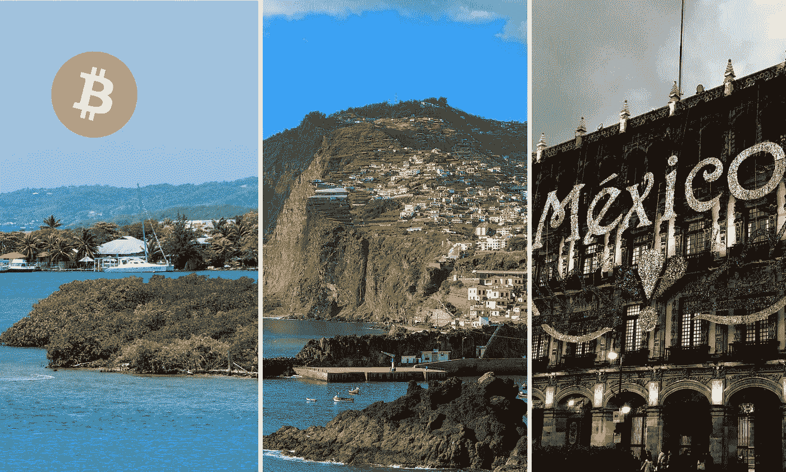

# 比特币在洪都拉斯 Roatán Próspera 成为法定货币；葡萄牙马德拉岛；墨西哥可能是下一个

> 原文：<https://medium.com/coinmonks/bitcoin-becomes-legal-tender-in-roat%C3%A1n-pr%C3%B3spera-honduras-madeira-portugal-and-mexico-may-be-a54fee5d4e63?source=collection_archive---------52----------------------->

比特币(BTC)将成为法定货币的下一个司法管辖区是洪都拉斯的 Roatán Próspera 和葡萄牙的一个自治岛屿地区 Madeira。如果墨西哥参议员英迪拉·肯皮斯(Indira Kempis)提出的一项法案获得成功，墨西哥可能会成为继萨尔瓦多之后正式承认比特币(BTC)为法定货币的下一个国家。

