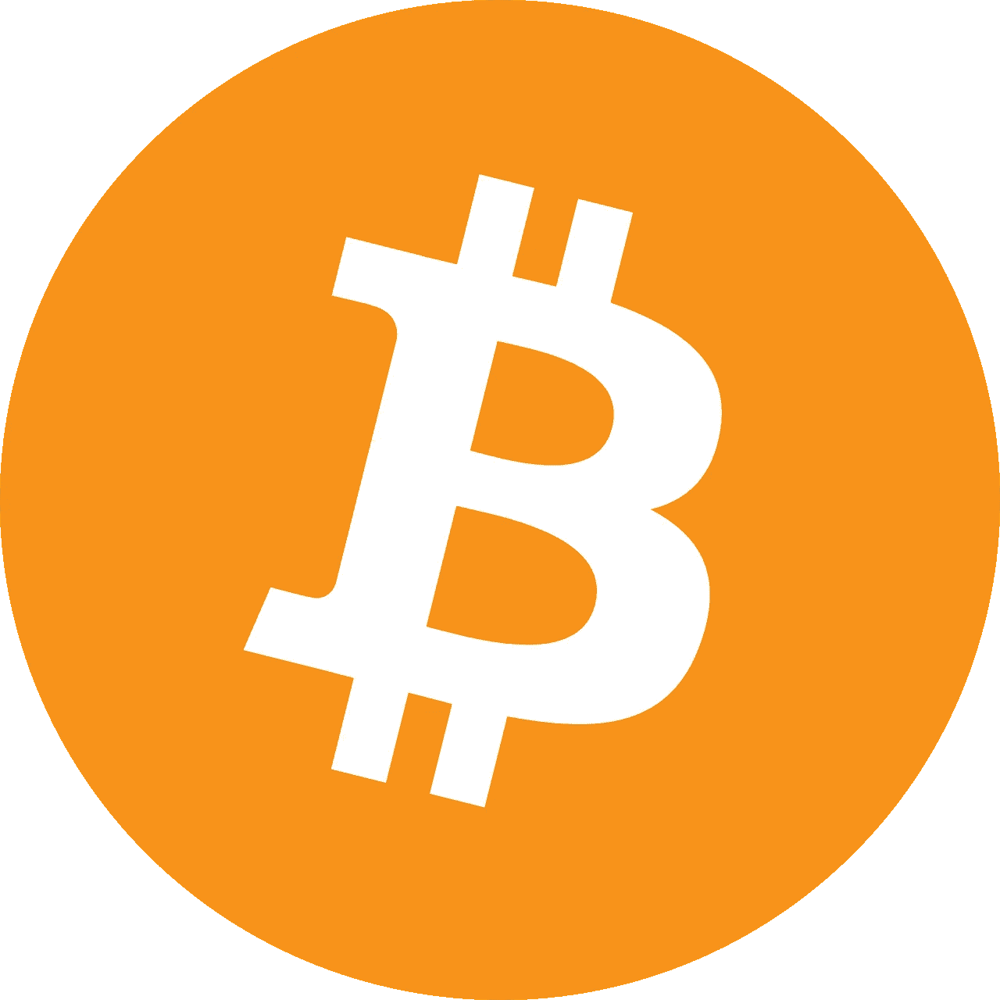

# 比特币通过改善能源市场的竞争和创新有益于环境

> 原文：<https://medium.com/coinmonks/bitcoin-benefits-the-environment-by-improving-competition-and-innovation-in-energy-markets-36be8ef2f95f?source=collection_archive---------45----------------------->

我相信比特币是暴政的敌人，是 21 世纪最伟大的发明。批评比特币的人要么不理解比特币，要么认为 T2 人只有在被控制和操纵的情况下才是最棒的。

或许这有点夸张？我不在乎。