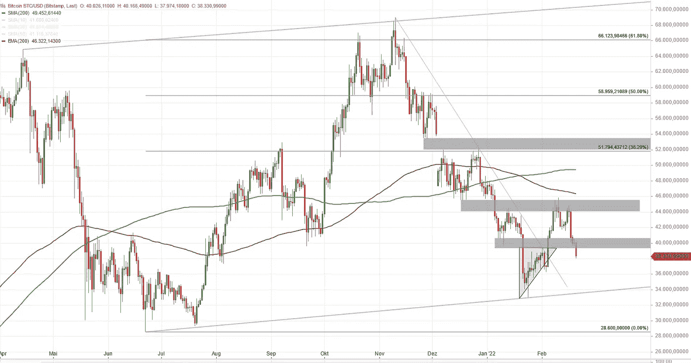
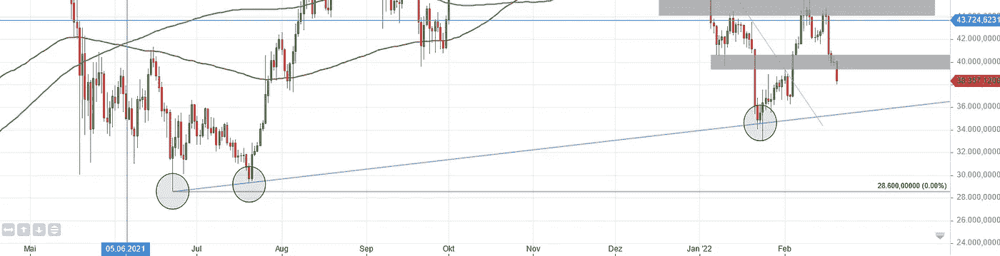
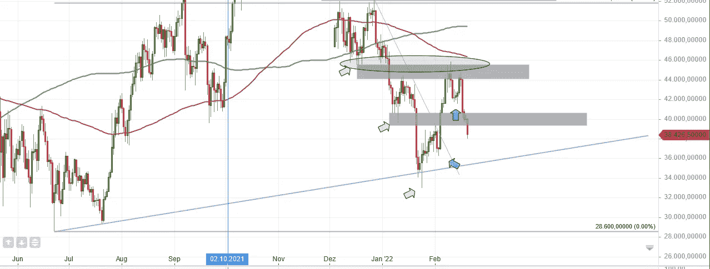
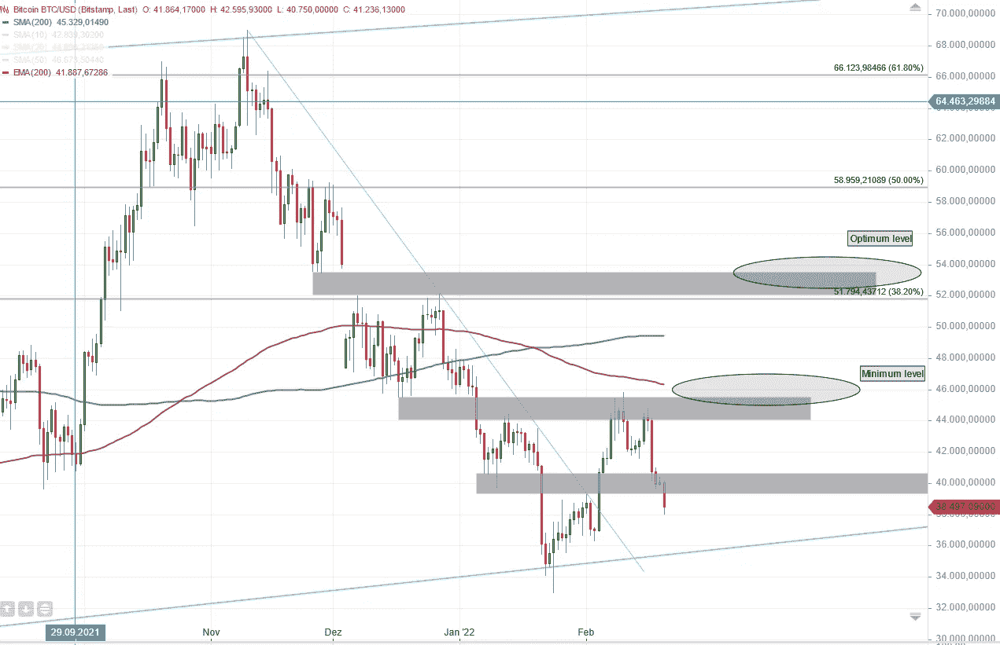

# 比特币大图—2022 年 2 月 20 日

> 原文：<https://medium.com/coinmonks/bitcoin-big-picture-20-02-2022-3f3cb2daa9e7?source=collection_archive---------29----------------------->

Bitcoin daily chart, created on guidants.com

# 看看每日比特币图表

对许多人来说，看一张图表可以和占星术相提并论。出于许多原因，这是我实际上理解的事情。

技术分析经常被误解，有影响力的人在没有任何线索的情况下谈论图表分析，然后删除他们的视频，这有助于巩固偏见。

如果你看后面，我们可以开始接受技术分析不是致富的圣杯，但它可以被认为是评估当前形势和标记在资产发展中起关键作用的价格区域的许多方法之一。

今天，我们将为比特币做这件事。

# 特种宽银幕电影

自 2021 年 11 月 10 日以来，比特币从 69 000 英镑跌至 33 000 英镑，跌幅约为 52%。从那以后，我们看到了价格的小幅回升，只是观察到这肯定是一次熊市回调，而不是真正的回升。从长期(几年)来看，我们仍处于上升趋势，但次级趋势明显指向下方。

让我说一个长期上升趋势的是，最近的强势下跌相对于 2021 年 6 月的前期回调，在更高的水平上停止，从而形成了更高的低点。更高的低点对于上涨趋势是必不可少的，你可以通过画一条趋势线(图中的蓝色)将之前的更高低点与当前的更高低点联系起来:

BitCoin — Long-term trendline points upwards

目前，主要趋势(上升趋势)是完整的，我们有三个趋势线，这使它成为一个有效的趋势线。

对于长期趋势来说，非常重要的是前期低点 28 600 不被价格打破。

## 次要趋势—持续修正

对于比特币这样一种波动性很大的资产，大幅回调已经成为交易员和投资者已经习惯的事情。众所周知，一个价格不可能永远上涨，在某个时候，需要进行修正，以使资产保持“健康”状态。因此，目前的下跌仍在正常范围内，然而，重要的是，它仍是一次“通常的”修正，而不是变成崩盘。如果先前的高低点被打破，这种情况就会发生。

图表告诉我们，调整尚未结束，我们甚至可能会看到更多疲软的日子:

*   在第二次趋势中，我们看到了一系列更低的低点(灰色箭头)
*   在第三阶段趋势中，我们看到了更高的低点(蓝色箭头)，但这一第三阶段趋势未能将价格确立在 46 000 点左右的前期水平(灰色椭圆)之上:

BitCoin daily chart: The grey bars mark areas of great importance for the secondary trend

这通常是调整尚未结束的迹象，我们可以预期任何事情:进一步下跌到蓝色趋势线并出现反弹，或者如果蓝色趋势线不成立，甚至更低的水平。其他情况也是可能的。

# 所以是占星术？？

在最后一部分，没有关于接下来会发生什么的明确陈述，因为我不知道。我想没人知道。技术分析无法告诉我们接下来会发生什么，我们只能谈论“如果这种情况发生，那么..”和概率。

但有一点很清楚，也很容易理解:只要价格不能突破前期的回调低点，我们就仍在回调之内，不应该投资。

让我们在图表中标出该区域，它可能是调整结束的一个指标:

BitCoin chart — when could the correction be over?

如果你想保护你的钱，想在投资时获得某种程度的安全，那么等待确认回调实际结束的信号是有意义的。这种信号可以被称为顺周期信号，在我们的情况下，相关水平是:

*   46，000 美元(创建一个小仓位)
*   54 000 美元(修正应该结束)

54 000 附近的区域也很有趣，因为它与斐波那契投影的一个重要标志在一起。许多交易者和投资者用这些标记来记录他们的进出时间。

只要价格保持在 46 000 以下，这种调整就是适时的。高于这个水平，多头交易和投资仍然风险很大。在 54 000 点以上，风险已经变得小得多，因为价格设法克服了具有高抛压的区域。

你对当前 BTC/美元的形势有什么看法？你投资比特币了吗？

不是投资/交易顾问。

> *加入 Coinmonks* [*电报频道*](https://t.me/coincodecap) *和* [*Youtube 频道*](https://www.youtube.com/c/coinmonks/videos) *了解加密交易和投资*

# 另外，阅读

*   [Bitget 回顾](https://coincodecap.com/bitget-review) | [双子星 vs BlockFi](https://coincodecap.com/gemini-vs-blockfi) | [OKEx 期货交易](https://coincodecap.com/okex-futures-trading)
*   [美国最佳加密交易机器人](https://coincodecap.com/crypto-trading-bots-in-the-us) | [经常性回顾](https://coincodecap.com/changelly-review)
*   [在印度利用加密套利赚取被动收入](https://coincodecap.com/crypto-arbitrage-in-india)
*   [霍比评论](https://coincodecap.com/huobi-review) | [OKEx 保证金交易](https://coincodecap.com/okex-margin-trading) | [期货交易](https://coincodecap.com/futures-trading)
*   [麻雀交换评论](https://coincodecap.com/sparrow-exchange-review) | [纳什交换评论](https://coincodecap.com/nash-exchange-review)
*   最好的[加密税务软件](/coinmonks/best-crypto-tax-tool-for-my-money-72d4b430816b) | [CoinTracking 评论](/coinmonks/cointracking-review-a-reliable-cryptocurrency-tax-software-5114e3eb5737)
*   [Stackedinvest 评论](https://coincodecap.com/stackedinvest-review) | [北海巨妖评论](/coinmonks/kraken-review-6165fc1056ac) | [bitFlyer 评论](https://coincodecap.com/bitflyer-review)
*   最佳[加密借贷平台](/coinmonks/top-5-crypto-lending-platforms-in-2020-that-you-need-to-know-a1b675cec3fa) | [杠杆代币](/coinmonks/leveraged-token-3f5257808b22)
*   最佳[加密制图工具](/coinmonks/what-are-the-best-charting-platforms-for-cryptocurrency-trading-85aade584d80) | [最佳加密交易所](/coinmonks/crypto-exchange-dd2f9d6f3769)
*   [比斯勒评论](https://coincodecap.com/bitsler-review)|[WazirX vs coin switch vs coin dcx](https://coincodecap.com/wazirx-vs-coinswitch-vs-coindcx)