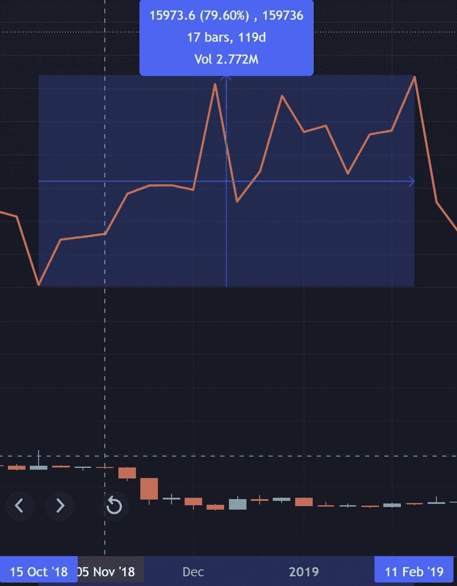

# 屁股进去了？衍生品市场及其对顶部/底部形成的影响

> 原文：<https://medium.com/coinmonks/bitcoin-bottom-is-in-derivatives-markets-and-their-impact-on-top-bottom-formation-1aaf5864bd05?source=collection_archive---------23----------------------->

免责声明:以下内容并非财务建议，仅供参考。斯莱特是一家对冲基金的普通合伙人，持有上述资产的头寸。虽然下文讨论了与基金有关的战略，但下文绝不是读者对该战略的认可或推荐。加密是一种高风险的投资类别，所以你应该与注册金融顾问交谈，并在投资前做自己的研究。

在 Twitter 上关注[@ slater hill](https://twitter.com/SlaterHeil)的定期市场评论。

加密市场，特别是比特币，有几个方面，不管是好是坏，都使其极易受到操纵和波动:

1.  市场参与者:鲸鱼+大量散户投资者
2.  缺乏监管
3.  相对流动性低
4.  公共数据和可追溯性

这些条件结合在一起，为那些知道如何操纵普通投资者的大玩家和做市商创造了一个游乐场。然而，他们也为那些愿意投入工作的人创造了一个成熟的收获阿尔法的环境。最终，除了那些有能力和流动性将市场推向一个或另一个方向的人，没有人知道市场将走向何方。问题是:你会成为鲸鱼观察者还是浮游生物？

crypto A 名单(即拥有资本控制市场的名单)由矿商、区块链基金会、基金以及最近的主权财富基金组成，它们都遵循类似的剧本，从生态系统中提取价值。这是一个过于简化的问题，但是剧本是这样的:

1.  允许来自比特币对手(如监管机构和其他主权国家)和宏观环境的负面消息打压价格，构建“熊市”叙事，催眠交易者睡觉，并训练他们在每次反弹时做空。
2.  建立长期衍生品头寸(OTM 看涨期权，佩珀)([什么是“现货”vs“衍生品”？](https://www.binance.com/en/blog/futures/crypto-spot-vs-crypto-futures-trading--whats-the-difference-421499824684901983)))
3.  建立长期现货头寸(如果是采矿者/验证者，则保留新的供应)
4.  制造供应短缺，用看涨的叙事推出内容(这部分内容部分是人为的，部分是基于市场参与者建立在自身基础上的自然动量心理。矿商可以停止向市场出售供应，这有很大的不同，每只牛都对内容有贡献)
5.  引起大众市场的注意，繁荣周期
6.  开始平仓多头
7.  开始扩大空头头寸
8.  构建无止境的衍生产品，利用本轮最新创新的势头，将它们抛给兴奋的投资者。
9.  卖出现货头寸(如果是矿商/验证商，则向市场引入新的供应)
10.  用无尽的 FUD 彻底杀死公牛的精神。
11.  安静下来，等待重复步骤 1

这就是 crypto 如何创造如此大规模的永久包持有者。新进者在顶部进入，大规模提款，说“去他妈的”，并决定坚持到下一个周期，到那时他们就被技术所打动，并准备长期持有。

现在我不是在这里说这对这个行业、对人们、对这个世界是好是坏。

DO YOU WANT TO BE RIGHT? OR DO YOU WANT TO MAKE MONEY?

其他人会写下无数对这个行业的批评，而建筑商会继续努力改进。我来这里是想弄清楚我们如何从这些动态中赚钱，并看看我能否创建一个任何人都可以遵循的简单分析。

## BITFINEX

Bitfinex 一直是加密鲸的家园。由于他们与 USDT([Tether——最大的稳定币](https://tether.to/))的密切联系，他们一直拥有一些最强的本地加密流动性，因此吸引了最大的本地加密玩家。

因为大多数最大的参与者都在那里交易，Bitfinex 的价格走势往往会领先于市场的其他部分。此外，长期“周期交易者”倾向于在交易所建立最大的头寸。

鉴于 Bitfinex 对市场的历史影响，在试图做出预测时，我更相信 Bitfinex 的数据，而不是其他任何交易所的数据。

## 相关性

回到我们操纵散户投资者的逐步指南，希望你能记住最重要的部分:在开始买卖现货之前建立衍生品头寸。

但是为什么呢？

现货交易直接影响市场价格，所有区块链数据自然都是公开的，因此当大股东开始买入或卖出现货头寸时，市场就会注意到。精明的资金跟随大笔资金。

通过已经建立的衍生品头寸，你可以通过买入或卖出现货并推动价格朝着你的衍生品头寸的方向发展来赚取高额利润。按照同样的思路，通过在买入/卖出现货之前退出衍生品头寸，你可以在现货交易开始影响市场之前获利。

因此，如果使用这种策略，衍生品多头敞口和价格行为之间应该是反向相关的。换句话说，衍生品敞口应该是未来的前兆。

同样，这是一个简单的分析，但它具有令人印象深刻的历史准确性，如果你接受我们正在交易一个被大规模操纵的市场，这个论点是高度合乎逻辑的。让我们看看它在图表上是什么样子，看看我们是否能从中提取任何价值。

## **Bitfinex —比特币**衍生品**多头敞口 vs 现货价格动作**

【2018 年 10 月 15 日–2019 年 2 月 11 日熊市底部

长卷:

Long Exposure increases 79.6% in anticipation of bull run while price decreases

价格:

Price Bottoms out in early 2019, Peak Long Accumulation at -53.46%

如果你仔细看上面的，然后和下面的比较，你会注意到多头的兴趣正好在下跌结束和上升趋势开始的那一周达到顶峰。

**2019 年 2 月 11 日–2019 年 6 月 24 日牛市**

长卷:

Longs decrease exposure, taking profits as price rises

价格:

Price rises 274% from the February bottom

**COVID 循环异常**

从 2019 年 6 月 24 日开始，多头像往常一样开始建立，预期下一个牛市周期，直到 covid news 吓得大玩家在 2020 年 Q1 抛售他们的头寸。多头兴趣明显消退，直到 4 月和 7 月因预期经济复苏而出现飙升。正如投资者遇到不可抗力时经常发生的那样，鲸鱼在这种情况下被困住了。在某种程度上，他们还是赢了，因为尽管价格很快回升，他们还是控制住了下跌风险。为了透明起见，我仍然包括了这些时期的图像。之后，相关性恢复。

长卷:

Longs anticipate a big move until spooked by covid concerns in early ‘20.

价格:

Bitcoin dumps 70% before bottoming in March ‘20

【2020 年 7 月 27 日–2021 年 1 月 25 日牛市

长卷:

Longs take profit on the way up, until interest bottoms

价格:

Bull run takes BTC 297% before correcting aggressively

**2021 年 1 月 25 日–2021 年 5 月 3 日**

2021 年 1 月后，市场异常活跃，中短期波动剧烈。如果你放大，你可以看到在短期周期中出现的类似的相关性。因为它更适合本文的长期观点，我们将越过这些短期波动，进入 5 月 21 日抛售后的下一次大的重新累积。

**2021 年 5 月 3 日至 2021 年 7 月 19 日**

长卷:

Longs rise 72% over the 2 months after the May dump took price down 50%+

价格:

May dump takes price down 50%

**2021 年 7 月 19 日–2021 年 10 月 11 日**

长卷:

Longs take profit as bullishness resumes

价格:

Mid 2021 Bull run sees Bitcoin price rise 100%

**今天**

长卷:

价格:

## 结论

总之，我们似乎正处于一个长期积累阶段的中间阶段。虽然黑天鹅或自然的最终投降肯定是可能的，但这些数据让我相信，我们至少正在接近这个区间的低端。我们的基金对我们的所有交易都采取中长期观点，我们将在未来几个月慢慢积累。

当然，这个信号不是即时买入信号。我们还必须承认困扰传统市场的明显普遍状况。自从 covid 冲击所有市场以来，比特币一直作为风险/增长资产进行交易，许多人认为，随着我们进入长期熊市，比特币将继续与其他增长资产一起下跌。然而，从本质上讲，比特币当然不属于传统金融领域。交易员之间正在进行一场拉锯战，他们认为比特币是一种风险资产，从股市熊市中可能消失的流动性中提取，而交易员认为比特币是“一切对冲工具”，在其他一切陷入混乱时会发光。我相信后者。从短期和中期来看，我可能是错的吗？毫无疑问。传统经济可能会把加密技术拖垮，导致长期熊市。然而，我认为，钱还是要去某个地方，投资者会得出这样的结论:比特币是比价格已经过高的大宗商品更好的避风港。我个人认为，这种观点正是不断上升的未平仓合约所显示的，我们应该很快就会恢复牛市。然而，我认为不提及这些最重要的问题是不负责任的，或者是听不进去的。

在今天市场上的所有噪音中，比特币似乎被无数的看跌言论拉向了一千个不同的方向。人们很容易被短期的价格波动所套牢。我希望这篇文章的观点可以简化和扩展我们对价格的看法，让我们从喧嚣中退一步，以平静的决心接近市场。

让我们记住，行业中有权力的人可以多么迅速地改变和推动叙事。让我们试着看看那些掌控者的行动，看看他们是如何计划未来的，而不是看现在。

你同意吗？不同意？以为我是傻逼？在评论里说说你的想法，大家一起讨论。

*   斯拉特尔

> 加入 Coinmonks [电报频道](https://t.me/coincodecap)和 [Youtube 频道](https://www.youtube.com/c/coinmonks/videos)了解加密交易和投资

# 另外，阅读

*   [3 商业评论](/coinmonks/3commas-review-an-excellent-crypto-trading-bot-2020-1313a58bec92) | [Pionex 评论](https://coincodecap.com/pionex-review-exchange-with-crypto-trading-bot) | [Coinrule 评论](/coinmonks/coinrule-review-2021-a-beginner-friendly-crypto-trading-bot-daf0504848ba)
*   [莱杰 vs Ngrave](/coinmonks/ledger-vs-ngrave-zero-7e40f0c1d694) | [莱杰 nano s vs x](/coinmonks/ledger-nano-s-vs-x-battery-hardware-price-storage-59a6663fe3b0) | [币安评论](/coinmonks/binance-review-ee10d3bf3b6e)
*   [Bybit Exchange 评论](/coinmonks/bybit-exchange-review-dbd570019b71) | [Bityard 评论](https://coincodecap.com/bityard-reivew) | [Jet-Bot 评论](https://coincodecap.com/jet-bot-review)
*   [3 commas vs crypto hopper](/coinmonks/3commas-vs-pionex-vs-cryptohopper-best-crypto-bot-6a98d2baa203)|[赚取加密利息](/coinmonks/earn-crypto-interest-b10b810fdda3)
*   最好的比特币[硬件钱包](/coinmonks/hardware-wallets-dfa1211730c6) | [BitBox02 回顾](/coinmonks/bitbox02-review-your-swiss-bitcoin-hardware-wallet-c36c88fff29)