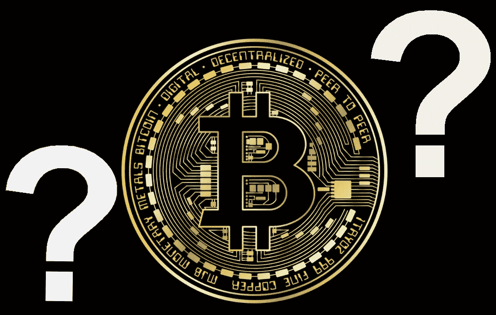
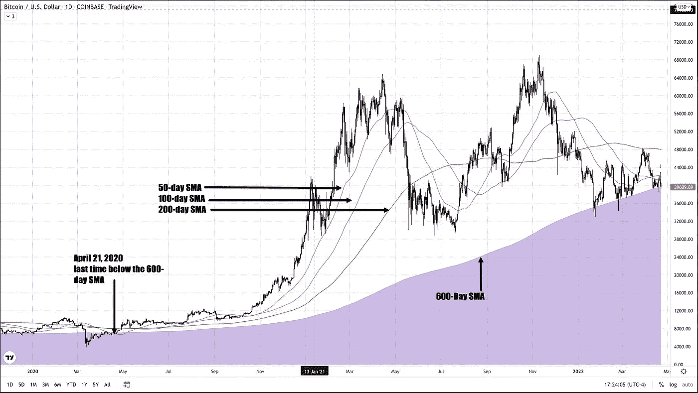
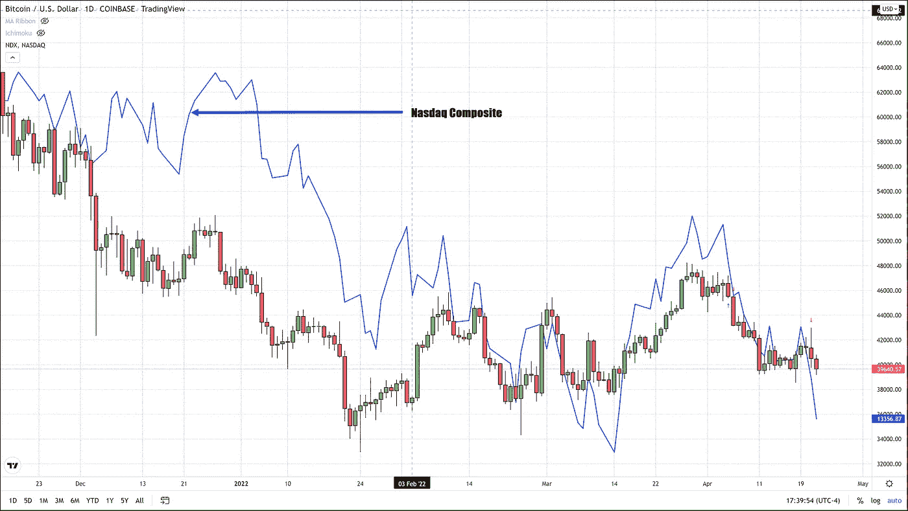
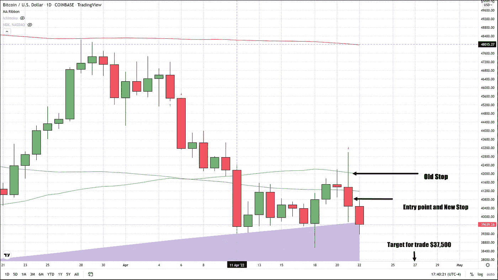

# 比特币跌破支撑位，BTC 也会收于支撑位下方吗？

> 原文：<https://medium.com/coinmonks/bitcoin-breaks-below-support-will-btc-also-close-below-support-de6fcfcffaa8?source=collection_archive---------45----------------------->

今天我们确认了我们的*‘三江溺水猫’*模式，截至美国东部时间下午 5:15，比特币交易下跌超过 2%或 800 美元。今天的确认蜡烛线是教科书式的低低高，看起来我们可能会在近两年内第一次收盘低于 600 天均线(简单移动平均线)。上一次收盘跌破 600 日均线是在两年零一天前的 2020 年 4 月 21 日！反驳了许多分析师的观点，即比特币的四年周期不再适用。我坚决不同意这个结论，并且相信这些围绕着日期减半的周期在今天仍然存在。

帮助 BTC 交易走低的因素包括美联储加息前纳斯达克指数的下跌。纳斯达克和 BTC 之间的相关性为 0.7，1.0 的相关性意味着它们完全反映了彼此的运动，0 意味着彼此相反。

有了今天的确认蜡烛，我们现在可以把我们的保护止损点降低到 40，800 美元的进场价格之上，因为当天的高点实际上就在这个价格点之上或之下，这取决于你在哪个交易所交易。所有接受我们最初要求做空并以上述价格出售比特币的交易者，现在都应该将保护性止损降低到我们的进场价格之上，以锁定一笔不亏损的交易。

从 42000 美元到 40850 美元采取保护性止损。我们这次交易的目标是 37，500 美元，交易者可以密切关注市场，或者简单地在 37，500 美元增加一个交易限额，这样如果达到这个价格点，你就可以自动获利。

任何有兴趣阅读更多关于比特币的文章的人，只需点击这个[链接](https://www.thegoldforecast.com/bitcoin)。

> 加入 Coinmonks [电报频道](https://t.me/coincodecap)和 [Youtube 频道](https://www.youtube.com/c/coinmonks/videos)了解加密交易和投资

# 另外，阅读

*   [3 商业评论](/coinmonks/3commas-review-an-excellent-crypto-trading-bot-2020-1313a58bec92) | [Pionex 评论](https://coincodecap.com/pionex-review-exchange-with-crypto-trading-bot) | [Coinrule 评论](/coinmonks/coinrule-review-2021-a-beginner-friendly-crypto-trading-bot-daf0504848ba)
*   [莱杰 vs Ngrave](/coinmonks/ledger-vs-ngrave-zero-7e40f0c1d694) | [莱杰 nano s vs x](/coinmonks/ledger-nano-s-vs-x-battery-hardware-price-storage-59a6663fe3b0) | [币安评论](/coinmonks/binance-review-ee10d3bf3b6e)
*   [Bybit Exchange 评论](/coinmonks/bybit-exchange-review-dbd570019b71) | [Bityard 评论](https://coincodecap.com/bityard-reivew) | [Jet-Bot 评论](https://coincodecap.com/jet-bot-review)
*   [3 commas vs crypto hopper](/coinmonks/3commas-vs-pionex-vs-cryptohopper-best-crypto-bot-6a98d2baa203)|[赚取加密利息](/coinmonks/earn-crypto-interest-b10b810fdda3)
*   最好的比特币[硬件钱包](/coinmonks/hardware-wallets-dfa1211730c6) | [BitBox02 回顾](/coinmonks/bitbox02-review-your-swiss-bitcoin-hardware-wallet-c36c88fff29)