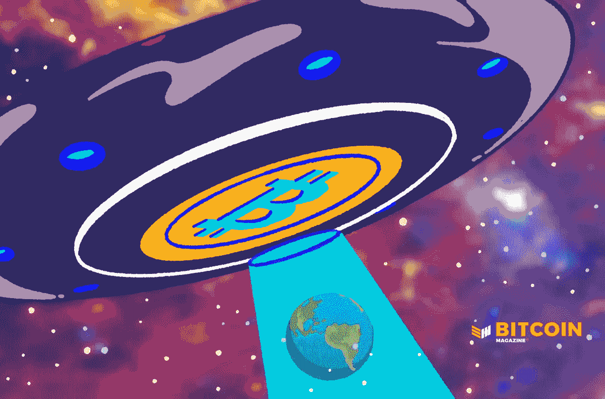

# 比特币给全球主义者带来最大的痛苦

> 原文：<https://medium.com/coinmonks/bitcoin-brings-maximum-pain-for-globalists-7aaf1c097069?source=collection_archive---------70----------------------->

欧洲的宏观形势看起来很悲观，随着美联储发出继续鹰派立场的信号，比特币提供了一条充满希望的前进道路。

[**在 YouTube 上看这一集**](https://youtu.be/ZQWMXWIoWlk?t=5501) **或者** [**隆隆**](https://rumble.com/v152op3-bitcoin-bear-market.html)

**这里听插曲:**

*   [苹果](https://podcasts.apple.com/de/podcast/fed-watch-bitcoin-and-macro/id1543640492?i=1000562318950)
*   [Spotify](https://open.spotify.com/episode/137Atrvv3mur9yiVqJzPvo?si=bb4b0e17ae794680)
*   [谷歌](https://podcasts.google.com/feed/aHR0cHM6Ly9mZWR3YXRjaC5saWJzeW4uY29tL3Jzcw/episode/MzY0MTVjNmYtYjI2OC00NTIyLTk2YTktN2I2MjRiYWUwMjkw?sa=X&ved=0CAUQkfYCahcKEwiYiqH9_-33AhUAAAAAHQAAAAAQLA)
*   [Libsyn](https://fedwatch.libsyn.com/fed-watch)
*   [阴云密布](https://overcast.fm/+m2ae6R0BA)

在这一集的“美联储观察”播客中，由于大众的需求，我欢迎汤姆·朗格回到节目中！Luongo 是我最喜欢的作家之一，因为他有趣的散文和对全球宏观经济，地缘政治和货币市场深刻的洞察力。他也是一个长期的比特币创造者，在他的写作和播客中讨论了很多年。

“美联储观察”是比特币创造者的宏观播客。在这一集里，我们首先从 Luongo 对全球形势的总体看法开始，然后深入了解一些关于欧洲、美国、美联储、乌克兰等的具体情况。我们将在节目结束时谈论 Luongo 对美国短期到中期，也就是未来 3 到 24 个月的展望。下面，我会提供更多的细节，但这是一个必须听的插曲！

# 餐桌上的病人

我问 Luongo 的第一个问题是，他和其他人一样看空吗？从宏观到地缘政治再到比特币，似乎我们所到之处，人们都在尖叫熊市和崩溃。然而，我认为这种崩溃叙事有些过头了，尤其是对美国而言。我请 Luongo 向我们介绍一下他对市场状况的总体看法。

他从识别餐桌上的病人开始，那就是欧洲。欧洲受到目前释放出来的力量的打击最大:大宗商品价格上涨、通胀加剧、对机构失去信心等。随着欧洲陷入困境并开始自我蚕食，欧洲投资组合中的所有资本最终都将流向某个地方，而且会流向美国。

始于乌克兰的冲突就在欧洲的门口，具体来说，就在过去十年欧洲最佳经济体的门口:波兰。Luongo 反问道，“华沙(波兰)还是纽约离乌克兰更近？”当投资者意识到这种新的冲突不会消失——然后像以前一样用经济武器与之斗争——他们必须摧毁自己的经济。资金将迅速从欧洲流向美国。我相信它也会流入比特币。

# 美联储是认真的

我问 Luongo，他是否认为美联储会实施超级强硬的加息。他的回答雄辩地表明，杰罗姆·鲍威尔在 2017 年加息的计划被新冠肺炎打断，现在鲍威尔正在焦土上加息，以打破所有其他央行和竞争对手的货币。

Luongo 认为，美联储之所以会这样做，是因为由华尔街银行和美国货币利益集团拥有的美联储正试图消除自金融危机以来积累的十年不当投资。他还认为这是美国金钱利益和欧洲全球主义者之间关系的破裂。如果不理解达沃斯人想要统治世界或毁灭世界的意图，我们就无法理解美联储。

Luongo 表示，美联储将继续加息，直到 2024 年，以打破达沃斯和激进的全球主义/共产主义目标。我倾向于同意他的观点。也许我不会像 Luongo 那样把它说得丰富多彩，但全球主义者是“全球共产主义者”，他们会在承认失败之前烧毁全球经济。

# 比特币和美国的命运交织在一起

在这一集的最后一部分，我问 Luongo 他对我的理论有什么看法:此时此刻，对美国经济有好处的东西对比特币也有好处。大部分比特币供应可能由美国实体持有，美国拥有最大的采矿业份额，最大的比特币感兴趣者份额，最多的风险资本资金和一些最宽松的监管。因此，如果比特币要在一个主要经济体蓬勃发展，它将在美国蓬勃发展。

Luongo 在这一点上倾向于同意我的观点，但更详细地分析了这一点，称华尔街有一部分人喜欢比特币，而这些人正是反对达沃斯的人。他们正在计划一个快速的替代品，并且对工作证明加密货币很友好，因为随着美国采矿业的腾飞，他们现在有钱在里面。

我不能详细地涵盖他的所有评论，因为 Luongo 的伟大之处在于他从许多不同的主题中提取线索，并将它们编织成一个令人耳目一新的视角。

在上述交流之后，我们进入了比特币在欧洲的未来。虽然我们都相对看好美国未来 10 年的经济——这将有利于比特币——但我们也都非常看空欧洲——这也将有利于比特币——因为这给了欧洲资本一个逃入比特币的理由。

同样，这是一个必须听的插曲，致命的严肃话题与 Luongo 的娱乐性讲故事能力混合在一起。

这个星期到此为止。感谢读者和听众。如果你喜欢这些内容，请订阅，在 iTunes 上评论并分享！

这是安塞尔·林德纳的客座博文。所表达的观点完全是他们自己的，不一定反映 BTC 公司或比特币杂志*的观点。*

*原载于 2022 年 5 月 20 日 https://bitcoinmagazine.com***。**

> *交易新手？尝试[加密交易机器人](/coinmonks/crypto-trading-bot-c2ffce8acb2a)或[复制交易](/coinmonks/top-10-crypto-copy-trading-platforms-for-beginners-d0c37c7d698c)*