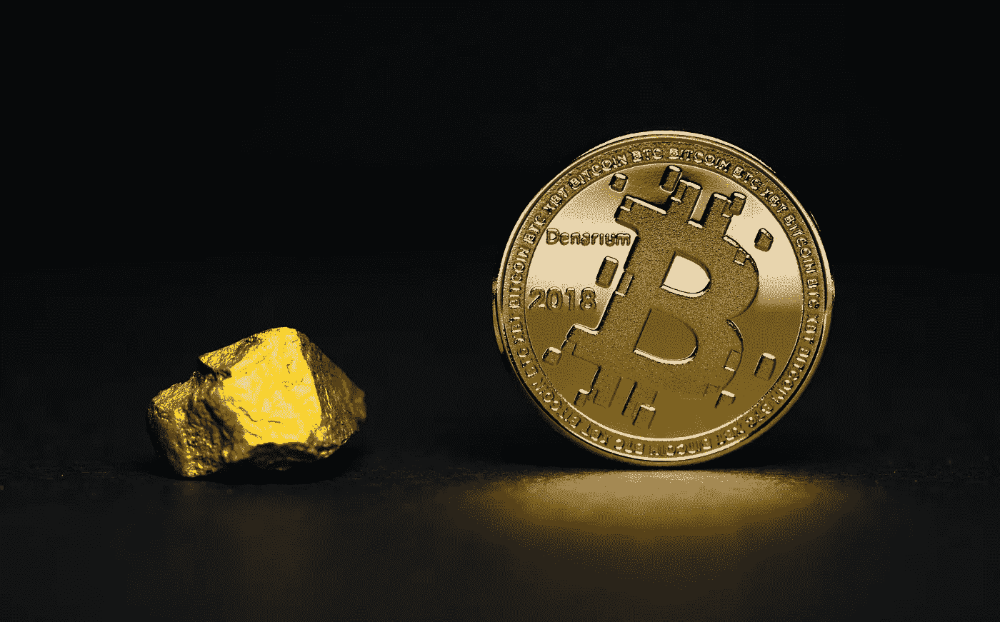

# 比特币(BTC)正在踩水，因为市场关注与俄罗斯相关的新闻

> 原文：<https://medium.com/coinmonks/bitcoin-btc-is-treading-water-as-markets-focus-on-russia-related-news-e60db14f5e36?source=collection_archive---------42----------------------->

Source photo Unsplash

周六，加密市场的情况喜忧参半。随着美国市场关闭，对俄罗斯入侵的担忧拖累了主要的加密公司。

上周六，比特币(BTC)结束了连续三天的跌势。然而，由于地缘政治继续限制比特币和更广泛的市场，涨幅仍然有限。比特币自始至终都是有范围限制的…