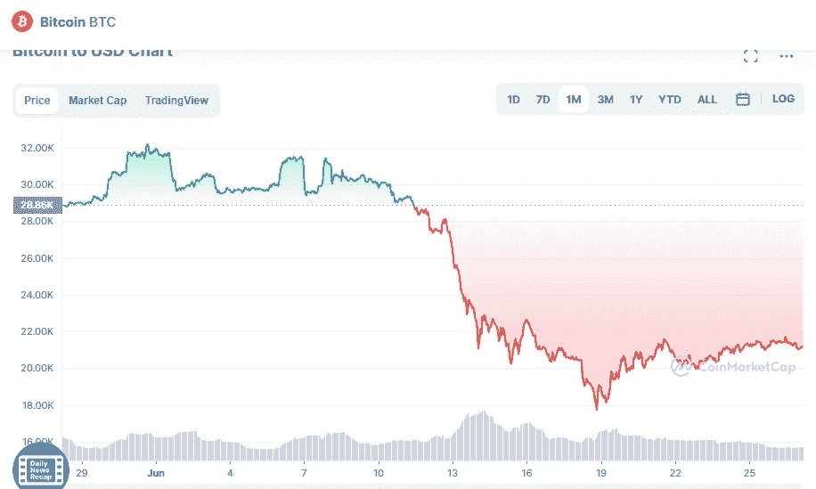

# 比特币(BTC)价格分析 6 月 27 日

> 原文：<https://medium.com/coinmonks/bitcoin-btc-price-analyase-27th-of-june-93454dea553f?source=collection_archive---------48----------------------->

Source photo [Bitcoin price today, BTC to USD live, marketcap and chart | CoinMarketCap](https://coinmarketcap.com/currencies/bitcoin/)

当你看 6 月 26 日烛台上的长灯芯时，你可以看到比特币的救济反弹正在与 22，000 美元的一些严重竞争对手竞争。这表明空头不准备放弃优势，正在逢高抛售。

很可能价格会被厂商拉低到 2 万美元。从这个水平反弹表明多头的目标是…