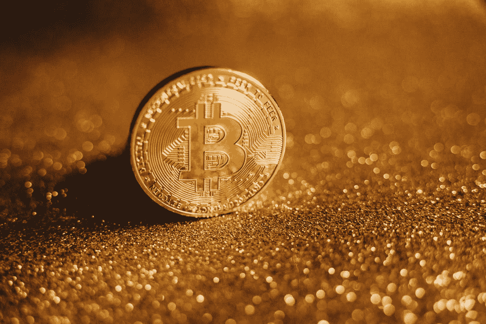
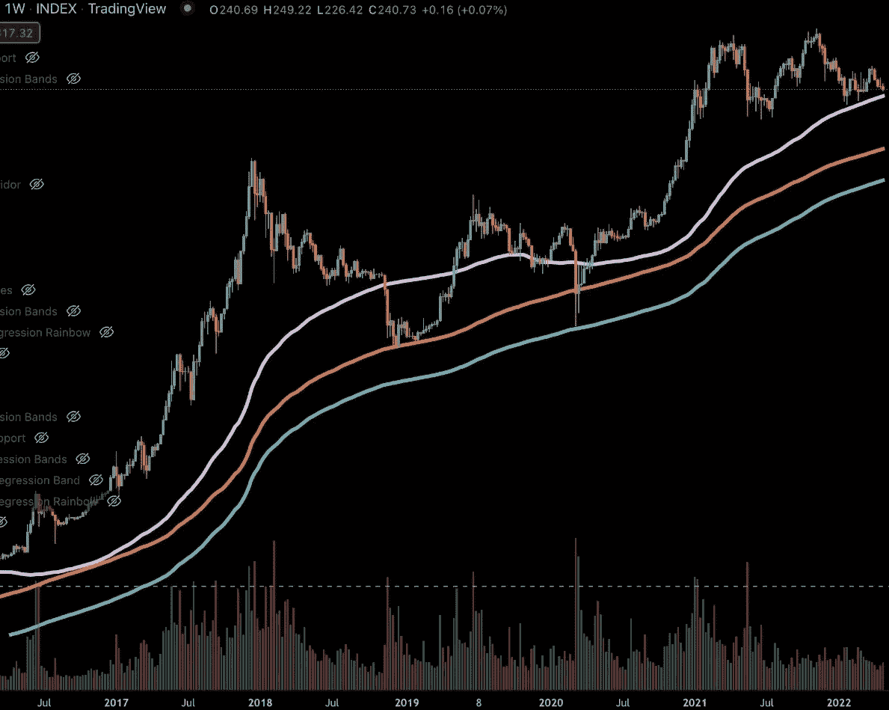
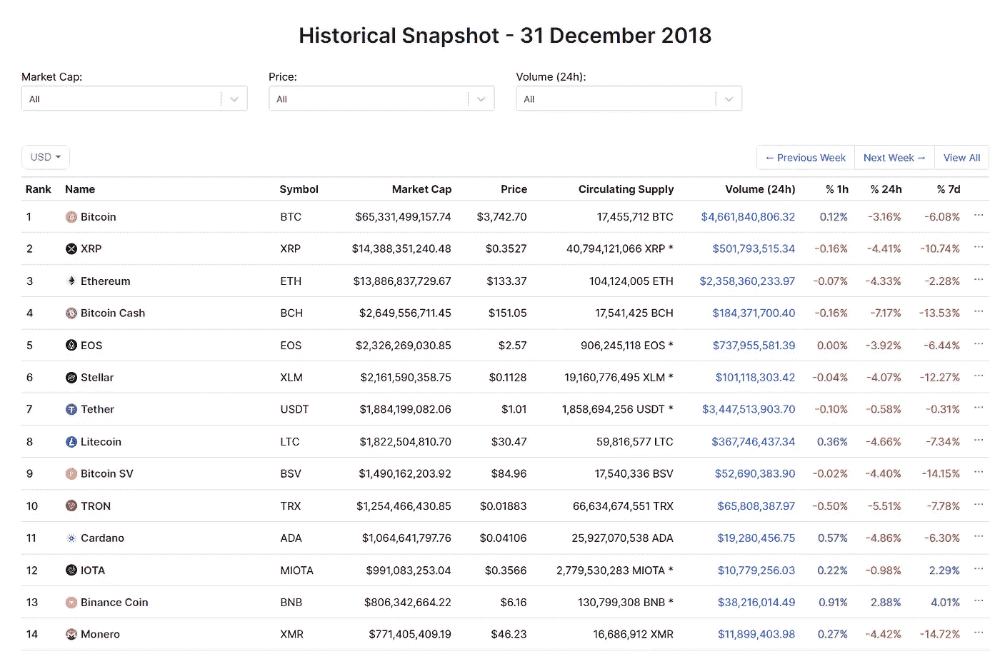

# 比特币——牛市还是熊市？

> 原文：<https://medium.com/coinmonks/bitcoin-bull-or-bear-market-a82ea3374a99?source=collection_archive---------29----------------------->

*比特币可能走向何方的思考*

4 年周期理论是基于比特币每减半一次。由于比特币每块的采矿奖励每 4 年减少一半，供应冲击导致价格适时上涨。传统上，这一理论还表明，熊市的底部通常会在周期的历史高点一年后结束。许多受欢迎的影响者提出，比特币的顶部应该发生在 2021 年底。回顾图表，我们可以看到，2021 年 10 月，比特币的投入创下历史新高。与这个理论的预测完全吻合。许多人忘记了这个日期，因为许多人认为比特币将在 2021 年底达到 10 万美元。当比特币价格开始暴跌时，许多人已经意识到他们犯了一个错误。比特币的目标从来不是价格，而是日期。由于价格投机，许多人错过了机会。有了这些知识，让我们来看看这次熊市的底部应该在何时何地出现。

比特币在 2021 年 10 月创下历史新高，约为 69000 美元。4 年周期理论表明，熊市的底部传统上是距离顶峰 1 年的时间。这将在 2022 年 10 月左右触底(前后相差几周)。实际上，2022 年第四季度。这适用于前 3 个周期，尚未失效。

不是 4 年周期理论的信徒吗？以下是更多指向潜在熊市或熊市趋势的证据。

比特币统治地位衡量比特币的市值与所有加密空间的市值之比。随着比特币的主导地位上升，替代比特币的市值(价格)下降，反之亦然。2018 年 6 月，随着比特币价格暴跌，比特币的主导地位飙升。为什么？如果比特币下跌，那么替代币甚至会进一步下跌，而不仅仅是将比特币与替代币的比率提高一个水平。截至 2022 年的 Q2，我们只是碰巧处于与 2018 年 6 月相同的比特币主导水平。在此期间，比特币又下跌了 61%，最终在 3000 美元左右找到了局部底部。

这种类似的情况加上美元(DXY)正在呈抛物线状下跌，纳斯达克指数处于较低的低点(比特币有时似乎与纳斯达克指数相关)，导致了假设的熊市趋势。

**这对我如此珍贵的狗狗们意味着什么？🐕**

明白所有的山寨币都会大受其害。以太坊，卡尔达诺，Dogecoin 和所有其他替代硬币都将受到影响。如果我们真的处于熊市，每当比特币下跌，替代币就会遭受更大的打击。在上一个周期中，替代币的总价值损失了 98%，而比特币损失了 85%。在某种程度上，我们可以假设在这个周期会看到这样的事情发生。通常情况下，最大的欣快感(爆炸)会带来最大的痛苦(大碰撞)。2021 年的周期没有看到一个突破，这意味着我们可能不会看到 85%的崩盘，而是一个更平静的价格下跌，但会到哪里呢？

**先说最坏的情况。**

一旦比特币形成新的历史高点，比特币在下一个周期就再也不会回到之前的历史高点以下，这意味着如果比特币真的跌至疯狂水平，该水平将在 2 万美元。许多评论家和专家不相信我们会达到这个数字，但这个目标不是不可能的。更合理的目标是关注 2021 年夏季低点。在 2021 年的周期中，我们看到比特币达到 64，000 美元，然后回落到 30，000 美元，然后再次达到 64，000 美元，最终达到 69，000 美元的历史高点。30，000 美元从技术分析层面来看是一个重要的支撑区域。比特币不太可能跌破这个价格，如果这个价格被突破，它很可能只是图表上的一个灯芯。我们应该预期这样的事件何时会发生？仅仅因为一个理论认为熊市的底部离顶部还有一年，并不意味着这个理论永远成立。从技术分析的角度来看，突破某些关键水平会让我们比预期更快地实现这一点。在 Q2 和 2022 年第四季度之间的任何时候，寻找一个重大投降事件发生。

**那么，我们在寻找什么呢？**

100 周 SMA(白线)目前在~ 38000 美元。如果我们跌破这条趋势线，预计比特币将创下更低的低点，市场将会流血。在本文发表时，我们正在与这条均线共舞。

200 周移动平均线(橙色线)目前位于 22，000 美元，这是我们最糟糕的情况的一部分。这个事件不太可能，但完全有可能。大多数批评者认为，我们不会看到这些水平，但比特币在过去曾数次回撤至这一水平。受人尊敬的技术分析师 Gareth Soloway 认为我们可以达到这些水平。只有时间才能证明他是否正确。

300 周移动平均线(Teel 线)目前在 16000 美元，仅被 wicks 触及过。

所有这些投降事件都是可能的，而且可以说是比特币最终创下新高所必需的。

**太棒了，那我该怎么办？**

有没有听过一句话，“财富是在熊市中赚来的”？历史不会总是重演，但却常常押韵。回顾之前的周期，我们可以看到，如果你在 4 年周期的建议“底部”购买了许多流行的加密货币，并在 2021 年的任何时候出售，那么你就会看到相当于改变生活的财富的巨大收益。

人们不常说“现金为王”，但在这个时刻，这样的说法是正确的。保存现金和大量使用比特币可能最终会提供一个更好的策略，而不是目前将美元成本平均化为替代比特币。等待购买时机至关重要。仅仅因为比特币处于熊市，并不意味着这是比特币的终极目标。把这当成一个机会，让自己在几年内获得重大收获。说到加密，玩“长线游戏”是最好的策略。与需求相比，比特币的价格被高估了，但当谈到长期的实际价值时，比特币被低估了。最终，你应该相信比特币。是的，比特币会经历被高估和被低估的阶段，但比特币会随着时间的推移而上涨，所以堆叠 sat 并等待！如果你想学习如何让你目前的加密资产为你工作，并在我们等待下一轮牛市时获得被动收入，请查看我页面上关于寻找最佳赌注和贷款 APY 的其他文章。

免责声明:*本文非理财建议。请做出自己明智的投资。*

> 加入 Coinmonks [电报频道](https://t.me/coincodecap)和 [Youtube 频道](https://www.youtube.com/c/coinmonks/videos)了解加密交易和投资

# 另外，阅读

*   [交易杠杆代币的最佳交易所](https://coincodecap.com/leveraged-token-exchanges)
*   [最佳加密分析或链上数据](https://coincodecap.com/blockchain-analytics) | [Bexplus 评论](https://coincodecap.com/bexplus-review)
*   [NFT 十大市场造币集锦](https://coincodecap.com/nft-marketplaces)
*   [AscendEx Staking](https://coincodecap.com/ascendex-staking)|[Bot Ocean Review](https://coincodecap.com/bot-ocean-review)|[最佳比特币钱包](https://coincodecap.com/bitcoin-wallets-india)
*   [Bitget 回顾](https://coincodecap.com/bitget-review)|[Gemini vs block fi](https://coincodecap.com/gemini-vs-blockfi)|[OKEx 期货交易](https://coincodecap.com/okex-futures-trading)
*   [美国最佳加密交易机器人](https://coincodecap.com/crypto-trading-bots-in-the-us) | [不断回顾](https://coincodecap.com/changelly-review)