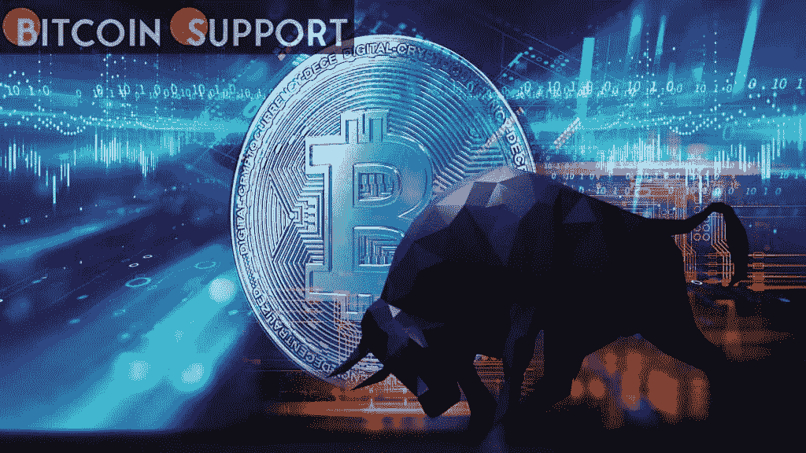
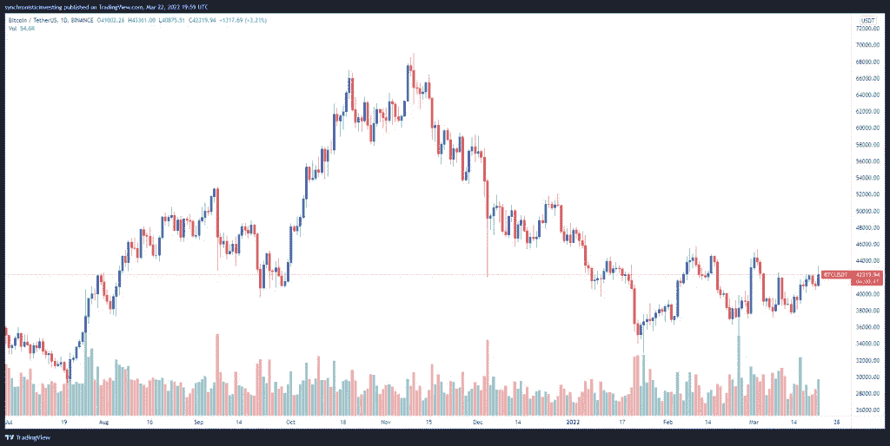
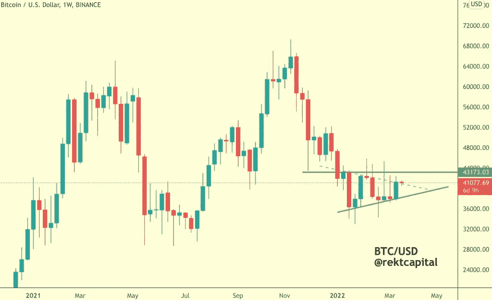
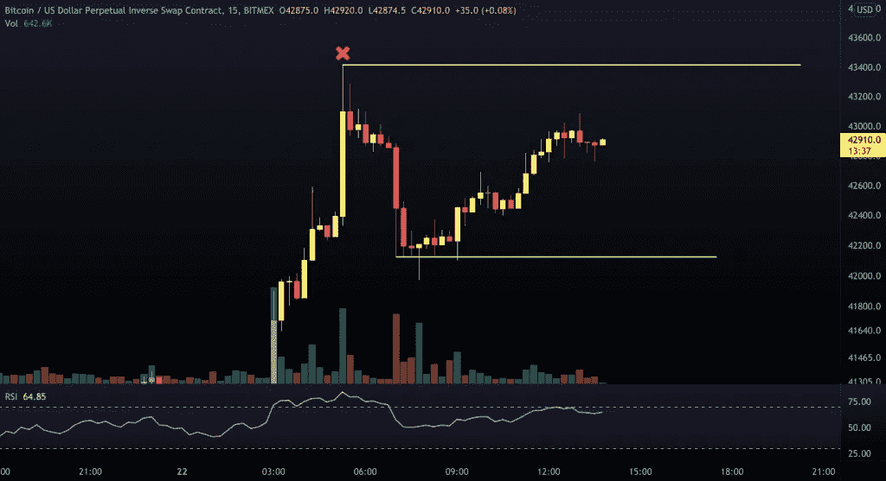
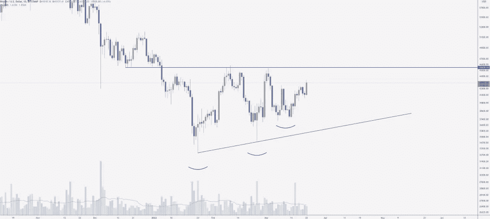
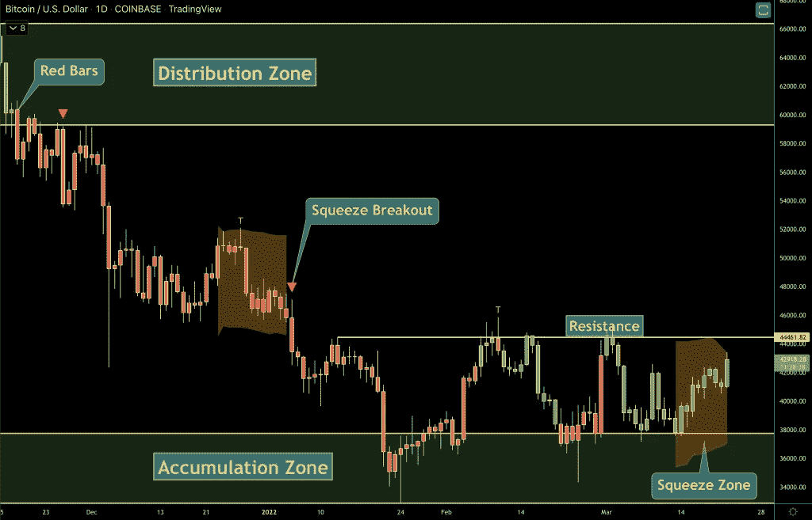

# 比特币多头的目标是 4.5 万美元，而一些分析师认为会出现回调

> 原文：<https://medium.com/coinmonks/bitcoin-bulls-are-aiming-for-45k-while-some-analysts-see-a-correction-6ab2f86636c3?source=collection_archive---------58----------------------->

**Visit our website:-** [**https://bitcoinsupports.com/**](https://bitcoinsupports.com/)

BTC 价格上涨超过 43，000 美元，多头目标是 45，000 美元，但一些分析师警告说，熊市旗正在形成，这可能导致市场下跌。3 月 22 日，看涨的叙事开始在加密货币生态系统中出现，比特币(BTC)暂时升至 43，000 美元上方，以太(ETH)在向利多的流动性池中存入价值 1.1 亿美元的 ETH 后，重新获得了近 3，000 美元的支持。

根据多位分析师的数据，比特币的价格上涨了 6.15%，从周二凌晨的 40884 美元的低点上涨到盘中的 43380 美元，然后在 42300 美元附近站稳。

**Visit our website:-** [**https://bitcoinsupports.com/**](https://bitcoinsupports.com/)

以下是一些分析师对比特币近期价格活动的看法，以及未来需要关注的潜在支撑位和阻力位。

**比特币的价格可能会下跌。**

市场分析师、匿名推特用户“Rekt Captial”在 3 月 22 日提供了一份比特币上涨的预测，发布了如下图表，称“如果比特币成功重新测试绿色虚线对角线作为新的支撑，”它“将跃入前方绿色 43100 美元的阻力。”

**Visit our website:-** [**https://bitcoinsupports.com/**](https://bitcoinsupports.com/)

该交易员表示，这是一个重要的里程碑，因为它“确认”了比特币“数月高点走低趋势”的结束，并预示着价格可能很快上涨。

尽管事情发生了这种看涨的变化，但交易伙伴、匿名 Twitter 用户“Ed NL”警告称，根据油价上涨后的价格走势建立 BTC 多头可能为时过早。

**Visit our website:-** [**https://bitcoinsupports.com/**](https://bitcoinsupports.com/)

“在最初的下跌之后，BTC 正在形成一个看跌的信号，”该分析师说，“但这感觉像是一个传统的陷阱，我们首先在向下修正之前取出早期的空头。”

**挤压势较高。根据加密交易员和《所有街道之狼》播客主持人斯科特·梅尔克(Scott Melker)的说法，比特币“继续创造更高的低点，朝着 45，500 美元左右的重要关口盘整，”他分享了下图。**

**Visit our website:-** [**https://bitcoinsupports.com/**](https://bitcoinsupports.com/)

“在最初的下跌之后，BTC 正在形成一个看跌的信号，”该分析师说，“但这感觉像是一个传统的陷阱，我们首先在向下修正之前取出早期的空头。”

挤压势较高。根据加密交易员和《所有街道之狼》播客主持人 Scott Melker 的说法，比特币“继续创造更高的低点，朝着 45500 美元左右的重要关口盘整”，他分享了下图。

**Visit our website:-** [**https://bitcoinsupports.com/**](https://bitcoinsupports.com/)

"请记住，我们有一个挤压阴影区，看起来像要爆发了！"威克补充道。“这可能是推动我们越过 45，000 美元至 46，000 美元关口的技术火花。”目前，加密货币的总市值为 1.923 万亿美元，比特币占据了 42%的市场份额。

**访问我们的网站:-**[**【https://bitcoinsupports.com/】**](https://bitcoinsupports.com/)

**免责声明:这些是作者的观点，不应被视为投资建议。读者应该自己做研究。**

> 加入 Coinmonks [电报频道](https://t.me/coincodecap)和 [Youtube 频道](https://www.youtube.com/c/coinmonks/videos)了解加密交易和投资

# 另外，阅读

*   [Godex.io 审核](/coinmonks/godex-io-review-7366086519fb) | [邀请审核](/coinmonks/invity-review-70f3030c0502) | [BitForex 审核](https://coincodecap.com/bitforex-review)
*   [最佳比特币保证金交易](/coinmonks/bitcoin-margin-trading-exchange-bcbfcbf7b8e3) | [萝莉点评](/coinmonks/lolli-review-e6ddc7895ad8) | [比特币保证金交易](https://coincodecap.com/bityard-margin-trading)
*   创造并出售你的第一个 NFT | [密码交易机器人](https://coincodecap.com/best-crypto-trading-bots)
*   [如何在 CoinDCX 上购买柴犬(SHIB)币？](https://coincodecap.com/buy-shiba-coindcx)
*   [CBET 评论](https://coincodecap.com/cbet-casino-review) | [库科恩 vs 比特币基地](https://coincodecap.com/kucoin-vs-coinbase) | [拜比特 vs 比特币基地](https://coincodecap.com/bybit-vs-coinbase)