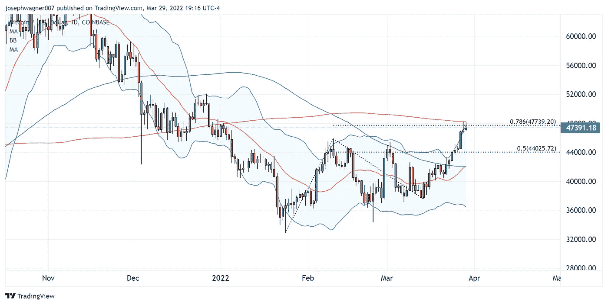
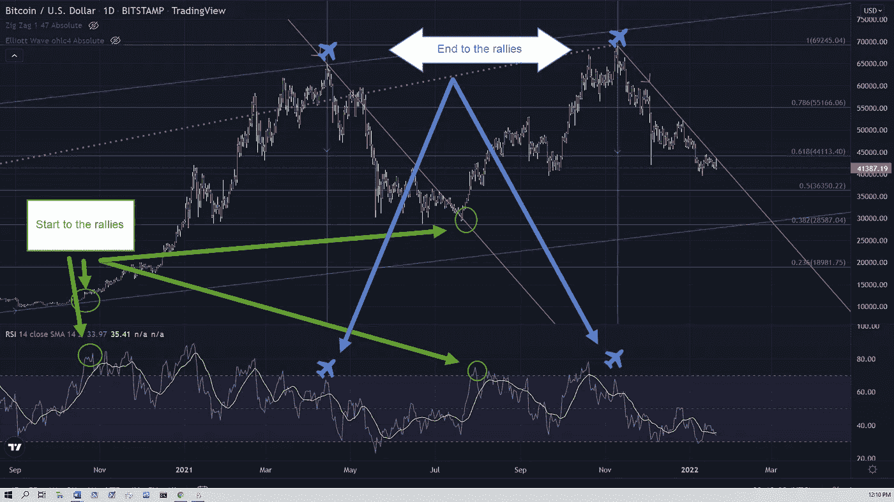
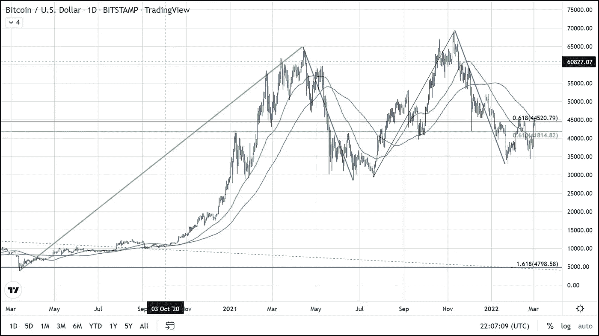
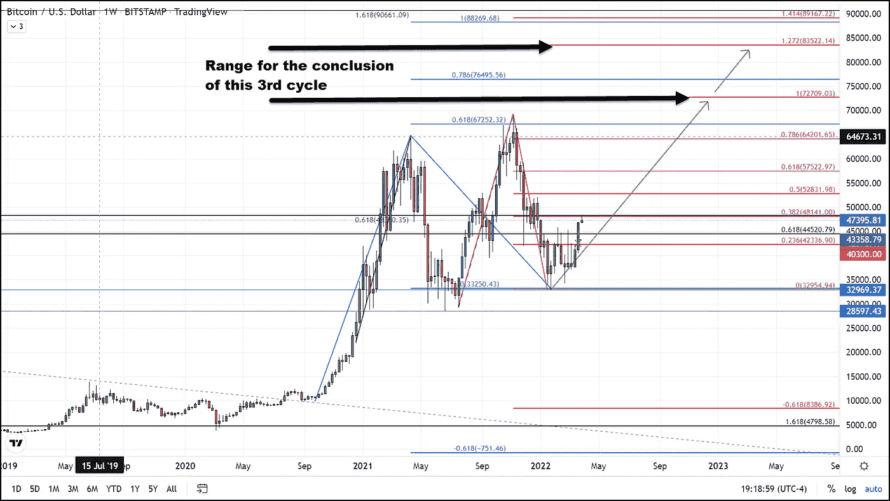

# 比特币多头控制了球

> 原文：<https://medium.com/coinmonks/bitcoin-bulls-take-control-of-the-ball-2dcad04b7c6a?source=collection_archive---------62----------------------->

在上周日，3 月 27 日，比特币在 44，500 美元(从 33，000 美元(去年的低点)到 69，000 美元的长期 61.8%斐波那契回撤线上方形成一个基础后，出现了巨大的突破。3 月 28 日，星期一，标志着自 1 月 4 日以来，比特币的收盘价首次超过这一关键水平。继昨天突破 44500 美元阻力后，我认为这是决定未来价格方向的最重要的价格点。

这个水平由斐波纳契谐波组成，是 2022 年的最高值。调和来自两个斐波那契数据集，第一个是包含 2021 年春季反弹至 60k 美元的回撤(= .618%)，第二个是从 2021 年低点达到 69k 美元的 2021 年秋季反弹。最近两次最吸引人的价格飙升都超过了 6 万美元。有趣的是顶峰的谎言。0.618(或 1.618)比率统一为 44，100 美元和 46，240 美元。在这两个水平的中间，既是今年的前纪录高点，也是“自由反弹”的 0.618%，从 37，500 美元的支撑位开始。

在三次试图带球穿过这个关键区域失败后，看涨的进攻在第四次下跌。直到 3 月 26 日周六，他们才勉强跑出最后一码，本赛季(2022 年)首次超过 50 码线。公牛队在“周日晚上足球赛”中再次与熊队比赛，比赛以一声巨响开始，当时 BTC 公牛队的四分卫能够将猪皮带到球场上，并交到他们的明星跑锋手中，后者将猪皮带到了端区，为公牛队在 2022 年首次触地得分。

现在，公牛队处于领先地位，并控制了球场，他们目前正面临着熊队的防守线，试图在新的混战线阻止公牛队。该线由 200 天移动平均线绘制，这是过去两个交易日的日内高点。

随着公牛队从最近的成功中重振旗鼓，粉丝们可以预计公牛队会在熊队的防守中找到一个漏洞，当他们这样做时，他们很可能会一路跑到 53，000 美元，然后再转手。

**第三个周期已经开始，将在新 ATH 结束**

周六突破四个月的区间标志着比特币积累期的结束。整个周末，情况完全变了。自 1 月底以来，我们一直预测比特币将进入八个月周期的第三次迭代，此前比特币已经进行了两次。八到九个月的周期包括四个月的抛物线反弹，三个月的同样陡峭的修正，以及两个月的积累期，然后开始新的周期。

这种季节性上涨、下跌和底部的形成将我们带到了 6 万美元以上的历史高点，并创造了更高的高点，在修正后也创造了更高的低点。正如我在今年 1 月 20 日发表的题为“比特币的孪生兄弟”的文章中所述，下面是一段摘录。

> BTC 在过去两个月所走的道路对我们来说一点也不奇怪，因为它在 2021 年第一次 ATH(6.5 万美元)后的三个月里遵循了完全相同的轨迹。不仅两个历史高点之后的调整在强度和持续时间上都相匹配，而且两个高点之前的反弹也有非常相似的特征。如果它继续遵循自 2020 年 12 月以来表现出的对称性，那么我们应该会在大约一个多月的时间里进一步巩固，然后在春末或夏初再次反弹至历史新高…

…如果这种模式继续下去，这将意味着我们将看到另一个从早春开始的大反弹。在所有条件相同的情况下，比特币价格的这种对称演变可能是阻力最小的路径，正如他们所说，事情通常是三件一件来的。-

1 月 24 日，我们在 33，000 美元处触底，昨天 3 月 27 日，我们进入了季节性波动的第三个阶段的抛物线反弹阶段。反弹部分是周期的开始，通常将持续四个月左右，我们预计价格不仅会创下历史新高，应该会达到 72，000 美元至 85，000 美元之间。我们应该在七月中旬达到这个新纪录。在接下来的几个月里，BTC 看起来注定要强势结束这第三个“赛季”。加密公牛队挤满看台并像喝醉的兄弟会男孩一样尖叫的时间正式开始了，所以拿好你的季票，你的利口酒，涂上你的脸，我们将在超级碗再见。对于任何有兴趣阅读我更多文章的人，只需点击这个[链接](https://www.thegoldforecast.com/bitcoin)。

> 加入 Coinmonks [电报频道](https://t.me/coincodecap)和 [Youtube 频道](https://www.youtube.com/c/coinmonks/videos)了解加密交易和投资

# 另外，阅读

*   [Bitget 回顾](https://coincodecap.com/bitget-review)|[Gemini vs block fi](https://coincodecap.com/gemini-vs-blockfi)cmd |[OKEx 期货交易](https://coincodecap.com/okex-futures-trading)
*   [AscendEx Staking](https://coincodecap.com/ascendex-staking)|[Bot Ocean Review](https://coincodecap.com/bot-ocean-review)|[最佳比特币钱包](https://coincodecap.com/bitcoin-wallets-india)
*   [霍比审核](https://coincodecap.com/huobi-review) | [OKEx 保证金交易](https://coincodecap.com/okex-margin-trading) | [期货交易](https://coincodecap.com/futures-trading)
*   [网格交易机器人](https://coincodecap.com/grid-trading) | [Cryptohopper 审查](/coinmonks/cryptohopper-review-a388ff5bae88) | [Bexplus 审查](https://coincodecap.com/bexplus-review)
*   [7 个最佳零费用加密交易平台](https://coincodecap.com/zero-fee-crypto-exchanges)