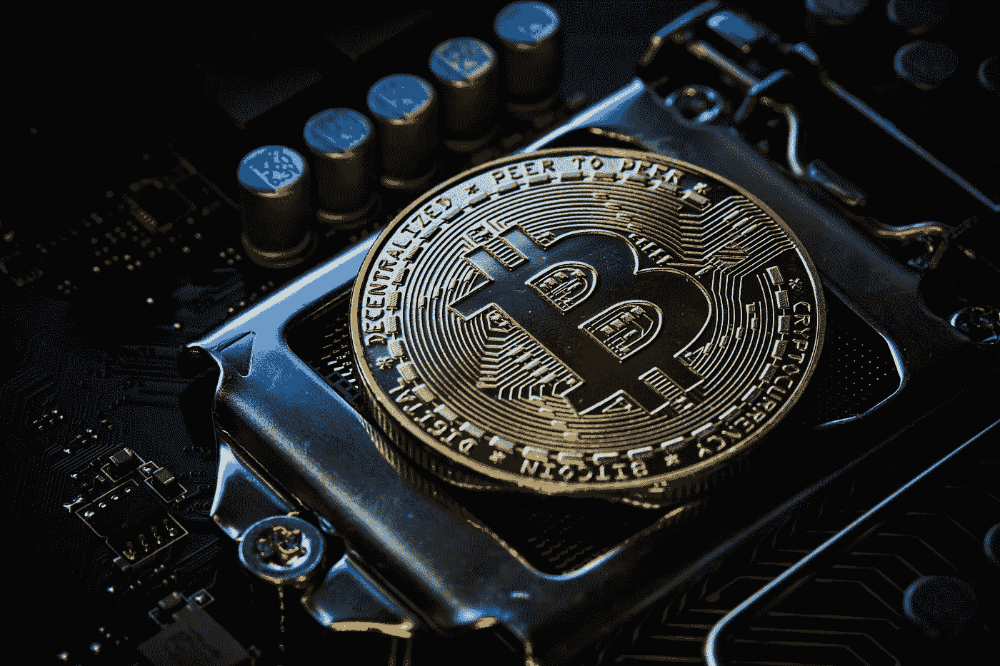

# 比特币可以对抗通货膨胀。这里你有理由

> 原文：<https://medium.com/coinmonks/bitcoin-can-combat-the-inflation-here-you-have-the-reasons-244efd4f1bb8?source=collection_archive---------31----------------------->

Source photo Unsplash.com

出于以下原因，比特币是比黄金或其他传统资产更好的通胀对冲工具。

## 1.比特币的供应量是有限的。

一种算法将比特币(BTC)的数量限制为最多 2100 万。2022 年将有 1900 万个比特币。90%的比特币可开采供应量已经…