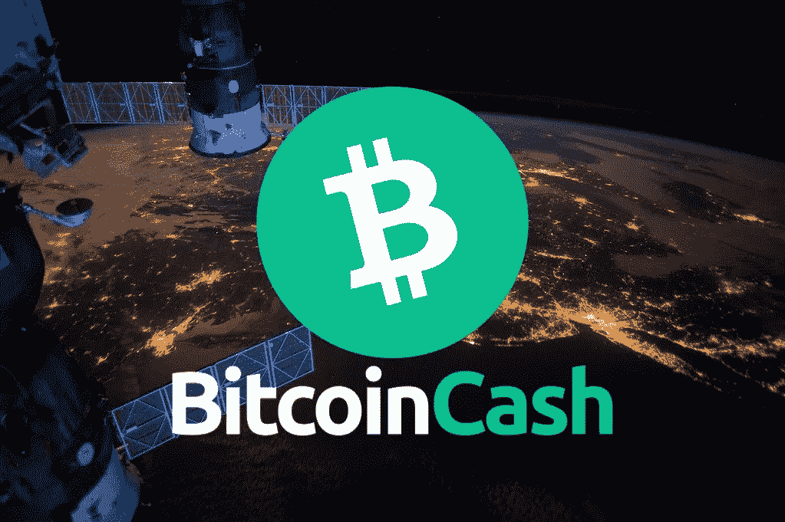
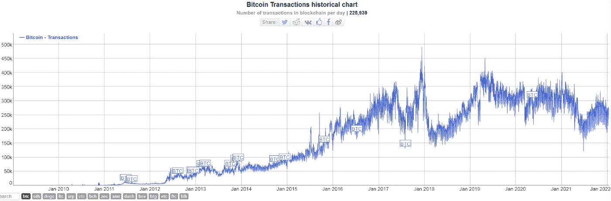
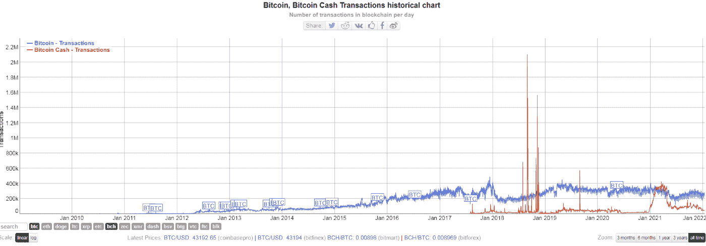
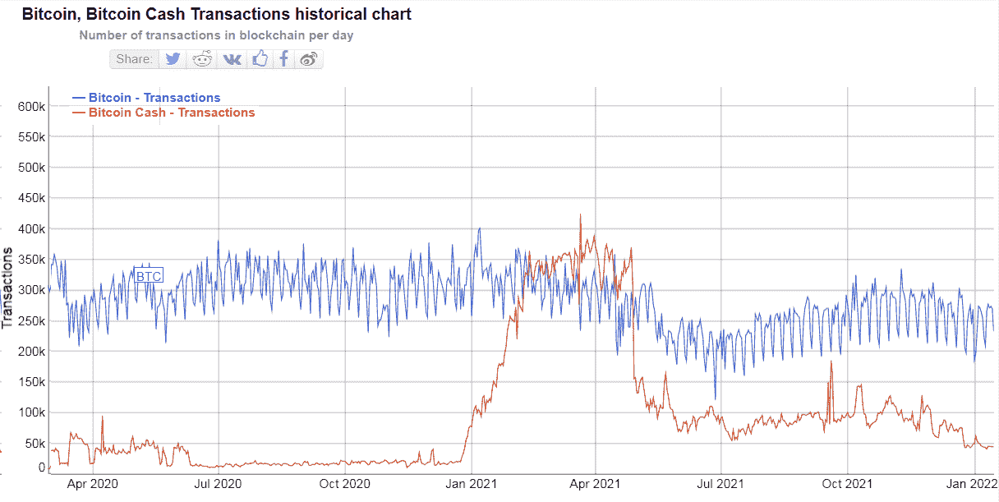
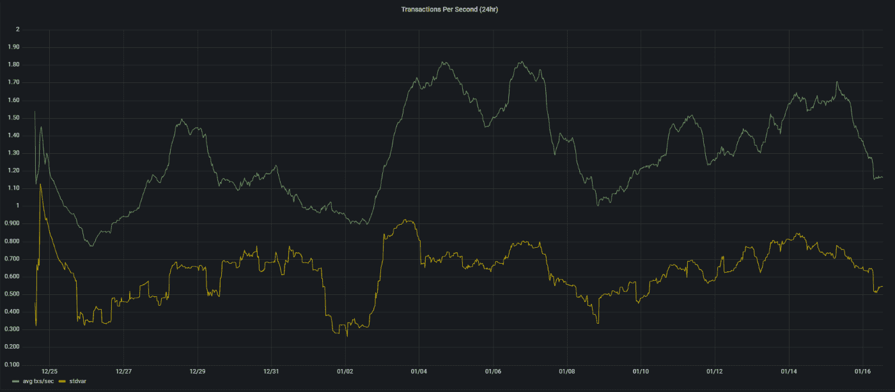

# 比特币现金增加了连锁应用

> 原文：<https://medium.com/coinmonks/bitcoin-cash-increasing-on-chain-adoption-ea9674987d9f?source=collection_archive---------10----------------------->

Robinhood 和 CashApp 等平台上的密码交易者和保管者的最新流入提出了一个问题，即他们中是否有人真的计划将密码存入非保管钱包并持有私钥。

这是加密货币背后的核心理念。拥有我们的基金，中间没有第三方介入。

投资者被比特币(BTC)的投机特性和价格波动所吸引。

我们并不指望调查结果表明，crypto 的绝大多数新投资者只是“持有者”,他们相信自己的资金在一个集中的交易所或交易平台上。

但是对于比特币现金投资者来说也是这样吗？看起来区块链提供的比特币现金的低费用和即时交易有利于实际的连锁采纳。

这是真正的采用，将我们的命运掌握在我们手中，从表面上看，比特币现金是唯一吸引新用户的分散式网络。

## BTC 网络没有增长

真实数据驳斥比特币(BTC)网络日益壮大的神话:

[*BitInfoCharts*](https://bitinfocharts.com/comparison/transactions-btc-eth.html#alltime)

比特币(BTC)交易在 2009 年至 2017 年间一直处于上升趋势，在 2017 年 12 月达到顶峰，此后，BTC 交易处于下降趋势。

原因是这样的:

**这是 BTC 网络可以服务的最大交易数量**。Blockstream 开发者决定区块链不应该扩大规模以满足大规模采用，因此，比特币(BTC 版本)就像那样被削弱了。

每当有新用户出现并测试网络时，费用就会大幅上涨到 50 美元甚至更高。

交易室和集中交易所的采用不能改变这个图表，因为大多数交易所和平台只是在用户侧显示数字，而没有实际的链上交易发生。

BTC 交易没有增长，因为公众意识到它只是一种运行在网络之上的投机资产，受到比特币核心发展停滞的影响。

## 比特币现金交易

[*BitInfoCharts*](https://bitinfocharts.com/comparison/transactions-btc-bch.html#alltime)

2018 年的峰值来自开发人员进行的各种压力测试。

在 2018 年和 2019 年期间，由于比特币(BTC)的失败，人们对加密货币的兴趣变淡了。费用达到 50 美元，交易在 mempool 中滞留数周，这使得每个新来者都放弃了比特币，这也对整个加密货币市场产生了影响。

不过，比特币现金的信息很清楚。比特币随着其 8MB 块的升级版本(目前为 32MB)而扩展。

2021 年上半年，比特币现金交易呈上升趋势，平均比 2020 年增加一倍以上。

[*BitInfoCharts*](https://bitinfocharts.com/comparison/transactions-btc-eth.html#alltime)

交易数量最近大幅下降，但平均而言，2020 年和 2021 年相比增加了一倍以上。尽管如此，自去年 12 月以来的最后一次下跌仍令人担忧。

2021 年 1 月至 2022 年 4 月之间的交易增长主要归因于 noise.cash，它在一个革命性的社交媒体网站内吸引并每天进行数十万次微交易作为小费。

这些交易被永久记录在区块链上，而不是像比特币核心 dev(和 Blockstream 联合创始人)Gregory Maxwell 所说的那样是“假的”，当时他在 BCH 身边对这一成就感到茫然。

## SmartBCH 侧链

这里还有一点我们不应该忽视，smartBCH 交易和这个侧链的增长。

SmartBCH 是比特币现金的侧链，利用 BCH 作为本地货币。SmartBCH 交易最近破纪录。smartBCH 交易不是记录在 BCH 区块链上，而是记录在 smartBCH 网络上。这是一个运行在比特币现金之上的不同网络，利用其高吞吐量，为以太坊因高费用和网络拥塞而出现的故障带来了一个高效的替代方案。

[*Grafana*](https://smartbch.fountainhead.cash/grafana/d/GUnTOBGnz/smartbch?orgId=1&from=1640323340598&to=1642331144810&viewPanel=26) *(Average tps on smartBCH in the last 30 days)*

比特币现金是每个人的 P2P 电子现金，不排除 99%的人收费低于一分钱。

SmartBCH 是一个面向所有人的智能合同网络。数字金融的未来，为所有人提供 DeFi、NFTs、Dapps，而不仅仅是一小部分精英。

smartBCH 上的交易为比特币现金带来了额外的提振，因为 smartBCH 运行在 BCH 之上，并利用 BCH 作为本地加密货币。锁定在 smartBCH 协议中的 BCH 正在增加，并且 smartBCH 的网络效应也在增加。随着 smartBCH 项目投资的增加，smartBCH 的价值将达到 Polygon 等类似智能合同 EVM 兼容网络的价值。

## 最后

似乎目前唯一教育用户传统金融系统危险的社区是比特币现金。其余的都只是想吸引投资者，成为这个体系的一部分。与此同时，除了以太坊之外，今天的所有智能合约网络都是集中式的。

绝大多数加密货币只是以价格为导向，许多加密货币采用集中方式运营，由一家私人公司甚至一家开发商控制。Solana、Cardano、Avalance、Terra Luna、Polygon 都有一个开/关开关，需要人工干预来清理 DDoS 攻击和垃圾邮件交易网络。

IOTA 树立了一个榜样，并且是一个关于当集中化应用于这种网络时投资者如何丧失信心的案例研究。

Satoshi 在白皮书中阐述了比特币之前数字货币失败的主要原因。这就是集中化，由一名管理员控制数据库，并能够调整货币政策。

如今，比特币是一种数字货币，其升级版是比特币现金。这是一种分散的 P2P 加密货币，旨在实现全球范围内的支付方式。

随着时间的推移，不具备显著分散化水平的网络将被遗忘。

然而，除了权力下放之外，区块链的基层也不应牺牲一些基本特征。

比特币实现了一个可扩展的网络，并以微不足道的费用提供快速交易，而没有牺牲网络的分散性或安全性。

Writing at the following websites: ● [ReadCash](https://read.cash/@Pantera) ● [NoiseCash](https://noise.cash/u/Pantera99) ● [Medium](/@panterabch) ● [Hive](https://hive.blog/@pantera1) ● [Steemit](https://steemit.com/@pantera1) ●[Vocal](https://vocal.media/authors/pantera) ● [Minds](https://www.minds.com/pantera99/) ● [Twitter](https://twitter.com/Panterabch) ● [LinkedIn](https://www.linkedin.com/in/panterabch/) ● [Reddit](https://www.reddit.com/user/coinflip1211) ● [email](https://read.cash/@Pantera/localcryptos-p2p-exchange-is-now-offering-bitcoin-cash-trading-06637230#bad-link)

> **免责声明**:本内容中发布的所有材料均用于娱乐和教育目的，并且**遵守公平使用准则**。无意侵犯版权。如果您是或代表本文所用材料的版权所有者，并且对所述材料的使用有疑问，请发送[电子邮件](https://read.cash/@Pantera/cryptouknowns-battlegrounds-the-crypto-battle-royal-part-i-0ca762da#bad-link)。

***如果你喜欢这篇文章，别忘了订阅并点赞！***

*原发布于*[*https://read . cash*](https://read.cash/@Pantera/bitcoin-cash-increasing-on-chain-adoption-984e7469)*。*

> 加入 Coinmonks [电报频道](https://t.me/coincodecap)和 [Youtube 频道](https://www.youtube.com/c/coinmonks/videos)了解加密交易和投资

## 也阅读

 [## 杠杆代币[多头代币]终极指南

### 杠杆化令牌是具有杠杆化风险敞口的 ERC20 令牌，不考虑保证金、要求、管理…

medium.com](/coinmonks/leveraged-token-3f5257808b22)  [## 最佳加密交易所| 2021 年十大加密货币交易所

### 编辑描述

blog.coincodecap.com](https://blog.coincodecap.com/crypto-exchange)  [## 2022 年最佳加密交换平台| CoinCodeCap

### 编辑描述

blog.coincodecap.com](https://blog.coincodecap.com/best-swap-platforms)  [## 10 大最佳在线赌场|赢得并赢取免费 BTC 2022 | CoinCodeCap

### 编辑描述

blog.coincodecap.com](https://blog.coincodecap.com/best-online-casinos)  [## 2021 年最佳加密借贷平台| 6 大比特币借贷平台

### 获得比特币和其他加密货币的最佳贷款利率

medium.com](/coinmonks/top-5-crypto-lending-platforms-in-2020-that-you-need-to-know-a1b675cec3fa)  [## 2021 年 6 大最佳硬件钱包|顶级加密硬件钱包[更新]

### 最好的加密货币硬件钱包是绝对必要的。我们将在 NGRAVE、Ledger Nano X 和…

medium.com](/coinmonks/the-best-cryptocurrency-hardware-wallets-of-2020-e28b1c124069)  [## 2021 年最佳免费加密交易机器人

### 2021 年币安、比特币基地、库币和其他密码交易所的最佳密码交易机器人。四进制，位间隙…

medium.com](/coinmonks/crypto-trading-bot-c2ffce8acb2a)  [## 最佳 4 个加密交易信号电报通道

### 这是乏味的找到正确的加密交易信号提供商。因此，在本文中，我们将讨论最好的…

medium.com](/coinmonks/best-crypto-signals-telegram-5785cdbc4b2b)